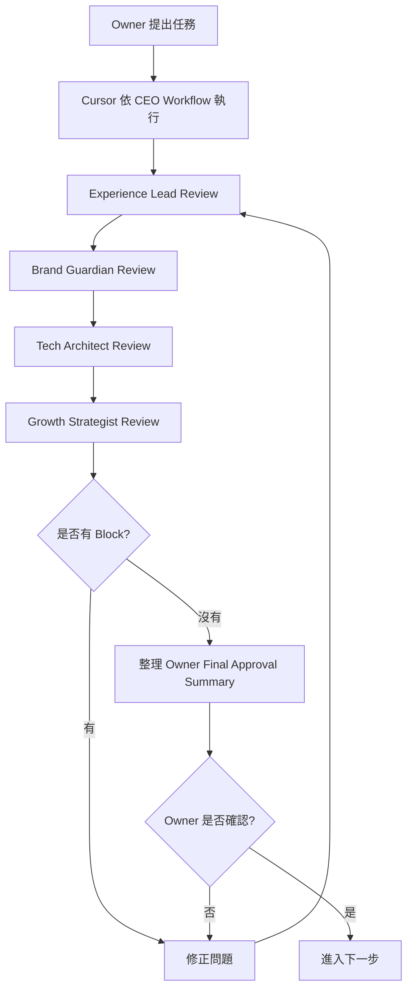

# Timiva Agents

## 文件目的

本文件定義 Timiva 專案使用的 4 個核心代理人角色、職責、決策邊界與應閱讀文件。

Agents 的用途不是取代 Owner，而是幫助 Owner 在產品、體驗、視覺、技術與成長面向進行穩定審查。

目前 Timiva 採用 Phase A：Owner 主導確認期。  
因此 Agents 只負責審查、驗證與風險提示，不擁有最終上線決策權。

---

## 1. Timiva 四個核心代理人

Timiva 使用 4 個核心代理人：

```text
1. Experience Lead
2. Brand Guardian
3. Tech Architect
4. Growth Strategist
```

中文對應：

```text
1. UI/UX 體驗長
2. 視覺風格官
3. 技術架構師
4. SEO 與增長駭客
```

---

## 2. Agents 分工總覽

| Agent | 中文角色 | 核心職責 | 守住的問題 |
|---|---|---|---|
| Experience Lead | UI/UX 體驗長 | 觸控目標、使用流程、頁面跳轉、減法設計 | 使用者能不能直覺完成任務 |
| Brand Guardian | 視覺風格官 | 色系、Bento Grid、layout、元件一致性 | 畫面是否像 Timiva |
| Tech Architect | 技術架構師 | Astro、Tailwind、元件重用、JS 正確性 | 程式是否穩定低維護 |
| Growth Strategist | SEO 與增長駭客 | Meta、FAQ Schema、內部連結、搜尋流量 | 工具是否能被搜尋與理解 |

---

## 3. Agents 工作流程圖



---

## 4. Experience Lead

中文角色：UI/UX 體驗長

### 4.1 角色定位

Experience Lead 專注於使用者體驗、觸控目標、頁面跳轉邏輯與減法設計。

它負責確保 Timiva 在手機上好理解、好操作，不會因為功能堆疊讓使用者迷路。

### 4.2 負責範圍

```text
觸控目標
使用流程
頁面跳轉邏輯
減法設計
手機直式操作
手機橫式操作
Bottom Sheet 使用體驗
主要 CTA 是否清楚
SEO / 廣告 / FAQ 是否干擾主要任務
```

### 4.3 可以 Block 的情況

```text
手機主流程無法完成
主要 CTA 不清楚
觸控目標太小
使用者會迷路
廣告或 SEO 壓過工具操作
手機橫式嚴重跑版
```

### 4.4 應閱讀文件

```text
docs/timiva-project-brief-v1.md
docs/timiva-product-principles-v2.md
docs/timiva-layout-system-v2.md
docs/timiva-new-tool-development-rules-v2.md
docs/timiva-tool-page-qa-checklist-v2.md
```

---

## 5. Brand Guardian

中文角色：視覺風格官

### 5.1 角色定位

Brand Guardian 專注於視覺風格、整體 layout、Bento Grid、色系、卡片、按鈕與元件一致性。

它負責防止開發過程中的樣式漂移，確保 Timiva 保持安靜、乾淨、Widget-like 的品牌感。

### 5.2 負責範圍

```text
色系
背景
Bento Grid
整體 layout
卡片樣式
按鈕層級
icon 一致性
字級與間距感
元件一致性
廣告容器視覺適配
```

### 5.3 可以 Block 的情況

```text
畫面明顯不像 Timiva
元件樣式和既有頁面不一致
layout 嚴重失衡
Bento / card 結構混亂
廣告容器破壞畫面
樣式漂移明顯
```

### 5.4 應閱讀文件

```text
docs/timiva-product-principles-v2.md
docs/timiva-layout-system-v2.md
docs/timiva-design-system-v2.md
docs/timiva-tailwind-css-guidelines-v2.md
docs/timiva-wireframe-index-v1.md
docs/timiva-ad-layout-guidelines-v1.md
```

---

## 6. Tech Architect

中文角色：技術架構師

### 6.1 角色定位

Tech Architect 專注於 Astro 架構、Tailwind CSS、元件重用、HTML 語意化、JS 邏輯正確性與低維護。

它負責確保程式乾淨、穩定，不會改一頁壞三頁。

### 6.2 負責範圍

```text
Astro component 重用
HTML 語意化
Tailwind theme tokens
Tailwind component class / @apply
JS 計算邏輯
LocalStorage
URL sharing
npm run build
console error
回歸穩定
```

### 6.3 可以 Block 的情況

```text
build 失敗
console error
計算邏輯錯誤
LocalStorage 導致 crash
修改共用元件導致既有頁面壞掉
違反 Tailwind / CSS 核心規範
使用 inline style
使用 !important
使用 CSS id selector
```

### 6.4 應閱讀文件

```text
docs/timiva-project-brief-v1.md
docs/timiva-tailwind-css-guidelines-v2.md
docs/timiva-layout-system-v2.md
docs/timiva-new-tool-development-rules-v2.md
docs/timiva-tool-page-qa-checklist-v2.md
```

---

## 7. Growth Strategist

中文角色：SEO 與增長駭客

### 7.1 角色定位

Growth Strategist 專注於 SEO、AEO、AI Search、Meta tags、FAQ Schema、Related Tools、內部連結與搜尋流量策略。

它負責把 Timiva 的工具轉化成可被搜尋、可被理解、可長期累積流量的入口。

### 7.2 負責範圍

```text
Meta title
Meta description
H1 / H2 結構
FAQ
FAQ Schema
AI Search 友善內容
Related Tools
內部連結
Programmatic SEO 機會
廣告與內容節奏
```

### 7.3 可以 Block 的情況

```text
H1 / title / description 缺失
FAQ 與工具功能不一致
FAQ Schema 錯誤
中英文混雜
SEO 區塊放錯位置
內部連結明顯錯誤
SEO 內容壓過工具體驗
```

### 7.4 應閱讀文件

```text
docs/timiva-product-principles-v2.md
docs/timiva-product-architecture-v3.md
docs/timiva-v1-roadmap-v2.md
docs/timiva-seo-aeo-ai-search-guidelines-v2.md
docs/timiva-ad-layout-guidelines-v1.md
```

---

## 8. Agents 回報格式

每個 Agent 回報時，應使用以下格式：

```text
Agent:
Result: Pass / Pass with minor notes / Block

Findings:
- ...

Required fixes:
- ...

Minor notes:
- ...

Owner attention:
- ...
```

---

## 9. 結果定義

### 9.1 Pass

表示該 Agent 負責範圍已通過，可以進入下一步。

### 9.2 Pass with minor notes

表示可以進入下一步，但有小問題可後續優化。

Minor notes 不應阻擋 Owner 確認或後續開發。

### 9.3 Block

表示有重大問題，不能進入下一步，必須修正後重跑對應 Gate。

---

## 10. Owner Final Approval

目前 Timiva 採用 Phase A：Owner 主導確認期。

即使 4 個 Agents 都回傳 Pass 或 Pass with minor notes，Cursor 仍必須整理 Owner Final Approval Summary。

在 Owner 明確確認前，不得進入：

```text
commit
deploy
重大結構調整
locked components 修改
```

---

## 11. 結論

Agents 的目的不是讓 AI 自動決策，而是讓 Timiva 在每次開發中都有固定審查角度。

最終規則：

```text
Agents 負責審查
Skills 負責流程
Cursor 負責執行與回報
Owner 前期負責最終確認
```
