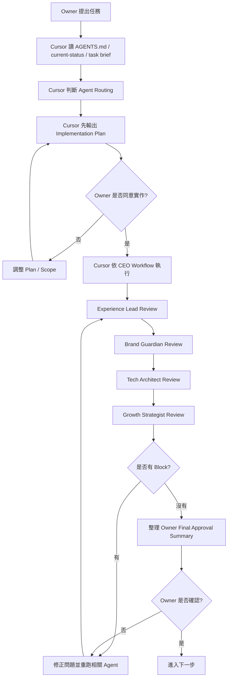

# Timiva Agents README

> 用途：本資料夾放置 Timiva 專案的 4 個核心審查代理人。  
> 根目錄 `AGENTS.md` 是 Cursor 任務入口；本資料夾是代理人的角色定義與使用規則。  
> 注意：舊版 monolithic `AGENTS.md` 已封存於 `local-docs/archive/docs/legacy-agents-v1.md`，不應放在根目錄覆蓋新版入口檔。

---

## 1. Timiva 四個核心代理人

Timiva 使用 4 個核心代理人：

```text
1. Experience Lead
2. Brand Guardian
3. Tech Architect
4. Growth Strategist
```

中文對應：

```text
1. UI/UX 體驗長
2. 視覺風格官
3. 技術架構師
4. SEO 與增長駭客
```

Agents 的用途不是取代 Owner，而是幫助 Owner 在產品、體驗、視覺、技術與成長面向進行穩定審查。

目前 Timiva 採用 Phase A：Owner 主導確認期。  
因此 Agents 只負責審查、驗證與風險提示，不擁有最終上線決策權。

---

## 2. Agents 分工總覽

| Agent | 中文角色 | 核心職責 | 守住的問題 |
|---|---|---|---|
| Experience Lead | UI/UX 體驗長 | 觸控目標、使用流程、頁面跳轉、減法設計 | 使用者能不能直覺完成任務 |
| Brand Guardian | 視覺風格官 | 色系、Bento Grid、layout、元件一致性 | 畫面是否像 Timiva |
| Tech Architect | 技術架構師 | Astro、Tailwind、元件重用、JS 正確性 | 程式是否穩定低維護 |
| Growth Strategist | SEO 與增長駭客 | Meta、FAQ Schema、內部連結、搜尋流量 | 工具是否能被搜尋與理解 |

---

## 3. Agent files

```text
agents/
├── README.md
├── experience-lead.md
├── brand-guardian.md
├── tech-architect.md
└── growth-strategist.md
```

### Project Design Assistant（skill，非第五 Agent）

Timiva 另有 **Project Design Assistant** — Gate-based project design guardrail skill：

```text
Canonical skill：agents/skills/project-design-assistant-skill.md
性質：review-only；由 Owner 或 workflow 在指定 Gate 主動呼叫
```

不加入 P / S / M / L Agent routing、Targeted Agent Review 固定名單、Pre-deploy 四 Agent routing。不取代 Owner Final Review。

---

## 4. Agents 工作流程



---

## 5. When Cursor should use each agent

### Experience Lead 必跑

```text
新增或修改工具主流程
修改手機直式或手機橫式
修改 Bottom Sheet / Bottom Control
新增表單、日期選擇、CTA、互動流程
加入廣告位置可能影響操作
```

### Brand Guardian 必跑

```text
修改 UI / layout / card / button / icon / background
修改首頁、全部工具頁、工具頁、Legal/Text page 視覺
加入廣告容器
修改 Tailwind class 可能造成樣式漂移
```

### Tech Architect 必跑

```text
任何程式碼修改
修改 Astro component
修改 Tailwind / CSS
修改 JavaScript 工具邏輯
修改 LocalStorage / URL sharing
commit / deploy 前
```

### Growth Strategist 必跑

```text
修改 H1 / title / meta description
修改 FAQ / FAQ Schema
修改 Related Tools / internal links
修改 All Tools Page 分類或文案
新增工具頁 SEO / AEO 內容
加入或調整廣告與內容節奏
```

---

## 6. Agent routing rule

每個任務至少要判斷 4 個 Agent 是否適用。

Cursor 在 plan-first 階段必須列出：

```text
Experience Lead: Required / N/A — reason
Brand Guardian: Required / N/A — reason
Tech Architect: Required / N/A — reason
Growth Strategist: Required / N/A — reason
```

Default rule:

```text
If this task changes code, Tech Architect is usually Required.
If this task changes UI, layout, mobile behavior, or flow, Experience Lead and Brand Guardian are usually Required.
If this task changes SEO, FAQ, meta, internal links, content strategy, or ads, Growth Strategist is Required.
```

---

## 7. Review result format

每個代理人只允許回傳三種結果：

```text
Pass
Pass with minor notes
Block
```

### Pass

表示該 Agent 負責範圍已通過，可以進入下一步。

### Pass with minor notes

表示可以進入下一步，但有小問題可後續優化。

Minor notes 不應阻擋 Owner 確認或後續開發。

### Block

表示有重大問題，不能進入下一步，必須修正後重跑對應 Gate。

---

## 8. Agents 回報格式

每個 Agent 回報時，應使用以下格式：

```text
Agent:
Result: Pass / Pass with minor notes / Block

Findings:
- ...

Required fixes:
- ...

Minor notes:
- ...

Owner attention:
- ...
```

---

## 9. Owner authority

Timiva 目前是 Phase A：Owner 主導確認期。

```text
Agents 負責審查與風險提示。
Cursor 負責實作與回報。
Owner 擁有最後決定權。
```

4 個 Agents 全部通過，不代表可以自動 commit / deploy。

在 Owner 明確確認前，不得進入：

```text
commit
deploy
重大結構調整
locked components 修改
```

---

## 10. 結論

Agents 的目的不是讓 AI 自動決策，而是讓 Timiva 在每次開發中都有固定審查角度。

最終規則：

```text
Agents 負責審查
Skills 負責流程
Cursor 負責執行與回報
Owner 前期負責最終確認
```
