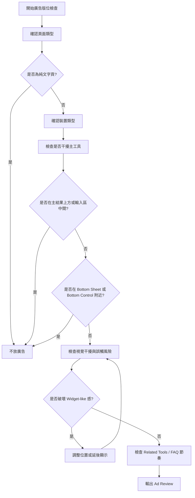

# Timiva Skill: Ad Placement Review

## 文件目的

本 Skill 用於檢查 Timiva 廣告版位是否符合產品體驗、視覺、手機操作與變現策略。

主要由 Experience Lead、Brand Guardian、Growth Strategist 共同使用。

---

## 1. 適用情境

使用於：

```text
新增廣告版位
調整工具頁 layout
調整 All Tools Page
規劃 AdSense
檢查手機直式廣告
檢查手機橫式廣告
```

---

## 2. Skill 流程圖



---

## 3. 禁止位置

廣告不得放在：

```text
主結果上方
主要輸入區中間
Bottom Sheet 內
固定底部操作列附近
會造成誤觸的位置
工具操作流程中間
```

---

## 4. 適合位置

廣告較適合放在：

```text
使用者完成主要任務之後
結果區下方
Related Tools 附近
FAQ / SEO 區塊前後
頁面底部內容區
```

---

## 5. 頁型規則

### Home Page

前期不建議放廣告。

若後期要放：

```text
不干擾 hero
不干擾主要工具卡片
不放第一屏最上方
```

### Tool Page

最適合測試廣告，但必須放在主任務之後。

### All Tools Page

可放低干擾廣告，但不能偽裝成工具卡片。

### Legal / Text Page

不放廣告。

---

## 6. 裝置規則

### 桌機

```text
可考慮內容下方、Related Tools 附近、右側欄
不能壓縮主工具
不能搶主結果焦點
```

### 手機直式

```text
結果區下方
Related Tools 下方
FAQ 前後
頁面底部
```

### 手機橫式

```text
應延後或隱藏
不在主工具第一屏放廣告
不壓縮主結果
不靠近 Bottom Control
```

---

## 7. Block 條件

```text
廣告放在主結果上方
廣告放在輸入區中間
廣告放在 Bottom Sheet
廣告靠近 Bottom Control
廣告造成誤觸
廣告偽裝成工具卡片
純文字頁放廣告
```

---

## 8. 輸出格式

```text
Skill: Ad Placement Review
Result: Pass / Pass with minor notes / Block

Page type:
- ...

Device:
- ...

Ad position:
- ...

Findings:
- ...

Required fixes:
- ...

Owner attention:
- ...
```
