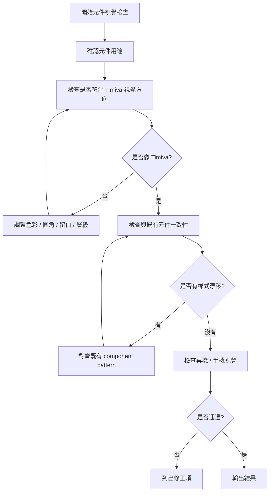

# Timiva Skill: Component Visual Review

## 文件目的

本 Skill 用於檢查單一元件或頁面區塊是否符合 Timiva 的視覺風格與元件一致性。

主要由 Brand Guardian 使用。

---

## 1. 適用情境

使用於：

```text
新增卡片元件
新增按鈕元件
新增 Tool Result Card
新增 Related Tools
新增 FAQ Section
新增 Ad Container
調整 Bento Grid
檢查樣式漂移
```

---

## 2. Skill 流程圖



---

## 3. 檢查項目

```text
是否安靜、乾淨、Widget-like
是否符合 Bento / card-based layout
圓角是否一致
陰影是否克制
色彩是否一致
按鈕層級是否清楚
icon 是否一致
主結果是否仍是焦點
手機版是否不擁擠
廣告容器是否不突兀
```

---

## 4. Block 條件

```text
畫面明顯不像 Timiva
元件風格和既有設計衝突
卡片太像廣告
按鈕層級混亂
主結果被視覺雜訊蓋過
手機版過度擁擠
```

---

## 5. 輸出格式

```text
Skill: Component Visual Review
Result: Pass / Pass with minor notes / Block

Component:
- ...

Visual findings:
- ...

Required fixes:
- ...

Minor notes:
- ...
```
