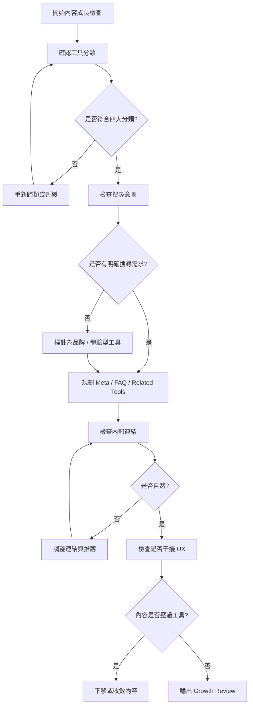

# Timiva Skill: Content Growth Review

## 文件目的

本 Skill 用於檢查 Timiva 的內容、分類、內部連結與長尾流量策略是否有助於搜尋成長，同時不破壞工具體驗。

主要由 Growth Strategist 使用。

---

## 1. 適用情境

使用於：

```text
規劃新工具
規劃工具分類
規劃 Related Tools
規劃 All Tools Page
規劃 FAQ
規劃長尾頁
檢查 SEO 與產品體驗平衡
```

---

## 2. Skill 流程圖



---

## 3. 搜尋意圖分類

Timiva 工具內容可分為：

```text
高搜尋需求工具
品牌差異化工具
互補情境工具
長尾延伸工具
```

### 高搜尋需求工具

```text
Date Range Calculator
Age Calculator
Days Between Dates
Add / Subtract Days
Countdown Timer
```

### 品牌差異化工具

```text
Life Progress Bar
Breathing Timer
Daily Rhythm tools
```

### 互補情境工具

```text
Stopwatch
Fullscreen Timer
Break Timer
Year Progress
```

### 長尾延伸工具

```text
Birthday Countdown
Holiday Countdown
Anniversary Countdown
Goal Countdown
```

---

## 4. 內部連結原則

Related Tools 應自然形成工具網絡。

原則：

```text
同分類優先
互補情境次之
不要每頁都推薦一樣的工具
不要推薦尚未存在且沒有 Coming Soon 狀態的頁面
不要放太多
```

---

## 5. All Tools Page 成長原則

All Tools Page 應使用正式分類：

```text
Important Dates
Timers & Focus
Daily Rhythm
Life Progress
```

每個分類應提供：

```text
分類名稱
一句話描述
工具卡片
Available / Coming Soon 狀態
簡短用途
```

不要把 All Tools Page 做成傳統工具大全。

---

## 6. 長尾內容原則

可以規劃長尾內容，但不應早期大量生成低品質頁面。

可以做：

```text
少量高品質 programmatic pages
固定模板
高搜尋意圖頁面
不需大量維護資料的頁面
```

暫緩：

```text
大量城市 / 節日 / 國家資料頁
需頻繁更新的資料庫
低品質關鍵字堆疊頁
```

---

## 7. Block 條件

```text
內容策略讓工具頁變成文章頁
內部連結不自然
Related Tools 過多
SEO 內容壓過工具
分類名稱混用
長尾頁需要高維護資料
```

---

## 8. 輸出格式

```text
Skill: Content Growth Review
Result: Pass / Pass with minor notes / Block

Growth opportunity:
- ...

Internal links:
- ...

Search intent:
- ...

Required fixes:
- ...

Minor notes:
- ...
```
