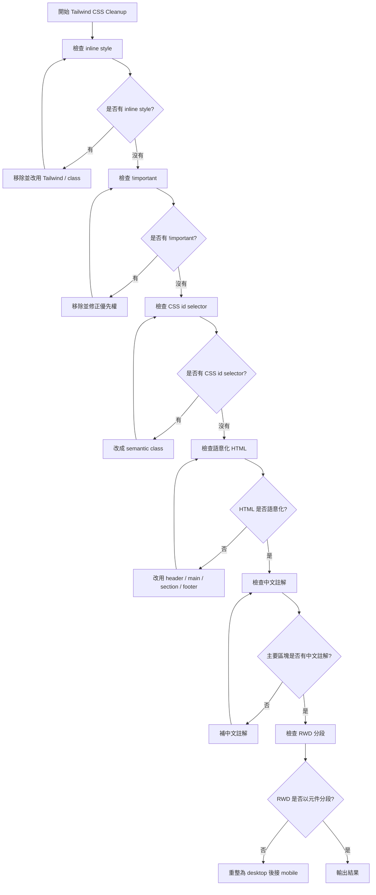

# Timiva Skill: Tailwind CSS Cleanup

## 文件目的

本 Skill 用於檢查與清理 Timiva 的 Tailwind CSS、HTML 語意、中文註解與 RWD 寫法。

主要由 Tech Architect 使用。

---

## 1. 適用情境

使用於：

```text
完成元件後
完成頁面後
修改 Tailwind 後
抽出 component class 後
發現樣式漂移後
commit 前
```

---

## 2. Skill 流程圖



---

## 3. 檢查項目

```text
是否有 inline style
是否有 !important
是否有 CSS id selector
HTML 是否語意化
主要區塊是否有中文註解
Tailwind class 是否過度混亂
是否大量使用 arbitrary values
是否可抽成 @apply component class
RWD 是否依元件分段
是否修改 locked components
```

---

## 4. Block 條件

```text
build 失敗
使用 inline style
使用 !important
使用 CSS id selector
主要區塊沒有語意化 HTML
RWD 全部集中在最後且難以維護
修改 locked components 未經 Owner 確認
```

---

## 5. 輸出格式

```text
Skill: Tailwind CSS Cleanup
Result: Pass / Pass with minor notes / Block

Files checked:
- ...

Findings:
- ...

Required fixes:
- ...

Minor notes:
- ...
```
