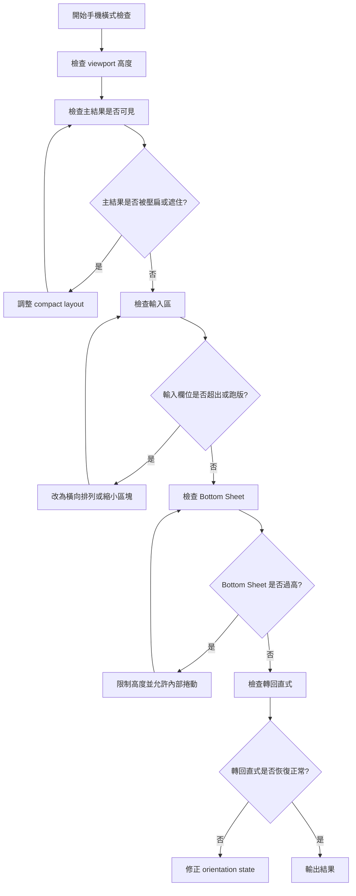

# Timiva Skill: Mobile Landscape Review

## 文件目的

本 Skill 用於專門檢查手機橫式 layout 與互動。

手機橫式必須獨立測試，不能假設手機直式正常就代表橫式正常。

主要由 Experience Lead、Brand Guardian、Tech Architect 共同使用。

---

## 1. 適用情境

使用於：

```text
新增工具頁
修改工具主體
新增 Bottom Sheet
調整輸入欄位
調整主結果區
修改 Header / Footer
修改手機 RWD
修正實機橫向跑版
```

---

## 2. Skill 流程圖



---

## 3. 檢查項目

```text
主結果是否仍可見
標題是否不必要省略
輸入欄位是否不超出
長文字是否不造成跑版
Bottom Sheet 是否不過高
Bottom Control 是否不貼 Footer
鍵盤開啟時是否不壓壞畫面
轉回直式是否恢復正常
廣告是否隱藏或後移
```

---

## 4. Block 條件

```text
主結果不可見
輸入欄位超出畫面
Bottom Sheet 過高且不可操作
轉回直式後 layout 壞掉
Footer 或 Bottom Control 互相重疊
手機橫式無法完成主要任務
```

---

## 5. 輸出格式

```text
Skill: Mobile Landscape Review
Result: Pass / Pass with minor notes / Block

Viewport notes:
- ...

Findings:
- ...

Required fixes:
- ...

Minor notes:
- ...
```
