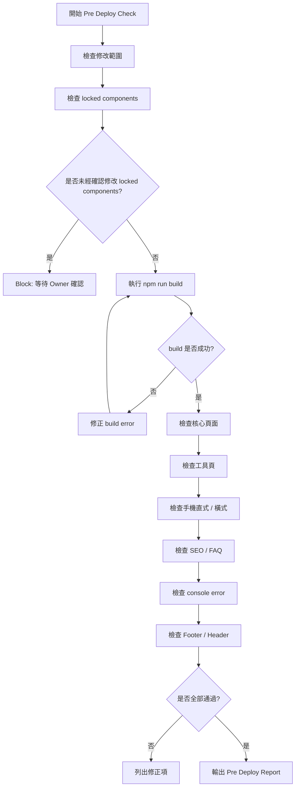

# Timiva Skill: Pre Deploy Check

## 文件目的

本 Skill 用於 Timiva commit 或 deploy 前的總檢查。

主要由 Tech Architect、Growth Strategist、Experience Lead 共同使用。

---

## 1. 適用情境

使用於：

```text
commit 前
deploy 前
完成一個工具後
完成一組 layout 後
加入 SEO / FAQ 後
修改共用元件後
```

---

## 2. Skill 流程圖



---

## 3. 必檢項目

```text
npm run build
Home Page
All Tools Page
每個已完成工具頁
Privacy Policy
Terms of Use
Contact
English / 繁體中文路由
Header
Footer
手機直式
手機橫式
桌機版
console error
```

---

## 4. SEO 必檢

```text
每頁 title
每頁 meta description
工具頁 H1
工具頁 FAQ
工具頁 FAQ Schema
Related Tools
canonical / language routing 規則
中英文不混雜
```

---

## 5. Tailwind / HTML 必檢

```text
無 inline style
無 !important
無 CSS id selector
主要區塊有中文註解
HTML 語意化
RWD 以元件分段
沒有不必要 hard-code
```

---

## 6. Locked Components 必檢

若有修改以下元件，必須確認 Owner 已同意：

```text
Header
Footer
Base Layout
全站背景
共用容器
```

未經確認修改 locked components 應 Block。

---

## 7. Block 條件

```text
build 失敗
主要頁面無法開啟
手機直式無法完成任務
手機橫式嚴重跑版
工具主要功能錯誤
FAQ Schema 錯誤
Header / Footer 被改壞
未經確認修改 locked components
```

---

## 8. 輸出格式

```text
Skill: Pre Deploy Check
Result: Pass / Pass with minor notes / Block

Build:
- Pass / Block

Pages checked:
- ...

Device checks:
- ...

SEO checks:
- ...

Locked components:
- ...

Required fixes:
- ...

Minor notes:
- ...

Owner approval required:
- Yes / No
```

---

## 9. 結論

Pre Deploy Check 的目的不是拖慢開發，而是避免：

```text
一個小修改改壞全站
手機橫式漏測
SEO 缺漏
Footer / Header 漂移
未經確認就 deploy
```

Phase A 期間，即使 Pre Deploy Check 通過，也必須等待 Owner 確認。
