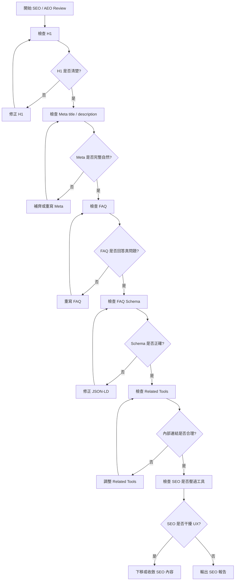

# Timiva Skill: SEO AEO Tool Page Review

## 文件目的

本 Skill 用於檢查 Timiva 工具頁是否符合 SEO、AEO、AI Search、FAQ Schema 與內部連結原則。

主要由 Growth Strategist 使用。

---

## 1. 適用情境

使用於：

```text
新增工具頁
補 FAQ
補 Meta tags
新增 Related Tools
調整 SEO 區塊
準備上線前
```

---

## 2. Skill 流程圖



---

## 3. 必備項目

每個工具頁至少包含：

```text
H1
Meta title
Meta description
短描述
主要工具區
Related Tools
FAQ
FAQ Schema / JSON-LD
語意化 HTML
```

---

## 4. H1 原則

H1 應：

```text
清楚說明工具名稱
與工具用途一致
不要堆關鍵字
不要過長
```

範例：

```text
Event Countdown
Date Range Calculator
Countdown Timer
Life Progress Bar
```

---

## 5. Meta Title 原則

Meta title 應：

```text
包含工具名稱
簡短描述用途
必要時加 Timiva
自然可讀
```

範例：

```text
Event Countdown | Timiva
Date Range Calculator | Timiva
```

---

## 6. Meta Description 原則

Meta description 應：

```text
說明工具能幫使用者完成什麼
保持自然
不要關鍵字堆疊
不要過度行銷
```

---

## 7. FAQ 原則

FAQ 建議 3 到 6 題。

常見題型：

```text
這個工具可以做什麼？
如何使用這個工具？
結果是怎麼計算的？
這個工具會儲存我的資料嗎？
可以在手機上使用嗎？
和另一個相似工具有什麼不同？
```

FAQ 不應：

```text
承諾工具沒有的功能
過度塞關鍵字
寫成長篇行銷文
放在主工具之前
```

---

## 8. FAQ Schema 原則

FAQ Schema 必須：

```text
與頁面 FAQ 內容一致
不包含頁面上沒有顯示的問題
JSON-LD 格式正確
中英文頁面各自對應正確語言
```

---

## 9. Related Tools 原則

每個工具頁建議 2 到 4 個 Related Tools。

原則：

```text
優先推薦同分類工具
再推薦互補情境
不要推薦太多
不要放在主工具上方
```

---

## 10. SEO 內容位置

SEO 內容必須放在工具體驗之後。

建議順序：

```text
Tool App
Result
Related Tools
FAQ / SEO Content
Footer
```

不要：

```text
FAQ / SEO Content
Tool App
Result
Footer
```

---

## 11. Block 條件

```text
H1 缺失
Meta title 缺失
Meta description 缺失
FAQ 與工具功能不一致
FAQ Schema 錯誤
中英文混雜
SEO 區塊壓過主工具
Related Tools 連結錯誤
```

---

## 12. 輸出格式

```text
Skill: SEO AEO Tool Page Review
Result: Pass / Pass with minor notes / Block

SEO checks:
| Item | Result | Notes |
|---|---|---|
| H1 | Pass / Block | |
| Meta title | Pass / Block | |
| Meta description | Pass / Block | |
| FAQ | Pass / Block | |
| FAQ Schema | Pass / Block | |
| Related Tools | Pass / Block | |
| AI Search clarity | Pass / Block | |

Required fixes:
- ...

Minor notes:
- ...
```
