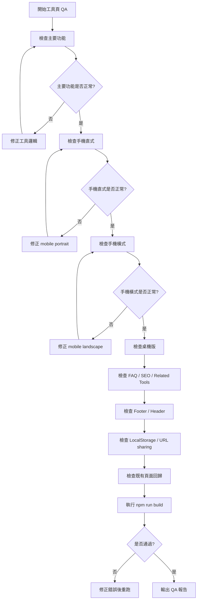

# Timiva Skill: Tool Page QA

## 文件目的

本 Skill 用於檢查 Timiva 工具頁是否符合功能、體驗、RWD、SEO、Footer 與回歸測試要求。

主要由 Tech Architect、Experience Lead、Growth Strategist 共同使用。

---

## 1. 適用情境

使用於：

```text
新增工具頁後
修改工具主體後
修改 Bottom Sheet 後
修改 FAQ / SEO 後
修改 Footer / Header 後
commit 前
deploy 前
```

---

## 2. Skill 流程圖



---

## 3. 基本功能檢查

```text
主要輸入是否可用
主要結果是否正確
預設狀態是否正常
空狀態是否正常
不合理輸入是否不 crash
重設功能是否正常
重新整理後是否正常
```

---

## 4. 手機直式檢查

```text
主結果是否一眼看懂
輸入欄位是否好點擊
CTA 是否清楚
Bottom Control 是否正常
Bottom Sheet 是否可開關
點擊背景是否可關閉
頁面是否自然滑動
Footer 是否不突兀
```

---

## 5. 手機橫式檢查

```text
主結果是否可見
標題是否不必要省略
輸入欄位是否不超出
Bottom Sheet 是否不過高
Bottom Control 是否不貼 Footer
轉回直式後是否恢復正常
```

---

## 6. 桌機版檢查

```text
主工具是否是焦點
內容寬度是否合理
Header 是否一致
Footer 是否一致
Related Tools 是否不搶主工具
FAQ 是否在工具體驗之後
```

---

## 7. SEO / FAQ 檢查

```text
H1 是否存在
Meta title 是否存在
Meta description 是否存在
FAQ 是否 3 到 6 題
FAQ Schema 是否正確
Related Tools 是否 2 到 4 個
SEO 內容是否不壓過主工具
中英文是否沒有混雜
```

---

## 8. LocalStorage / URL Sharing 檢查

如工具有使用 LocalStorage，需檢查：

```text
初次進入不 crash
保存後重新整理可恢復
資料格式錯誤有 fallback
清除 / reset 後資料正確移除
不同工具 key 不互相衝突
```

如工具有 URL sharing，需檢查：

```text
分享 URL 可開啟
URL 缺參數時不 crash
URL 參數錯誤時有 fallback
不在 URL 放敏感資料
```

---

## 9. 回歸檢查

修改工具頁後，至少檢查：

```text
Home Page
All Tools Page
Header
Footer
已完成工具頁
Legal / Text Page
手機直式
手機橫式
桌機版
```

---

## 10. Block 條件

```text
主要功能不可用
手機直式無法完成任務
手機橫式嚴重跑版
build 失敗
console error
FAQ Schema 錯誤
Footer 被改壞
既有工具被改壞
```

---

## 11. 輸出格式

```text
Skill: Tool Page QA
Result: Pass / Pass with minor notes / Block

Tool:
- ...

Checks:
| Item | Result | Notes |
|---|---|---|
| Main function | Pass / Block | |
| Mobile portrait | Pass / Block | |
| Mobile landscape | Pass / Block | |
| Desktop | Pass / Block | |
| FAQ / SEO | Pass / Block | |
| Header / Footer | Pass / Block | |
| Build | Pass / Block | |

Required fixes:
- ...

Minor notes:
- ...
```
