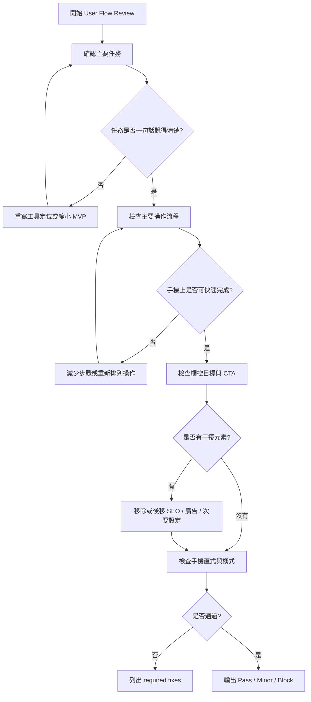

# Timiva Skill: User Flow Review

## 文件目的

本 Skill 用於檢查 Timiva 的工具頁、元件或流程是否符合手機優先、直覺操作與減法設計原則。

主要由 Experience Lead 使用。

---

## 1. 適用情境

使用於：

```text
新增工具主體
修改工具流程
新增 Bottom Sheet
調整 CTA
調整輸入欄位
新增手機操作流程
檢查使用者是否會迷路
```

---

## 2. Skill 流程圖



---

## 3. 檢查項目

```text
主要任務是否清楚
使用者是否能幾秒內理解工具
手機直式是否好操作
手機橫式是否不跑版
主要 CTA 是否清楚
觸控目標是否合理
輸入步驟是否過多
Bottom Sheet 是否干擾主結果
SEO 是否壓過工具
廣告是否干擾操作
```

---

## 4. Block 條件

```text
手機主流程無法完成
主要 CTA 不清楚
觸控目標太小
使用者會迷路
輸入流程過長
Bottom Sheet 無法正常關閉
廣告或 SEO 壓過主工具
手機橫式嚴重跑版
```

---

## 5. 輸出格式

```text
Skill: User Flow Review
Result: Pass / Pass with minor notes / Block

Main task:
- ...

Findings:
- ...

Required fixes:
- ...

Minor notes:
- ...

Owner attention:
- ...
```
