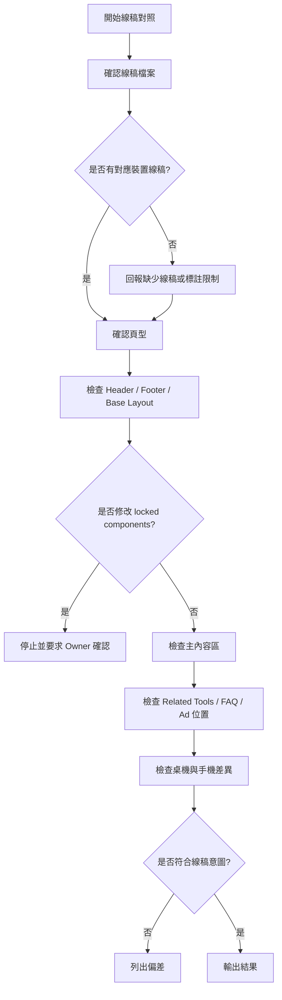

# Timiva Skill: Wireframe to Layout Review

## 文件目的

本 Skill 用於檢查 Cursor 是否正確依照線稿實作 layout。

主要由 Brand Guardian 與 Experience Lead 使用。

---

## 1. 適用情境

使用於：

```text
根據線稿建立頁面
調整首頁 layout
調整工具頁 layout
調整全部工具頁
調整 Legal / Text Page
檢查桌機 / 手機直式 / 手機橫式是否一致
```

---

## 2. Skill 流程圖



---

## 3. 檢查項目

```text
是否使用正確線稿
是否對應正確裝置
Header 是否一致
Footer 是否一致
主內容寬度是否符合線稿
區塊順序是否符合線稿
Related Tools 位置是否正確
FAQ / SEO 位置是否正確
廣告位置是否符合標註
手機直式是否符合線稿
手機橫式是否符合線稿
```

---

## 4. Block 條件

```text
把桌機線稿套到手機版
把手機直式當手機橫式
自行改變主 layout
修改 locked components
廣告位置未經線稿或規範確認
工具主體位置明顯錯誤
```

---

## 5. 輸出格式

```text
Skill: Wireframe to Layout Review
Result: Pass / Pass with minor notes / Block

Wireframe used:
- ...

Findings:
- ...

Layout deviations:
- ...

Required fixes:
- ...

Owner attention:
- ...
```
