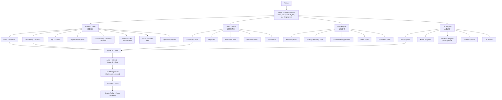

# Timiva Product Architecture V4

> Updated: 2026-07-10
> Replaces the planning assumptions in V3 where Life Progress Bar was the V1 fourth tool.
> V1.5 redefined as Search Foundation／搜尋鋪路期（開發優先順序策略，非分類變更）。

## 文件目的

本文件定義 Timiva 的產品功能架構、工具分類、優先順序與功能邊界。

---

## 1. 產品定位

Timiva 是一個簡單、舒服、手機好用的時間與生活節奏工具網站。

核心原則：

```text
少工具，但每個都超舒服。
```

English:

```text
Simple tools for important dates, focus, daily rhythm, and life progress.
```

中文：

```text
簡單、舒服、手機好用的時間與生活節奏工具。
```

---

## 2. 四大分類

```text
1. Important Dates / 重要日子
2. Timers & Focus / 計時與專注
3. Daily Rhythm / 日常節奏
4. Life Progress / 人生進度
```

分類名稱不因工具調整而更改。

### V1.5 Search Foundation（優先順序策略，非分類變更）

```text
V1.5 Search Foundation is a priority strategy, not a category change.
V1.5 是搜尋鋪路期的開發優先順序，不改變 Timiva 四大分類。
優先做高搜尋意圖、低維護的日期與時間工具。
Daily Rhythm / Timers & Focus / Life Progress 的完整補齊延後至 V2。
```

---

## 3. 架構總覽



---

## 4. V1 core tools

| Order | Tool | Category | Status / purpose |
|---:|---|---|---|
| 1 | Event Countdown | Important Dates | Deployed · production baseline |
| 2 | Date Range Calculator | Important Dates | Deployed · production baseline |
| 3 | Countdown Timer | Timers & Focus | Deployed · site-integrated |
| 4 | Year Progress | Life Progress | Deployed · site-integrated |

V1 no longer uses a multi-mode Life Progress Bar as the fourth tool.

---

## 4.1 Fifth tool — Age Calculator（deployed）

| Order | Tool | Category | Status / purpose |
|---:|---|---|---|
| 5 | Age Calculator | Important Dates | Deployed · V1.5 first Search Foundation tool · standalone + link integration complete |

Age Calculator 為 Timiva **第五個工具**，已正式上線於 `https://timiva.app`。Deployed HEAD：`f48df91`。

---

## 4.2 Sixth tool — Days Between Dates（deployed）

| Order | Tool | Category | Status / purpose |
|---:|---|---|---|
| 6 | Days Between Dates | Important Dates | Deployed · V1.5 second Search Foundation tool · standalone + link integration complete |

Days Between Dates 為 Timiva **第六個工具**，已正式上線於 `https://timiva.app`。Standalone：`69ba30b`。Deployed HEAD：`18a262c`。

---

## 5. Important Dates

定位：

```text
處理重要日期、事件倒數與日期計算。
```

| Priority | Tool | 中文 | Core use | Maintenance |
|---|---|---|---|---|
| P0 | Event Countdown | 事件倒數 | 建立重要事件倒數 | Low |
| P0 | Date Range Calculator | 日期區間計算 | 計算日期區間 | Low |
| P0 | Age Calculator | 年齡計算 | 年齡與生日日期差 | Low — **已部署 · V1.5 first Search Foundation tool** |
| P1 | Days Between Dates | 日期差計算 | 聚焦相差天數 | Low — **已部署 · V1.5 second Search Foundation tool** |
| P1 | Business Days Calculator | 工作日計算 | 排除週末的工作日差 | Low — **已部署 · V1.5 third Search Foundation tool** · MVP 不做國定假日資料庫 |
| P1 | Date Calculator / Add or Subtract Days | 日期加減計算 | 計算 N 天前後 | Low — **local complete（尚未 push／deploy）** |
| P1 | Hours Calculator | 時數計算 | 時數／時間差計算 | Low — **下一支開發工具** |
| P2 | Lunar Date Converter | 農曆日期轉換 | 公曆／農曆日期轉換 | Low — optional；不做農民曆／宜忌／吉日 |
| P2 | Pet Age Calculator | 寵物年齡換算 | 年齡換算參考 | Low — optional；不做健康／醫療建議 |
| P2 | Japanese Era Converter | 日本年號換算 | 明治／大正／昭和／平成／令和等現代年號 | Low — optional；不做大型歷史年號資料庫 |
| P2 | Birthday Countdown | 生日倒數 | 生日情境倒數 | Low |
| P3 | Holiday Countdown | 節日倒數 | 長尾節日情境 | Medium |
| P3 | Anniversary Countdown | 週年倒數 | 紀念日情境 | Low |

Holiday data must not become a high-maintenance global database in early phases.

Important Dates 低維護邊界（V1.5 Search Foundation）：

```text
Business Days Calculator MVP：排除週末即可，不做國定假日資料庫
Lunar Date Converter：可列 optional；不做農民曆、宜忌、吉日、沖煞
Pet Age Calculator：只做年齡換算參考，不做健康、醫療、照護建議
Japanese Era Converter：只做現代年號換算，不做大型歷史年號資料庫
```

---

## 6. Timers & Focus

定位：

```text
處理現在開始的一段時間。
```

| Priority | Tool | 中文 | Core use | Maintenance |
|---|---|---|---|---|
| P0 | Countdown Timer | 一般倒數計時器 | 快速設定並倒數 | Low |
| P1 | Stopwatch | 碼表 | 計算實際經過時間 | Low |
| P1 | Fullscreen Timer | 全螢幕計時器 | 大畫面低干擾計時 | Low |
| P2 | Pomodoro Timer | 番茄鐘 | 專注 / 休息週期 | Low |
| P2 | Focus Timer | 專注計時 | 輕量專注計時 | Low |
| P3 | Interval Timer | 間歇計時器 | 循環間歇 | Medium |
| P3 | Meeting Timer | 會議計時器 | 會議 / 簡報時間 | Low |

Avoid early background systems, complex notifications, history reports, and sync.

---

## 7. Daily Rhythm

定位：

```text
處理每天的節奏、休息、能量與恢復。
```

Daily Rhythm 仍是 Timiva 四大分類之一，但**不是 V1.5 立即優先序**。完整工具線補齊延後至 V2。

| Priority | Tool | 中文 | Core use | Maintenance |
|---|---|---|---|---|
| P1 | Breathing Timer | 呼吸節奏計時 | 呼吸與短暫休息節奏 | Low |
| P1 | Fasting / Recovery Timer | 斷食 / 恢復計時器 | 時間追蹤，不做健康建議 | Low |
| P2 | Circadian Energy Planner | 生理能量排程器 | 起床後時間區間提示 | Medium |
| P2 | Break Timer | 休息提醒 | 工作 / 休息節奏 | Low |
| P2 | Focus Flow Timer | 專注流計時 | 專注與休息節奏 | Low |
| P3 | Energy Reset Timer | 能量重置計時 | 短時間狀態重置 | Low |
| P3 | Stretch Timer | 伸展計時 | 伸展節奏 | Low |

Boundary:

```text
時間追蹤與節奏提示，不提供醫療、健康診斷、營養或療效承諾。
```

---

## 8. Life Progress

定位：

```text
讓使用者看見自己在年度、月份、目標期限或長期時間中的位置。
```

Architecture decision:

```text
Life Progress 不採一個大型多模式工具。
每一種時間尺度應優先成為清楚、低維護的獨立工具。
```

| Priority | Tool | 中文 / working name | Core use | Maintenance |
|---|---|---|---|---|
| P0 | Year Progress | 今年進度 | 顯示今年已過與剩餘比例 | Low |
| P1 | Milestone Progress | 里程碑進度（暫名） | 單一里程碑期限 / 進度 | Medium |
| P2 | Month Progress | 本月進度 | 顯示本月已過與剩餘比例 | Low |
| P2 | Goal Countdown | 目標倒數 | 距離目標期限多久 | Low |
| P3 | Life Timeline | 人生時間軸（暫名） | 長期時間視覺化 | Medium |
| P3 | Habit Streak Counter | 習慣連續天數 | 簡單連續日數 | Medium |

### Year Progress V1 boundary

Included:

```text
Current-year percentage
Days passed / remaining
12 monthly segments
One monthly note
Theme
Share
```

Excluded:

```text
Life mode
Custom timeline
Milestones
Goal tracking
Habit tracking
Multi-mode switch
Backend / account / sync
```

---

## 9. Development priority

### Phase 1 — V1 core（deployed）

```text
1. Event Countdown — deployed
2. Date Range Calculator — deployed
3. Countdown Timer — deployed
4. Year Progress — deployed
```

### Phase 1.5 / V1.5 — Search Foundation／搜尋鋪路期

```text
5. Age Calculator — deployed · first Search Foundation tool
6. Days Between Dates — deployed · second Search Foundation tool
7. Business Days Calculator — deployed · third Search Foundation tool · MVP：排除週末；無國定假日資料庫
8. Date Calculator / Add or Subtract Days — local complete（尚未 push／deploy）
9. Hours Calculator — next
10. Lunar Date Converter — optional
11. Pet Age Calculator — optional
12. Japanese Era Converter — optional
```

V1.5 是優先順序策略，不是分類變更。Daily Rhythm 不在此階段前段優先開發。

### Phase 2 / V2 — Category completion and brand differentiation

```text
13. Breathing Timer
14. Fasting / Recovery Timer
15. Stopwatch
16. Fullscreen Timer
17. Pomodoro Timer
18. Month Progress
19. Milestone Progress（working name）
20. Goal Countdown
21. Circadian Energy Planner
```

### Phase 3 — Later extensions

```text
Birthday Countdown
Holiday Countdown
Anniversary Countdown
Break Timer
Focus Flow Timer
Habit Streak Counter
Interval Timer
Meeting Timer
Life Timeline
```

---

## 10. Low-maintenance boundary

Can do:

```text
Time calculation
Countdown
Timer
Progress visualization
Rhythm prompts
LocalStorage for low-risk preferences
URL sharing
Native share
Simple themes
PWA later
```

Avoid:

```text
Membership
Cloud sync
Large goal-management system
Daily task backend
AI coach
Health diagnosis
Nutrition advice
Sleep analysis
Social check-ins
Leaderboard
Complex reports
Push backend
```

---

## 11. New-tool workflow

```text
Product decision
→ Plan-first
→ B0 V2 scaffold
→ B1A lower content
→ B1B static visual
→ B2 interaction / calculation
→ QA and Agent Reviews
→ Owner acceptance
→ standalone-tool commit
→ Post-tool Link Integration Gate
→ link QA / commit
→ push / deploy readiness
```

A tool is not fully integrated until the Post-tool Link Integration Gate is complete.

---

## 12. Conclusion

Timiva remains:

```text
Mobile-first
Widget-like
Pure frontend first
Low maintenance
Few tools
High comfort
```

V1 fourth tool:

```text
Year Progress / 今年進度
```

The earlier multi-mode Life Progress Bar concept is retired from the V1 public tool plan.
