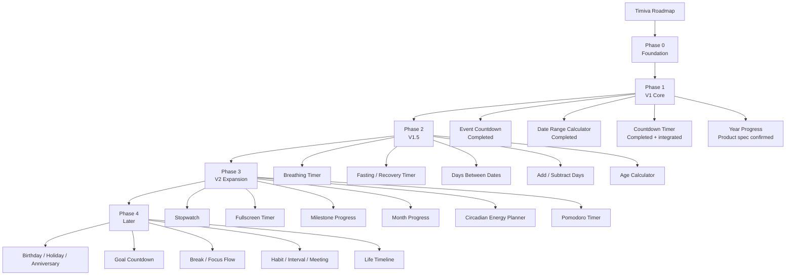

# Timiva V1 Roadmap V3

> Updated: 2026-06-21
> Main change from V2: Year Progress replaces Life Progress Bar as the V1 fourth tool.

---

## 1. V1 goal

Timiva V1 should establish:

```text
A clear bilingual product foundation
Three accepted V2 tool baselines
A fourth Life Progress representative
Consistent Header / Footer / Layout
Mobile portrait / landscape quality
SEO / FAQ support without becoming a traditional tool portal
```

Success criteria:

```text
1. Users understand each tool within seconds.
2. Mobile portrait and landscape remain stable.
3. Each tool feels like a small app / widget.
4. SEO supports rather than overwhelms the tool.
5. The site remains low-maintenance and pure-frontend first.
```

---

## 2. Roadmap flow



---

## 3. Current completed foundation

```text
Astro + Tailwind
EN / ZH route structure
Home / All Tools / Tool / Legal page types
Header / Footer / BaseLayout baseline
V2 tool result / drawer / overlay baselines
Task brief / validation report workflow
Four-Agent review model
Owner approval gates
Post-tool Link Integration Gate
```

---

## 4. Phase 1 — V1 core tools

| Order | Tool | Category | Current status |
|---:|---|---|---|
| 1 | Event Countdown | Important Dates | Completed baseline |
| 2 | Date Range Calculator | Important Dates | Completed baseline |
| 3 | Countdown Timer | Timers & Focus | Completed and site-integrated |
| 4 | Year Progress | Life Progress | Product spec / flow confirmed; Plan-first next |

Phase 1 covers:

```text
Important Dates
Timers & Focus
Life Progress
```

Daily Rhythm begins in V1.5.

---

## 5. Year Progress development roadmap

```text
Product specification: Complete
Product function flow: Complete
Plan-first task: Ready
Implementation: Not started
```

Development sequence:

```text
1. Plan-first repository audit
2. B0 V2 tool page scaffold
3. B1A lower content
4. B1B upper static visual
5. B2A date calculation
6. B2B Tool Theme Layer / theme / share
7. B3 full QA and Agent Reviews
8. Owner standalone-tool acceptance
9. Tool implementation commit
10. Post-tool Link Integration
11. Link QA / commit
12. V1 pre-deploy readiness
```

---

## 6. Phase 2 — V1.5

| Order | Tool | Category | Purpose |
|---:|---|---|---|
| 5 | Breathing Timer | Daily Rhythm | Establish calm rhythm / rest use case |
| 6 | Fasting / Recovery Timer | Daily Rhythm | Time tracking only; no health advice |
| 7 | Days Between Dates | Important Dates | Search-focused date difference |
| 8 | Add / Subtract Days | Important Dates | Search-focused date arithmetic |
| 9 | Age Calculator | Important Dates | Age / birthday search demand |

Year Progress is removed from V1.5 because it is now the V1 fourth tool.

---

## 7. Phase 3 — V2 expansion

| Order | Tool | Category | Purpose |
|---:|---|---|---|
| 10 | Stopwatch | Timers & Focus | Complete basic timer line |
| 11 | Fullscreen Timer | Timers & Focus | Large low-distraction display |
| 12 | Milestone Progress (working name) | Life Progress | Focused single-milestone progress |
| 13 | Month Progress | Life Progress | Shorter-term time awareness |
| 14 | Circadian Energy Planner | Daily Rhythm | Differentiation with careful health boundary |
| 15 | Pomodoro Timer | Timers & Focus | Common focus cycle use case |

---

## 8. Phase 4 — Later

```text
Birthday Countdown
Holiday Countdown
Anniversary Countdown
Goal Countdown
Break Timer
Focus Flow Timer
Habit Streak Counter
Interval Timer
Meeting Timer
Life Timeline
```

Rules:

```text
Do not create a high-maintenance holiday database early.
Do not turn goals or habits into a large productivity platform.
Do not depend on background notifications or sync early.
```

---

## 9. V1 completion standard

Each V1 tool needs:

```text
Tool core experience
Mobile portrait
Mobile landscape
Desktop
EN / ZH
Related Tools
FAQ
FAQ JSON-LD
Metadata / canonical / hreflang
ToolAdSlot disabled
Build pass
Agent Reviews
Owner real-device approval
Standalone-tool commit
Post-tool Link Integration
Link QA and integration commit
```

---

## 10. V1 release sequence after Year Progress

```text
Year Progress standalone acceptance
→ Year Progress implementation commit
→ Year Progress Post-tool Link Integration
→ All Tools / Home final content check
→ Timiva V1 Pre Deploy Final Check
→ Push / Deploy approval
```

No commit, push, or deploy occurs without Owner approval.

---

## 11. Deferred scope

```text
Live AdSense
Member system
Backend / database
Cloud sync
Social features
Large programmatic SEO
Complex reports
Push backend
PWA until core tool release timing is confirmed
```

---

## 12. Current next action

```text
Run the Year Progress Plan-first task.
Cursor inspects the repository and outputs a plan only.
Owner reviews the plan before any file edits.
```
