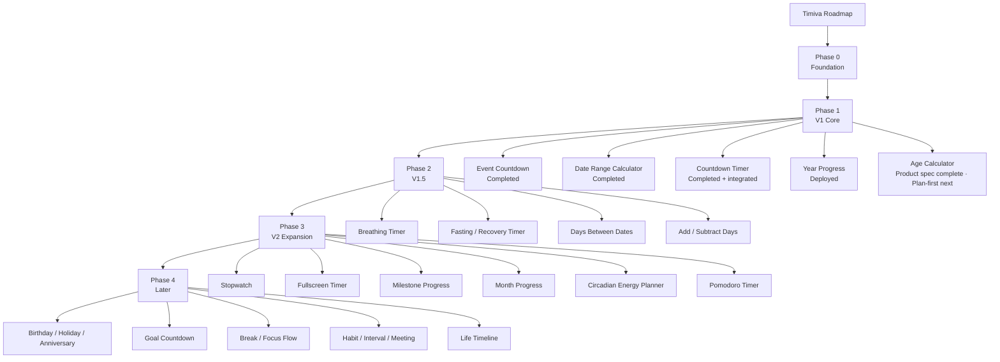

# Timiva V1 Roadmap V3

> Updated: 2026-07-05
> Main changes: Year Progress deployed as V1 fourth tool; Age Calculator advanced to fifth tool with product spec complete.

---

## 1. V1 goal

Timiva V1 should establish:

```text
A clear bilingual product foundation
Three accepted V2 tool baselines
A fourth Life Progress representative
Consistent Header / Footer / Layout
Mobile portrait / landscape quality
SEO / FAQ support without becoming a traditional tool portal
```

Success criteria:

```text
1. Users understand each tool within seconds.
2. Mobile portrait and landscape remain stable.
3. Each tool feels like a small app / widget.
4. SEO supports rather than overwhelms the tool.
5. The site remains low-maintenance and pure-frontend first.
```

---

## 2. Roadmap flow



---

## 3. Current completed foundation

```text
Astro + Tailwind
EN / ZH route structure
Home / All Tools / Tool / Legal page types
Header / Footer / BaseLayout baseline
V2 tool result / drawer / overlay baselines
Task brief / validation report workflow
Four-Agent review model
Owner approval gates
Post-tool Link Integration Gate
```

---

## 4. Phase 1 — V1 core tools

| Order | Tool | Category | Current status |
|---:|---|---|---|
| 1 | Event Countdown | Important Dates | Completed baseline |
| 2 | Date Range Calculator | Important Dates | Completed baseline |
| 3 | Countdown Timer | Timers & Focus | Completed and site-integrated |
| 4 | Year Progress | Life Progress | Deployed · site-integrated |

Phase 1 covers:

```text
Important Dates
Timers & Focus
Life Progress
```

Daily Rhythm begins in V1.5.

---

## 5. Year Progress status（deployed）

```text
Product specification: Complete
Implementation: Complete
Link integration: Complete
Production: Deployed on timiva.app
```

---

## 5.1 Age Calculator — next product development

| Item | Status |
|---|---|
| Order | **5** — Timiva fifth tool |
| Category | Important Dates / 重要日子 |
| Routes | `/en/age-calculator/`, `/zh/age-calculator/` |
| Product specification | Complete |
| Plan-first | Ready for repository-aware Plan-first |
| Implementation | Not started |
| Commit / push / deploy | Not committed · Not pushed · Not deployed |

Canonical spec: [`docs/tools/age-calculator/product-spec.md`](../tools/age-calculator/product-spec.md)

Development sequence（implementation 階段；Plan-first 先行）:

```text
1. Plan-first repository audit
2. Owner Plan Review
3. B0 V2 tool page scaffold
4. B1A lower content
5. B1B upper static visual
6. B2 smart date input + calculation logic + calculation-date interaction
7. Full QA and Agent Reviews
8. Owner standalone-tool acceptance
9. Tool implementation commit
10. Post-tool Link Integration
11. Link QA / commit
12. push / deploy checkpoint
```

---

## 6. Phase 2 — V1.5

| Order | Tool | Category | Purpose |
|---:|---|---|---|
| 6 | Breathing Timer | Daily Rhythm | Establish calm rhythm / rest use case |
| 7 | Fasting / Recovery Timer | Daily Rhythm | Time tracking only; no health advice |
| 8 | Days Between Dates | Important Dates | Search-focused date difference |
| 9 | Add / Subtract Days | Important Dates | Search-focused date arithmetic |

Age Calculator 已提前至第五個工具（見 §5.1），不再列於 Phase 2 第 9 位。

---

## 7. Phase 3 — V2 expansion

| Order | Tool | Category | Purpose |
|---:|---|---|---|
| 10 | Stopwatch | Timers & Focus | Complete basic timer line |
| 11 | Fullscreen Timer | Timers & Focus | Large low-distraction display |
| 12 | Milestone Progress (working name) | Life Progress | Focused single-milestone progress |
| 13 | Month Progress | Life Progress | Shorter-term time awareness |
| 14 | Circadian Energy Planner | Daily Rhythm | Differentiation with careful health boundary |
| 15 | Pomodoro Timer | Timers & Focus | Common focus cycle use case |

---

## 8. Phase 4 — Later

```text
Birthday Countdown
Holiday Countdown
Anniversary Countdown
Goal Countdown
Break Timer
Focus Flow Timer
Habit Streak Counter
Interval Timer
Meeting Timer
Life Timeline
```

Rules:

```text
Do not create a high-maintenance holiday database early.
Do not turn goals or habits into a large productivity platform.
Do not depend on background notifications or sync early.
```

---

## 9. V1 completion standard

Each V1 tool needs:

```text
Tool core experience
Mobile portrait
Mobile landscape
Desktop
EN / ZH
Related Tools
FAQ
FAQ JSON-LD
Metadata / canonical / hreflang
ToolAdSlot disabled
Build pass
Agent Reviews
Owner real-device approval
Standalone-tool commit
Post-tool Link Integration
Link QA and integration commit
```

---

## 10. V1 release status

```text
V1 four tools + Year Progress: deployed on timiva.app
V1 SEO technical closeout: complete
```

Post–Year Progress optional follow-up:

```text
Year Progress HTTPS Share verification（non-blocking）
```

No further push or deploy occurs without Owner approval.

---

## 11. Deferred scope

```text
Live AdSense
Member system
Backend / database
Cloud sync
Social features
Large programmatic SEO
Complex reports
Push backend
PWA until core tool release timing is confirmed
```

---

## 12. Current next action

```text
Age Calculator repository-aware Plan-first task.
Cursor inspects the repository and outputs a plan only.
Owner reviews the plan before any file edits.
Implementation not started.
```
