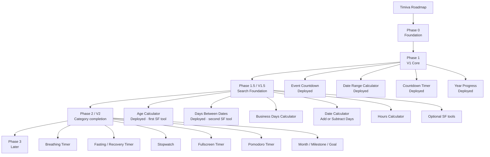

# Timiva V1 Roadmap

> Updated: 2026-07-13
> Main changes: Business Days Calculator moved ahead of Date Calculator in V1.5 development order；Days Between Dates / Age Calculator remain deployed；V1.5 remains Search Foundation／搜尋鋪路期。

---

## 1. V1 goal

Timiva V1 should establish:

```text
A clear bilingual product foundation
Three accepted V2 tool baselines
A fourth Life Progress representative
Consistent Header / Footer / Layout
Mobile portrait / landscape quality
SEO / FAQ support without becoming a traditional tool portal
```

Success criteria:

```text
1. Users understand each tool within seconds.
2. Mobile portrait and landscape remain stable.
3. Each tool feels like a small app / widget.
4. SEO supports rather than overwhelms the tool.
5. The site remains low-maintenance and pure-frontend first.
```

---

## 2. Roadmap flow



---

## 3. Current completed foundation

```text
Astro + Tailwind
EN / ZH route structure
Home / All Tools / Tool / Legal page types
Header / Footer / BaseLayout baseline
V2 tool result / drawer / overlay baselines
Task brief / validation report workflow
Four-Agent review model
Owner approval gates
Post-tool Link Integration Gate
```

---

## 4. Phase 1 — V1 core tools（deployed）

| Order | Tool | Category | Current status |
|---:|---|---|---|
| 1 | Event Countdown | Important Dates | Deployed · production baseline |
| 2 | Date Range Calculator | Important Dates | Deployed · production baseline |
| 3 | Countdown Timer | Timers & Focus | Deployed · site-integrated |
| 4 | Year Progress | Life Progress | Deployed · site-integrated |

Phase 1 covers:

```text
Important Dates
Timers & Focus
Life Progress
```

四大分類仍完整保留。Daily Rhythm 的完整工具線補齊延後至 V2，不在 V1.5 前段優先開發。

---

## 5. Year Progress status（deployed）

```text
Product specification: Complete
Implementation: Complete
Link integration: Complete
Production: Deployed on timiva.app
```

---

## 5.1 Age Calculator — V1.5 first Search Foundation tool（deployed）

| Item | Status |
|---|---|
| Order | **5** — Timiva fifth tool · V1.5 first Search Foundation tool |
| Category | Important Dates / 重要日子 |
| Routes | `/en/age-calculator/`, `/zh/age-calculator/` |
| Product specification | Complete |
| Implementation | Complete · V1.5 standalone + link integration |
| Production | Deployed on timiva.app |
| Deployed HEAD | `f48df91` feat: integrate Age Calculator links |

Canonical spec: [`docs/tools/age-calculator/product-spec.md`](../tools/age-calculator/product-spec.md)

---

## 5.2 Days Between Dates — V1.5 second Search Foundation tool（deployed）

| Item | Status |
|---|---|
| Order | **6** — Timiva sixth tool · V1.5 second Search Foundation tool |
| Category | Important Dates / 重要日子 |
| Routes | `/en/days-between-dates/`, `/zh/days-between-dates/` |
| Product specification | Complete |
| Implementation | Complete · V1.5 standalone + link integration |
| Production | Deployed on timiva.app |
| Standalone commit | `69ba30b` feat: add Days Between Dates standalone tool |
| Deployed HEAD | `18a262c` feat: integrate Days Between Dates links |
| B7 Production Verification | PASS · No blocking issues found |

Canonical spec: [`docs/tools/days-between-dates/product-spec.md`](../tools/days-between-dates/product-spec.md)

---

## 6. Phase 1.5 / V1.5 — Search Foundation／搜尋鋪路期

V1.5 重新定義為 **Search Foundation**：優先開發高搜尋意圖、低維護的日期與時間工具，先建立自然搜尋入口。

這是**開發優先順序策略**，不是分類變更。Timiva 四大分類不變。

| Order | Tool | Category | Notes |
|---:|---|---|---|
| 5 | Age Calculator | Important Dates | **已完成 · 已上線** · first Search Foundation tool |
| 6 | Days Between Dates | Important Dates | **已完成 · 已上線** · second Search Foundation tool |
| 7 | Business Days Calculator | Important Dates | **下一支開發工具** · MVP：排除週末即可；不做國定假日資料庫 |
| 8 | Date Calculator / Add or Subtract Days | Important Dates | 高搜尋日期加減 · 接續 Business Days 之後 |
| 9 | Hours Calculator | Important Dates / time utility | 高搜尋時數計算 |
| 10 | Lunar Date Converter | Important Dates | Optional · zh-Hant opportunity；不做農民曆／宜忌／吉日 |
| 11 | Pet Age Calculator | Important Dates | Optional · emotional age-conversion；不做健康／醫療建議 |
| 12 | Japanese Era Converter | Important Dates | Optional · 現代年號換算；不做大型歷史年號資料庫 |

V1.5 發布節奏：

```text
單工具開發 → 單工具驗收 → Post-tool Link Integration Gate
→ Link QA → Owner 確認後 deploy
工具頁完成 ≠ 可直接上線
```

---

## 7. Phase 2 / V2 — Category completion and brand differentiation

補齊四大分類與品牌差異化（含 Daily Rhythm）：

| Order | Tool | Category | Purpose |
|---:|---|---|---|
| 13 | Breathing Timer | Daily Rhythm | Calm rhythm / rest use case |
| 14 | Fasting / Recovery Timer | Daily Rhythm | Time tracking only; no health advice |
| 15 | Stopwatch | Timers & Focus | Complete basic timer line |
| 16 | Fullscreen Timer | Timers & Focus | Large low-distraction display |
| 17 | Pomodoro Timer | Timers & Focus | Common focus cycle use case |
| 18 | Month Progress | Life Progress | Shorter-term time awareness |
| 19 | Milestone Progress (working name) | Life Progress | Single-milestone progress |
| 20 | Goal Countdown | Life Progress | Distance to a goal deadline |
| 21 | Circadian Energy Planner | Daily Rhythm | Differentiation with careful health boundary |

---

## 8. Phase 3 — Later

```text
Birthday Countdown
Holiday Countdown
Anniversary Countdown
Break Timer
Focus Flow Timer
Habit Streak Counter
Interval Timer
Meeting Timer
Life Timeline
```

Rules:

```text
Do not create a high-maintenance holiday database early.
Do not turn goals or habits into a large productivity platform.
Do not depend on background notifications or sync early.
```

---

## 9. V1 completion standard

Each V1 / V1.5 tool needs:

```text
Tool core experience
Mobile portrait
Mobile landscape
Desktop
EN / ZH
Related Tools
FAQ
FAQ JSON-LD
Metadata / canonical / hreflang
ToolAdSlot disabled
Build pass
Agent Reviews
Owner real-device approval
Standalone-tool commit
Post-tool Link Integration
Link QA and integration commit
Owner-confirmed deploy
```

---

## 10. V1 release status

```text
V1 four tools + Year Progress: deployed on timiva.app
Age Calculator (V1.5 first Search Foundation tool): deployed on timiva.app
Days Between Dates (V1.5 second Search Foundation tool): deployed on timiva.app
V1 SEO technical closeout: complete
```

Post–Year Progress optional follow-up:

```text
Year Progress HTTPS Share verification（non-blocking）
```

No further push or deploy occurs without Owner approval.

---

## 11. Deferred scope

```text
Live AdSense
Member system
Backend / database
Cloud sync
Social features
Large programmatic SEO
Complex reports
Push backend
PWA until core tool release timing is confirmed
國定假日完整資料庫
農民曆 / 宜忌 / 吉日 / 沖煞
健康 / 醫療 / 照護建議
大型歷史年號資料庫
```

---

## 12. Current next action

```text
V1.5 Search Foundation 下一工具：Business Days Calculator（Timiva 第七個工具）。
接續：Date Calculator / Add or Subtract Days → Hours Calculator
（Lunar / Pet Age / Japanese Era 為 optional）
```
