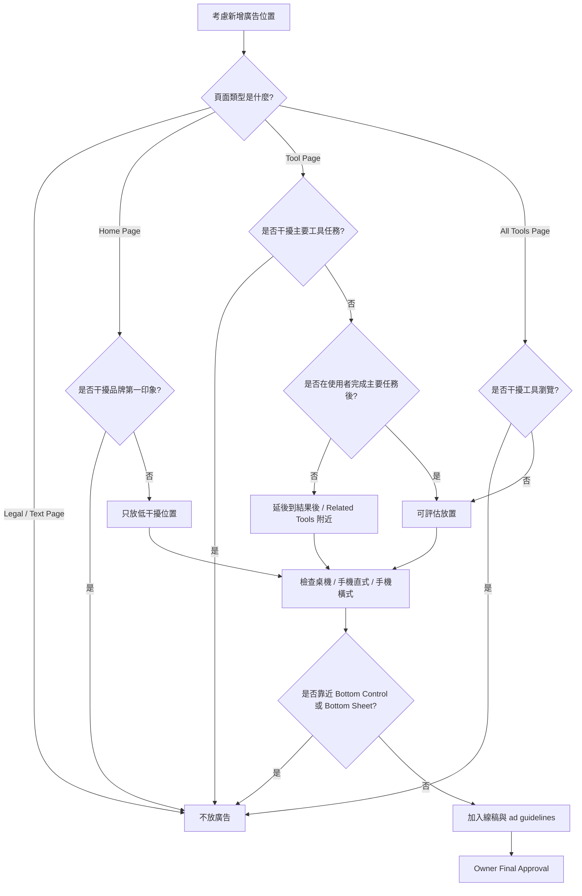

# Timiva Ad Layout Guidelines V1

## 文件目的

本文件定義 Timiva 廣告版位、廣告體驗、裝置差異與禁止事項。

Timiva 未來可以使用 Google AdSense 變現，但廣告不應破壞工具體驗、品牌感與手機操作。

---

## 1. 廣告核心原則

Timiva 的廣告原則：

```text
不干擾主要操作
不遮住主結果
不破壞 App 感
不造成誤觸
手機版與桌機版可以有不同廣告位置
優先放在使用者完成主要任務之後
```

Timiva 不應為了廣告，把工具頁變成傳統工具站。

---

## 2. 廣告決策流程圖



---

## 3. 廣告不得放的位置

廣告不得放在：

```text
主結果上方
主要輸入區中間
Bottom Sheet 內
固定底部操作列附近
會造成誤觸的位置
工具操作流程中間
手機鍵盤可能遮擋的位置
```

原因：

```text
這些位置會破壞工具體驗、降低信任感，並讓 Timiva 看起來像傳統工具站。
```

---

## 4. 廣告較適合的位置

廣告較適合放在：

```text
使用者完成主要任務之後
結果區下方
Related Tools 附近
FAQ / SEO 區塊前後
頁面底部內容區
```

原則：

```text
先讓使用者完成任務，再出現廣告。
```

---

## 5. 頁面類型規則

### 5.1 Home Page

首頁是 Timiva 的第一印象。

首頁前期不建議放廣告。

若後期要放，應符合：

```text
不干擾 hero
不干擾主要工具卡片
不破壞品牌感
不放在第一屏最上方
```

---

### 5.2 Tool Page

工具頁是最可能放廣告的頁型，但要最小心。

推薦順序：

```text
1. 結果區下方
2. Related Tools 附近
3. FAQ / SEO 區塊前後
4. 頁面底部內容區
```

不推薦：

```text
工具主結果上方
輸入區中間
Bottom Sheet 內
Bottom Control 附近
```

---

### 5.3 All Tools Page

全部工具頁可以放低干擾廣告。

適合位置：

```text
工具分類區塊之間
工具列表後方
頁面底部內容區
```

不適合：

```text
第一個工具分類上方
工具卡片中偽裝成工具
影響工具瀏覽的位置
```

---

### 5.4 Legal / Text Page

純文字頁不放廣告。

包含：

```text
Privacy Policy
Terms of Use
Contact
```

原因：

```text
純文字頁主要用途是信任、法務與聯絡，不應混入廣告。
```

---

## 6. 裝置規則

### 6.1 桌機版

桌機版可以考慮：

```text
主內容下方廣告
Related Tools 附近廣告
右側欄廣告
FAQ 區塊前後廣告
```

右側欄廣告注意：

```text
不能壓縮主工具
不能讓工具變成傳統雙欄工具站
不能搶主結果焦點
```

---

### 6.2 手機直式

手機直式廣告應更保守。

適合：

```text
結果區下方
Related Tools 下方
FAQ 前後
頁面底部
```

不適合：

```text
第一屏主結果上方
輸入區中間
Bottom Control 附近
Bottom Sheet 內
```

---

### 6.3 手機橫式

手機橫式空間較短，廣告應延後或隱藏。

原則：

```text
不在主工具第一屏放廣告
不靠近 Bottom Control
不壓縮主結果
必要時延後到內容下方
```

---

## 7. 廣告容器視覺規則

廣告容器應：

```text
清楚標示 Ad / Sponsored
與內容有適當間距
視覺低干擾
不偽裝成工具卡片
不使用過度醒目的背景
```

廣告容器不應：

```text
像主要 CTA
像工具結果
像 Related Tool
像系統通知
```

---

## 8. 廣告與 SEO 的關係

SEO 區塊可以與廣告接近，但仍要保持可讀性。

適合順序：

```text
Tool App
Result
Related Tools
Ad
FAQ / SEO Content
Footer
```

或：

```text
Tool App
Result
Related Tools
FAQ
Ad
Footer
```

不要：

```text
Tool App
Ad
Result
FAQ
Footer
```

---

## 9. 廣告與 Related Tools 的關係

Related Tools 是產品探索，廣告是變現。

兩者不可混淆。

規則：

```text
Related Tools 不應長得像廣告
廣告不應偽裝成 Related Tools
兩者之間要有明確區隔
```

---

## 10. 廣告加入前檢查清單

加入廣告前，先確認：

```text
頁面類型已確認
裝置位置已確認
不在主結果上方
不在輸入區中間
不在 Bottom Sheet
不靠近 Bottom Control
不造成誤觸
不破壞品牌感
不讓工具變成傳統工具站
線稿已標示
Owner 已確認
```

---

## 11. 廣告加入後 QA

加入廣告後，必須檢查：

```text
手機直式是否仍可順暢操作
手機橫式是否沒有被壓縮
桌機主工具是否仍是焦點
Footer 是否沒有被推擠得怪異
FAQ 是否仍可閱讀
Related Tools 是否仍清楚
工具主流程是否沒有被打斷
```

---

## 12. 結論

Timiva 可以加入廣告，但廣告必須服從產品體驗。

原則是：

```text
工具先完成任務
使用者先得到結果
廣告再自然出現
```

如果廣告位置會破壞手機操作、主結果可讀性或 Widget-like 品牌感，就不要放。
