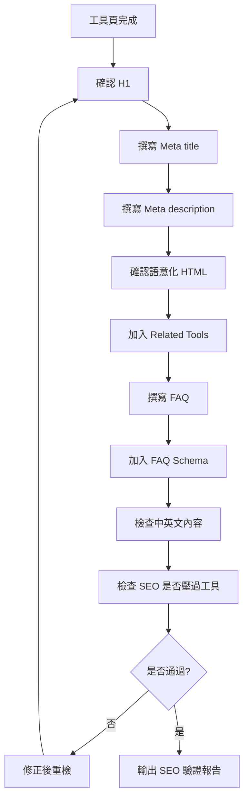

# Timiva SEO AEO AI Search Guidelines V2

## 文件目的

本文件定義 Timiva 的 SEO、AEO、AI Search、FAQ Schema、內部連結與內容規範。

Timiva 需要搜尋流量，但 SEO 不能破壞 App-like 工具體驗。

本文件是 `agents/skills/seo-aeo-tool-page-skill.md` 與 `agents/skills/content-growth-review-skill.md` 的正式規範來源。

---

## 1. 核心原則

Timiva 的 SEO 原則：

```text
工具體驗在前
SEO 補充在後
FAQ 解答真問題
不要堆關鍵字
不要讓頁面變成傳統工具站
```

頁面優先順序：

```text
1. App 感工具主體
2. 結果區 / 狀態區
3. Related Tools
4. FAQ / SEO Content
5. Footer
```

---

## 2. SEO / AEO 流程圖



---

## 3. 工具頁必備 SEO 項目

每個工具頁至少包含：

```text
H1
短描述
Meta title
Meta description
主要工具區
Related Tools
FAQ
FAQ Schema / JSON-LD
語意化 HTML
正確語系路由
```

---

## 4. H1 原則

H1 應：

```text
清楚說明工具名稱
與工具用途一致
自然可讀
不要堆關鍵字
不要過長
```

範例：

```text
Event Countdown
Date Range Calculator
Countdown Timer
Life Progress Bar
```

---

## 5. Meta Title 原則

Meta title 應：

```text
包含工具名稱
簡短描述用途
必要時加 Timiva
自然可讀
```

範例：

```text
Event Countdown | Timiva
Date Range Calculator | Timiva
Countdown Timer | Timiva
Life Progress Bar | Timiva
```

---

## 6. Meta Description 原則

Meta description 應：

```text
說明工具能幫使用者完成什麼
包含自然語言搜尋意圖
保持簡短
不要關鍵字堆疊
不要過度行銷
```

範例方向：

```text
Create a simple countdown for an important date and see how much time is left.
```

---

## 7. 語意化 HTML 原則

SEO / AEO 需要語意化 HTML 支援。

應使用：

```html
<header>
<main>
<section>
<article>
<nav>
<footer>
```

工具頁內容應有合理 heading 結構：

```text
H1 = 工具名稱
H2 = How to use / FAQ / Related tools
H3 = FAQ questions or sub-sections
```

不要整頁都用 div。

---

## 8. FAQ 原則

每個工具頁建議 3 到 6 題 FAQ。

FAQ 應回答真問題，例如：

```text
What is this tool for?
How do I use it?
How is the result calculated?
Does this tool save my data?
Can I use it on mobile?
What is the difference between this and another related tool?
```

FAQ 不應：

```text
堆關鍵字
回答頁面沒有的功能
寫成長篇行銷文
放在主工具之前
```

---

## 9. FAQ Schema 原則

FAQ Schema 必須：

```text
與頁面實際 FAQ 一致
不包含頁面沒有顯示的問題
JSON-LD 格式正確
中英文頁面各自使用對應語言
```

如果 FAQ 更新，FAQ Schema 也必須同步更新。

---

## 10. Related Tools 原則

Related Tools 是 Timiva 的內部連結核心。

數量與產品規則（現行 canonical）：

```text
最多 3 個
不要求一定滿 3 個
只有 1–2 個真正相關工具時就維持較少數量
不為湊滿而加入低相關推薦
優先最接近使用者意圖
SEO 需求不得凌駕產品相關性
```

產品細節以 [`docs/workflow/new-tool-development.md`](../workflow/new-tool-development.md) §12 為準；本節只保留 SEO／內部連結責任摘要。

原則：

```text
優先推薦同分類工具
再推薦互補使用情境
不要每頁都推薦完全一樣的工具
不要推薦過多
不要放在主工具上方
```

範例：

```text
Event Countdown → Date Range Calculator / Birthday Countdown / Age Calculator
Date Range Calculator → Days Between Dates / Add or Subtract Days / Age Calculator
Countdown Timer → Stopwatch / Pomodoro Timer / Fullscreen Timer
Life Progress Bar → Year Progress / Month Progress / Goal Countdown
```

---

## 11. All Tools Page SEO 原則

All Tools Page 應使用正式分類：

```text
Important Dates
Timers & Focus
Daily Rhythm
Life Progress
```

每個分類應包含：

```text
分類名稱
一句話分類說明
工具卡片
Available / Coming Soon 狀態
簡短用途
```

All Tools Page 不應變成傳統工具大全。

---

## 12. 多語系 SEO 原則

Timiva 目前主要支援：

```text
/en/
/zh/
```

原則：

```text
英文頁使用英文內容
繁中頁使用繁中內容
不要中英文混雜
工具名稱可保留英文，但描述應符合頁面語言
Meta title / description 各語系分開撰寫
FAQ 各語系分開撰寫
```

根目錄：

```text
/ → /en/
```

---

## 13. AI Search 友善內容原則

AI Search 友善內容應：

```text
清楚說明工具用途
使用自然問題與簡短答案
避免過度抽象
避免純行銷文
FAQ 結構清楚
使用語意化 HTML
```

適合格式：

```text
What this tool does
How to use it
How the result is calculated
Data / privacy note
Related tools
FAQ
```

---

## 14. Programmatic SEO 原則

Programmatic SEO 可以做，但不應早期大量生成低品質頁面。

可以做：

```text
少量高品質模板
高搜尋意圖頁
低維護資料頁
不需要頻繁更新的頁面
```

暫緩：

```text
大量城市組合頁
大量節日資料頁
需要持續維護的國家資料庫
低品質關鍵字堆疊頁
```

Programmatic SEO 必須符合：

```text
內容有真實用途
頁面不是只為搜尋而存在
工具體驗仍是主體
```

---

## 15. 廣告與 SEO 的關係

SEO 區塊可以與廣告接近，但不能被廣告破壞閱讀節奏。

適合順序：

```text
Tool App
Result
Related Tools
Ad
FAQ / SEO Content
Footer
```

或：

```text
Tool App
Result
Related Tools
FAQ
Ad
Footer
```

不要：

```text
Tool App
Ad
Result
FAQ
Footer
```

---

## 16. SEO Block 條件

以下情況應 Block：

```text
H1 缺失
Meta title 缺失
Meta description 缺失
FAQ 與工具功能不一致
FAQ Schema 錯誤
中英文混雜
SEO 區塊放在主工具上方
Related Tools 連結錯誤
關鍵字堆疊
內容讓頁面像傳統工具站
```

---

## 17. SEO 驗證報告格式

```text
# Timiva SEO Validation Report

Tool:
Language:
Date:

## Result
Pass / Pass with minor notes / Block

## Checks
| Item | Result | Notes |
|---|---|---|
| H1 | Pass / Block | |
| Meta title | Pass / Block | |
| Meta description | Pass / Block | |
| Semantic HTML | Pass / Block | |
| Related Tools | Pass / Block | |
| FAQ | Pass / Block | |
| FAQ Schema | Pass / Block | |
| Language consistency | Pass / Block | |
| AI Search clarity | Pass / Block | |

## Required fixes
- ...

## Minor notes
- ...

## Owner attention
- ...
```

---

## 18. 結論

Timiva 的 SEO 目標不是把頁面做成文章，而是讓工具：

```text
能被搜尋
能被理解
能被 AI 摘要引用
能自然引導到其他工具
但仍然保持 App-like 的主要體驗
```

SEO 是輔助，不是主角。
