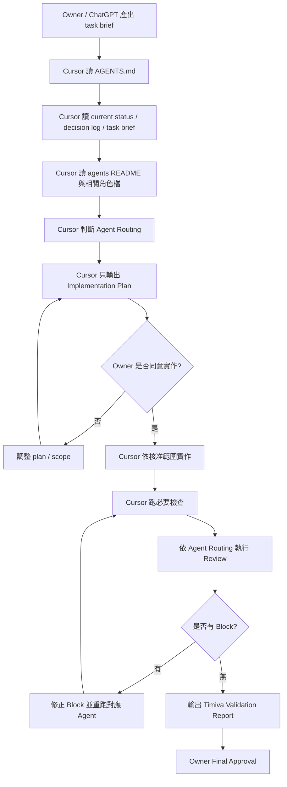

# Timiva Agent Review Workflow V1

## 文件目的

本文件把 Timiva 既有 4 個 Cursor 代理人正式融入日常工作流。

它用來回答：

```text
什麼時候要用哪個代理人？
Cursor 在計畫階段要怎麼判斷？
完成後的驗證報告要怎麼整合四代理人？
代理人意見衝突時怎麼處理？
```

> 根目錄 `AGENTS.md` 是 Cursor 的任務入口。  
> `agents/README.md` 與 `agents/*.md` 是角色定義。  
> 舊版 monolithic agents 文件已封存到 `docs/archive/legacy-agents-v1.md`，不可放回根目錄覆蓋新版入口。

---

## 1. Four-Agent model

Timiva 使用 4 個固定代理人：

| Agent | 中文角色 | 核心責任 | 守住的問題 |
|---|---|---|---|
| Experience Lead | UI/UX 體驗長 | 手機操作、觸控目標、使用流程、減法設計 | 使用者能不能直覺完成任務 |
| Brand Guardian | 視覺風格官 | 視覺一致性、Widget-like 品牌感、樣式漂移 | 畫面是否像 Timiva |
| Tech Architect | 技術架構師 | Astro、Tailwind、語意化 HTML、JS 穩定、低維護 | 程式是否穩定低維護 |
| Growth Strategist | SEO 與增長駭客 | SEO、AEO、FAQ Schema、Related Tools、內部連結 | 工具是否能被搜尋與理解 |

角色檔位置：

```text
agents/README.md
agents/experience-lead.md
agents/brand-guardian.md
agents/tech-architect.md
agents/growth-strategist.md
```

---

## 2. Agent review flow



---

## 3. Plan-first Agent Routing

Cursor 在任何任務開始前，不只要列出檔案修改計畫，也要列出 Agent Routing。

固定格式：

```text
## Agent Routing

Experience Lead: Required / N/A
Reason:

Brand Guardian: Required / N/A
Reason:

Tech Architect: Required / N/A
Reason:

Growth Strategist: Required / N/A
Reason:
```

Default rule:

```text
If this task changes code, Tech Architect is usually Required.
If this task changes UI, layout, mobile behavior, or flow, Experience Lead and Brand Guardian are usually Required.
If this task changes SEO, FAQ, meta, internal links, content strategy, or ads, Growth Strategist is Required.
```

---

## 4. 哪些情境必須啟用哪些 Agent

### 4.1 UI / layout / visual tasks

必跑：

```text
Experience Lead
Brand Guardian
Tech Architect
```

視情況：

```text
Growth Strategist：如果影響 H1、FAQ、Related Tools、SEO content、內部連結
```

### 4.2 Tool page tasks

必跑：

```text
Experience Lead
Brand Guardian
Tech Architect
Growth Strategist
```

原因：工具頁通常同時影響手機體驗、視覺、程式與 SEO。

### 4.3 Legal / Text page content tasks

必跑：

```text
Tech Architect
Growth Strategist
```

視情況：

```text
Experience Lead：如果調整閱讀動線、手機版排版或 footer 距離
Brand Guardian：如果調整視覺樣式或 LegalTextLayout
```

### 4.4 Pre-deploy / final check tasks

必跑：

```text
Experience Lead
Brand Guardian
Tech Architect
Growth Strategist
```

### 4.5 Ads tasks

必跑：

```text
Experience Lead
Brand Guardian
Growth Strategist
Tech Architect
```

廣告任務必須同時檢查操作干擾、品牌感、內容節奏與技術穩定。

---

## 5. Block handling

任一 Agent 回傳 `Block` 時：

```text
1. 不得要求 Owner Final Approval
2. 不得 commit / deploy
3. 必須列出 Block 原因
4. 修正後只需重跑相關 Agent，但 Pre Deploy 任務建議全部重跑
```

Block 回報格式：

```text
Blocking Agent:
Block reason:
Affected files:
Required fix:
Retest needed:
Owner decision needed:
```

---

## 6. Agent conflict handling

若代理人意見衝突，依照 Timiva 最高決策順位裁決：

```text
1. 使用者能不能在手機上舒服完成主要任務
2. 是否符合 Timiva 的 Widget-like 品牌核心
3. 是否能低維護、穩定、純前端運作
4. 是否有 SEO / AEO / 搜尋流量價值
5. 是否不破壞未來廣告與變現空間
```

常見裁決：

| 衝突 | 裁決 |
|---|---|
| SEO 想加更多文字，但 UX 覺得干擾 | UX 優先，SEO 下移或收斂 |
| 視覺想加動畫，但 Tech 覺得高維護 | 低維護優先，改成輕量效果 |
| Tech 想用最簡表單，但 Brand 覺得太傳統 | 保留低維護，調整成 Timiva 元件風格 |
| 廣告想放高流量位置，但 UX 覺得干擾 | 不放，改放任務完成後 |

---

## 7. Validation report integration

完成後的 `Timiva Validation Report` 必須包含 Agent Review 表格：

```text
| Agent | Required? | Result | Notes |
|---|---|---|---|
| Experience Lead | Yes / No | Pass / Minor / Block / N/A | |
| Brand Guardian | Yes / No | Pass / Minor / Block / N/A | |
| Tech Architect | Yes / No | Pass / Minor / Block / N/A | |
| Growth Strategist | Yes / No | Pass / Minor / Block / N/A | |
```

若某 Agent 是 N/A，必須寫原因。

---

## 8. Owner Final Approval

目前 Timiva 採用 Phase A：Owner 主導確認期。

即使 4 個 Agents 都回傳 `Pass` 或 `Pass with minor notes`，Cursor 仍必須整理 Owner Final Approval Summary。

在 Owner 明確確認前，不得進入：

```text
commit
deploy
重大結構調整
locked components 修改
```
