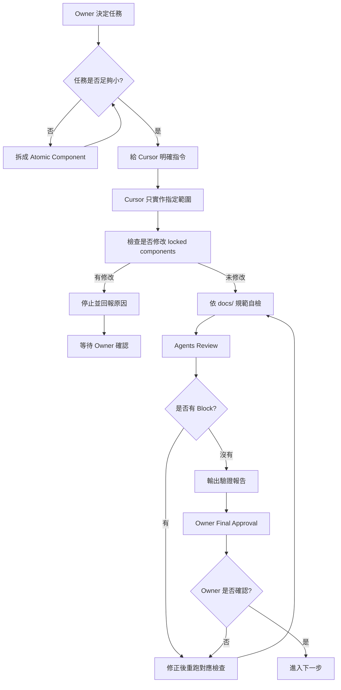

# Timiva CEO Workflow V1

## 文件目的

本文件定義 Timiva 的開發心法與最小任務流程。

Timiva 採用 CEO Workflow 的目的，是避免 Cursor 一次改太多、一次做整站、一次重寫共用版型，導致產品方向、視覺、技術與 SEO 失控。

本文件適用於：

```text
新增元件
新增頁面
新增工具
修改 layout
修改 Tailwind
補 SEO / FAQ
加入廣告版位
進行 QA 修正
```

---

## 1. CEO Workflow 核心概念

Timiva 的開發方式是：

```text
Owner 拆小任務
Cursor 做單一 Atomic Component
Agents 負責審查
Skills 負責固定檢查
Cursor 輸出驗證報告
Owner 前期最終確認
```

核心原則：

```text
不要叫 AI 寫整站
不要叫 AI 一次完成完整工具
不要叫 AI 一次大改所有 layout
每次只要求它完成一個最小化元件或明確範圍
```

---

## 2. CEO Workflow 流程圖



---

## 3. Atomic Component 定義

Atomic Component 是 Timiva 開發時的最小任務單位。

可以是：

```text
Header
Footer
Tool Hero
Tool Result Card
Input Panel
Control Buttons
Mobile Bottom Control
Bottom Sheet
Related Tools
FAQ Section
Ad Container
Language Switcher
Tool Card
Category Section
```

不應是：

```text
整個首頁
整個工具頁
整個網站
全部 RWD
全部 SEO
全部廣告系統
```

---

## 4. 任務大小判斷

### 4.1 適合交給 Cursor 的任務

```text
新增一個 Tool Result Card
新增一個 Related Tools 元件
調整 Header 手機版
新增一個 FAQ Section
補一個工具的 meta title / description
修正一個手機橫式跑版問題
建立一個 Ad Container placeholder
```

### 4.2 不適合直接交給 Cursor 的任務

```text
幫我做完整首頁
幫我做完整工具頁
幫我做完所有 RWD
幫我把整站 SEO 做好
幫我重新設計全部 layout
幫我加入所有廣告
```

如果任務太大，Cursor 應先要求拆小，不應直接執行。

---

## 5. Locked Components 規則

以下元件完成並經 Owner 確認後，視為 locked components：

```text
Header
Footer
Base Layout
全站背景
共用容器
```

Locked components 規則：

```text
1. Cursor 不得自行修改 locked components
2. 若任務不需要修改 locked components，不得順手修改
3. 若 Cursor 認為必須修改，必須先回報原因
4. Owner 確認前不得修改 locked components
```

回報格式：

```text
我認為需要修改 locked component：

Component:
原因:
影響頁面:
替代方案:
是否需要回歸測試:
是否需要 Owner 確認:
```

---

## 6. Cursor 任務基本格式

每次給 Cursor 任務時，建議使用以下格式：

```text
請依照 Timiva CEO Workflow 執行。

本次任務：
[寫清楚任務]

範圍限制：
- 只處理 [指定範圍]
- 不修改 Header、Footer、Base Layout
- 不新增其他功能
- 不處理 SEO / FAQ，除非我要求

實作要求：
- 使用 Tailwind CSS
- 保持語意化 HTML
- 每個主要段落加中文註解
- RWD 以元件為單位分段：先桌機版，後手機版
- 優先使用既有 component
- 不使用 inline style
- 不使用 !important
- 不使用 CSS id selector

完成後：
- 檢查 docs/ 規範
- 回報修改檔案
- 回報是否影響共用元件
- 輸出驗證報告
- 等待 Owner 確認
```

---

## 7. Tailwind 實作規則

CEO Workflow 中所有 Tailwind 任務都必須遵守：

```text
Tailwind 負責樣式
HTML 負責語意
Component 負責重用
中文註解負責可讀性
RWD 負責裝置適配
```

禁止：

```text
inline style
!important
CSS id selector
任意 hard-code 顏色
每頁各自寫一套 layout
為了快速修正破壞共用元件
```

---

## 8. RWD 分段規則

RWD 必須以元件為單位分段書寫。

正確順序：

```text
Header
├── Header desktop
└── Header mobile

Tool
├── Tool desktop
└── Tool mobile

Footer
├── Footer desktop
└── Footer mobile
```

不要採用：

```text
全部 desktop 寫完
再把全部 mobile 集中寫在最後
```

---

## 9. Agents Review

完成任務後，Cursor 應依需要啟動 4 個 Agent 檢查：

```text
Experience Lead = 檢查使用流程與手機操作
Brand Guardian = 檢查視覺一致與樣式漂移
Tech Architect = 檢查技術正確與低維護
Growth Strategist = 檢查 SEO / AEO / 內容與內部連結
```

不是每次都需要完整 4 個 Agents 深度審查，但每次都應至少說明：

```text
本次任務涉及哪些 Agent 檢查
哪些 Agent 不適用
原因是什麼
```

---

## 10. 驗證報告規則

Cursor 完成後不能只說：

```text
已完成
```

必須輸出驗證報告。

基本格式：

```text
## Timiva Validation Report

### 1. 本次完成內容
- ...

### 2. 修改檔案
- ...

### 3. 是否修改 locked components
- 是 / 否
- 說明：

### 4. Docs 規範檢查
| 檢查項目 | 結果 | 備註 |
|---|---|---|
| Tailwind CSS | Pass / Block | |
| Semantic HTML | Pass / Block | |
| 中文註解 | Pass / Block | |
| RWD 分段 | Pass / Block | |
| No inline style | Pass / Block | |
| No !important | Pass / Block | |
| No CSS id selector | Pass / Block | |

### 5. Agents Review
| Agent | Result | Notes |
|---|---|---|
| Experience Lead | Pass / Minor / Block | |
| Brand Guardian | Pass / Minor / Block | |
| Tech Architect | Pass / Minor / Block | |
| Growth Strategist | Pass / Minor / Block / N/A | |

### 6. 仍需 Owner 確認
- ...
```

---

## 11. SEO 驗證報告規則

若任務涉及工具頁 SEO / FAQ / 內容，Cursor 必須補充 SEO 驗證。

不能只寫：

```text
FAQ 已加入，Meta 已優化。
```

必須寫清楚：

```text
SEO 檢查報告：
- H1：已確認 / 未處理
- Meta title：已加入 / 未處理
- Meta description：已加入 / 未處理
- FAQ：已加入幾題 / 未處理
- FAQ Schema：已加入 / 未處理
- Related Tools：已加入幾個 / 未處理
- 內部連結：已確認 / 未處理
- 未完成項目：
```

---

## 12. Owner Final Approval

目前 Timiva 採用 Phase A：Owner 主導確認期。

因此：

```text
Agents 通過不代表自動上線
Cursor 完成不代表可以 commit
驗證報告完成不代表可以 deploy
```

必須等 Owner 明確確認：

```text
確認，可以進入下一步
```

才可以進入下一步。

---

## 13. 結論

Timiva CEO Workflow 的重點是：

```text
任務要小
範圍要清楚
共用元件要鎖定
完成後要驗證
前期由 Owner 確認
```

這樣可以避免 Cursor 自由發揮，讓 Timiva 在產品、視覺、技術與 SEO 上保持一致。
