# Timiva Core Docs Index V1

## 文件目的

本文件整理 Timiva 新專案建置所需的核心文件架構。

Timiva 採用一套適合 Cursor、Agents、Skills 與 Owner 決策共同使用的文件系統，讓產品方向、設計規範、技術實作、SEO 成長與驗收流程保持一致。

本文件用來回答：

- Timiva 專案需要哪些核心文件
- 每份文件負責什麼
- Cursor 應該優先閱讀哪些文件
- 哪些文件屬於產品決策
- 哪些文件屬於設計規範
- 哪些文件屬於 AI 協作與驗收流程
- 哪些文件屬於開發、測試與部署檢查

---

## 1. Timiva 專案文件原則

Timiva 的文件不是為了堆疊規範，而是為了讓產品、設計、技術與內容策略在開發過程中保持一致。

所有文件都應該服務以下目標：

```text
1. 保持 Timiva 的產品核心
2. 避免開發過程中樣式漂移
3. 避免工具越做越像傳統工具站
4. 讓 Cursor 可以理解專案脈絡
5. 讓 Agents 能依照固定角色審查
6. 讓 Skills 能執行可重複流程
7. 讓 Owner 可以在前期保有最終確認權
```

Timiva 的核心方向是：

```text
少工具
高完成度
Mobile-first
Widget-like
低維護
SEO 不干擾 UX
品牌感明確
```

Timiva 不應該成為：

```text
傳統工具大全
資訊密集的 SEO 站
功能堆疊型產品
高維護 App
需要大量後端與資料庫的服務
```

---

## 2. 核心文件分層

Timiva 專案文件分成 5 層：

```text
1. Project Core Docs
2. Product Architecture Docs
3. Design System Docs
4. AI Collaboration Docs
5. Execution & Validation Docs
```

每一層都有不同目的：

```text
Project Core Docs = 定義 Timiva 是什麼
Product Architecture Docs = 定義工具分類與開發順序
Design System Docs = 定義畫面、元件、CSS 與線稿規則
AI Collaboration Docs = 定義 Agents、Skills 與決策流程
Execution & Validation Docs = 定義 SEO、QA、測試與部署檢查
```

---

## 3. 文件系統快速流程圖

```mermaid
flowchart TD
    A[Timiva Core Docs Index] --> B[Project Core Docs]
    A --> C[Product Architecture Docs]
    A --> D[Design System Docs]
    A --> E[AI Collaboration Docs]
    A --> F[Execution & Validation Docs]

    B --> B1[timiva-project-brief-v1.md]
    B --> B2[timiva-product-principles-v2.md]

    C --> C1[timiva-product-architecture-v3.md]
    C --> C2[timiva-v1-roadmap-v2.md]
    C --> C3[timiva-new-tool-development-rules-v2.md]

    D --> D1[timiva-layout-system-v2.md]
    D --> D2[timiva-design-system-v2.md]
    D --> D3[timiva-tailwind-css-guidelines-v2.md]
    D --> D4[timiva-wireframe-index-v1.md]
    D --> D5[timiva-ad-layout-guidelines-v1.md]

    E --> E1[AGENTS.md]
    E --> E2[experience-lead.md]
    E --> E3[brand-guardian.md]
    E --> E4[tech-architect.md]
    E --> E5[growth-strategist.md]
    E --> E6[timiva-decision-validation-flow-v1.md]
    E --> E7[timiva-ceo-workflow-v1.md]
    E --> E8[timiva-cursor-command-patterns-v1.md]

    F --> F1[timiva-tool-page-qa-checklist-v2.md]
    F --> F2[timiva-seo-aeo-ai-search-guidelines-v2.md]
    F --> F3[timiva-pre-deploy-checklist-v1.md]
```



---

## 4. Project Core Docs

Project Core Docs 是 Cursor 進入專案後最先要讀的文件。

這一層回答：

```text
Timiva 是什麼？
Timiva 要做成什麼樣子？
產品核心是什麼？
哪些事情不要做？
誰有最後決策權？
```

---

### 4.1 `docs/timiva-project-brief-v1.md`

用途：

```text
Timiva 專案總說明書
```

內容應包含：

```text
- 專案背景
- 網域與技術基礎
- 建置目標
- V1 目標
- 產品原則
- 不做項目
- Cursor 開發注意事項
```

此文件是 Cursor 開始任何任務前必讀文件。

---

### 4.2 `docs/timiva-product-principles-v2.md`

用途：

```text
Timiva 產品原則與判斷標準
```

內容應包含：

```text
- Timiva 不是傳統工具站
- 少工具，高完成度
- Mobile-first
- 像 iPhone Widget App
- 工具體驗優先於 SEO
- 低維護、純前端優先
- 不做會員、雲端同步、大型資料庫
- 不做健康診斷、AI 教練、複雜報表
```

此文件用來判斷所有功能、頁面、元件與內容是否符合 Timiva。

---

## 5. Product Architecture Docs

Product Architecture Docs 用來定義 Timiva 的工具分類、開發順序與功能邊界。

這一層回答：

```text
Timiva 有哪些工具？
工具分成哪些分類？
哪些工具先做？
哪些工具延後？
新增工具時怎麼判斷？
```

---

### 5.1 `docs/timiva-product-architecture-v3.md`

用途：

```text
Timiva 功能架構圖
```

內容應包含：

```text
- 四大分類
- 每個分類的定位
- 工具清單
- 優先順序
- Mermaid 功能架構圖
```

Timiva 正式採用情境化分類名稱：

```text
1. Important Dates
2. Timers & Focus
3. Daily Rhythm
4. Life Progress
```

中文對應：

```text
1. 重要日子
2. 計時與專注
3. 日常節奏
4. 人生進度
```

分類定位：

```text
Important Dates = 處理重要日期、事件倒數與日期計算
Timers & Focus = 處理正在進行的一段時間，例如計時、碼表與專注
Daily Rhythm = 處理每天的節奏、專注、休息、能量與恢復
Life Progress = 處理年度、月份、人生與目標的長期進度
```

正式文件、線稿、工具索引、首頁分類與相關工具區都應統一使用以上 4 個分類名稱。

不要再使用舊分類名稱，避免 Cursor 混用或產生錯誤命名。

---

### 5.2 `docs/timiva-v1-roadmap-v2.md`

用途：

```text
V1 到 V2 開發順序
```

內容應包含：

```text
- Phase 0：上線前基礎整理
- Phase 1：V1 核心工具
- Phase 2：V1.5 差異化工具
- Phase 3：V2 擴充工具
- Phase 4：後期延伸
- 暫緩項目
```

V1 核心工具建議為：

```text
1. Event Countdown
2. Date Range Calculator
3. Countdown Timer
4. Life Progress Bar
```

V1 的目的不是一次完成很多工具，而是先建立 Timiva 的核心體驗：

```text
重要日子的 SEO 基礎
倒數與計時的 App 感
長期進度的品牌差異化
手機優先的使用體驗
低維護的純前端架構
```

---

### 5.3 `docs/timiva-new-tool-development-rules-v2.md`

用途：

```text
新增工具開發規則
```

內容應包含：

```text
- 新工具是否符合 Timiva 核心
- MVP 定義原則
- 狀態設計
- LocalStorage 使用規則
- URL sharing 使用規則
- Related Tools 規則
- FAQ 規則
- 健康 / 身體節奏工具邊界
```

新增工具時必須先確認：

```text
1. 是否跟時間、日期、節奏、進度有關？
2. 使用者是否能在幾秒內理解用途？
3. 手機上是否能快速完成主要操作？
4. 是否可以純前端或低維護完成？
5. 是否能像一張高質感的小 App / Widget？
```

---

## 6. Design System Docs

Design System Docs 用來確保頁面、元件、線稿與 CSS 在開發過程中保持一致。

這一層回答：

```text
畫面怎麼排？
元件怎麼長？
手機直式怎麼處理？
手機橫式怎麼處理？
Tailwind 怎麼寫？
廣告如何不破壞畫面？
```

---

### 6.1 `docs/timiva-layout-system-v2.md`

用途：

```text
全站 layout 規範
```

內容應包含：

```text
- 全站頁型分類
- Header 規則
- Main 規則
- Footer 規則
- 首頁 layout
- 工具頁 layout
- 全部工具頁 layout
- 純文字頁 layout
- 手機直式規則
- 手機橫式規則
- 桌機版規則
```

全站頁型建議先分為：

```text
Home Page
Tool Page
All Tools Page
Legal / Text Page
```

---

### 6.2 `docs/timiva-design-system-v2.md`

用途：

```text
視覺設計規範
```

內容應包含：

```text
- 視覺風格
- 色彩方向
- Bento Grid / card-based layout
- 圓角
- 陰影
- 卡片
- 按鈕
- icon
- 工具結果數字
- 表單輸入
- Bottom sheet
- FAQ
- Related Tools
- 廣告容器視覺規則
```

視覺方向應保持：

```text
安靜
乾淨
柔和
App-like
Widget-like
不要資訊太密
不要像傳統工具站
```

---

### 6.3 `docs/timiva-tailwind-css-guidelines-v2.md`

用途：

```text
Tailwind CSS 實作規範
```

Timiva 採用 Tailwind CSS 作為主要樣式工具，但必須維持語意化 HTML、清楚中文區塊標註、元件化管理與分段式 RWD 寫法。

內容應包含：

```text
- 使用 Tailwind CSS 作為主要 styling 工具
- 保持 HTML 語意化，不因 Tailwind 而濫用 div
- 每個主要區塊都要有中文註解標註
- 可使用 @apply 整理重複出現的元件樣式
- 可使用 Tailwind theme tokens 管理色彩、間距、圓角、陰影
- 不使用 inline style
- 不使用 !important
- 不使用 CSS id selector
- 不讓每個頁面各寫一套 layout
- RWD 必須以元件為單位分段書寫
```

Tailwind 實作原則：

```text
Tailwind 負責樣式
HTML 負責語意
Component 負責重用
中文註解負責可讀性
RWD 負責裝置適配
```

RWD 書寫順序應採用元件分段：

```text
Header
├── Header desktop
└── Header mobile

Tool
├── Tool desktop
└── Tool mobile

Footer
├── Footer desktop
└── Footer mobile
```

不要採用：

```text
全部 desktop 寫完
再把全部 mobile 寫在後面
```

每個元件應先完成桌機版，再接著完成手機版，避免樣式分散、維護困難與 Cursor 修改時誤判。

---

### 6.4 `docs/timiva-wireframe-index-v1.md`

用途：

```text
線稿索引與標註規則
```

內容應包含：

```text
- 每張線稿對應頁面
- 桌機版 / 手機直式 / 手機橫式
- 哪些區塊是共用 layout
- 哪些區塊是廣告
- 哪些區塊不能改
- 哪些只是示意
```

建議線稿資料夾：

```text
docs/wireframes/
├── README.md
├── home-desktop.png
├── home-mobile-portrait.png
├── home-mobile-landscape.png
├── tool-desktop.png
├── tool-mobile-portrait.png
├── tool-mobile-landscape.png
├── all-tools-desktop.png
├── all-tools-mobile-portrait.png
├── legal-desktop.png
├── legal-mobile-portrait.png
└── ad-placement-reference.png
```

---

### 6.5 `docs/timiva-ad-layout-guidelines-v1.md`

用途：

```text
廣告版位與體驗規範
```

內容應包含：

```text
- 桌機工具頁廣告
- 手機直式廣告
- 手機橫式廣告
- 全部工具頁廣告
- 純文字頁不放廣告
- 廣告容器尺寸
- 廣告不能放的位置
```

廣告不得放在：

```text
- 主結果上方
- 主要輸入區中間
- Bottom sheet 內
- 固定底部操作列附近
- 容易造成誤觸的位置
```

廣告應優先放在：

```text
- 使用者完成主要任務之後
- 結果區下方
- 相關工具附近
- FAQ / SEO 區塊前後
- 頁面底部內容區
```

---

## 7. AI Collaboration Docs

AI Collaboration Docs 用來定義 Cursor、Agents、Skills 的工作方式。

這一層回答：

```text
有哪些代理人？
每個代理人負責什麼？
哪些任務用 Skills？
代理人意見衝突時怎麼處理？
什麼時候需要 Owner 確認？
Cursor 指令要怎麼下？
```

---

### 7.1 `AGENTS.md`

用途：

```text
代理人總覽
```

內容應包含：

```text
- 4 個核心代理人
- 每個代理人的職責
- 每個代理人的決策邊界
- 每個代理人應讀文件
- 每個代理人不能做什麼
```

4 個核心代理人為：

```text
1. Experience Lead
2. Brand Guardian
3. Tech Architect
4. Growth Strategist
```

---

### 7.2 `.agents/experience-lead.md`

用途：

```text
UI/UX 體驗長角色規範
```

負責：

```text
- 觸控目標
- 使用流程
- 頁面跳轉邏輯
- 減法設計
- 手機直式與橫式操作
- 避免使用者迷路
- 避免 SEO、廣告或 FAQ 干擾主要任務
```

守住的問題：

```text
使用者能不能在手機上直覺完成主要任務？
```

---

### 7.3 `.agents/brand-guardian.md`

用途：

```text
視覺風格官角色規範
```

負責：

```text
- 色系
- Bento Grid
- 整體 layout
- 元件一致性
- 樣式漂移檢查
- 廣告容器視覺適配
```

守住的問題：

```text
畫面是否像 Timiva？
是否維持安靜、乾淨、Widget-like 的品牌感？
```

---

### 7.4 `.agents/tech-architect.md`

用途：

```text
技術架構師角色規範
```

負責：

```text
- Astro component 重用
- HTML 語意化
- Tailwind theme tokens
- Tailwind component class / @apply
- JS 計算邏輯
- LocalStorage / URL sharing
- build 與回歸穩定
```

守住的問題：

```text
程式是否正確、乾淨、低維護？
是否避免改一頁壞三頁？
```

---

### 7.5 `.agents/growth-strategist.md`

用途：

```text
SEO 與增長駭客角色規範
```

負責：

```text
- Meta tags
- FAQ Schema
- AI Search 友善內容
- Related Tools
- 內部連結
- Programmatic SEO 機會
- 把工具轉化為搜尋流量
```

守住的問題：

```text
工具是否能被搜尋到、被理解，並長期累積流量？
```

---

### 7.6 `docs/timiva-decision-validation-flow-v1.md`

用途：

```text
決策驗證與 Owner 確認流程
```

內容應包含：

```text
- 4 角色驗證流程
- Pass / Pass with minor notes / Block
- 衝突裁決規則
- Owner Final Approval
- 前期 / 中期 / 後期決策權限
```

目前 Timiva 專案應採用：

```text
Phase A：Owner 主導確認期
```

也就是：

```text
代理人負責審查
Owner 負責最終確認
Owner 確認後才進入下一步
```

代理人全部通過不代表自動上線。

---

### 7.7 `docs/timiva-ceo-workflow-v1.md`

用途：

```text
Timiva 開發心法與最小任務流程
```

內容應包含：

```text
- 不叫 AI 寫整站
- 每次只完成一個 Atomic Component
- Cursor 必須檢查 docs/ 規範
- 完成後必須輸出驗證報告
- 前期必須等待 Owner 確認
```

核心流程：

```text
Owner 拆任務
↓
Cursor 做單一 Atomic Component
↓
Agents 依角色審查
↓
Skills 執行固定檢查
↓
Cursor 輸出驗證報告
↓
Owner 最終確認
↓
進入下一步
```

---

### 7.8 `docs/timiva-cursor-command-patterns-v1.md`

用途：

```text
Cursor 指令佈景主題
```

內容應包含：

```text
- Atomic Component 指令佈景主題
- 新增頁面骨架指令佈景主題
- 套用共用版型指令佈景主題
- Locked Components 指令佈景主題
- Tailwind 實作指令佈景主題
- RWD 分段書寫指令佈景主題
- SEO / FAQ 補強指令佈景主題
- 完成後驗證報告指令佈景主題
- Owner Final Approval 指令佈景主題
```

當 Header、Footer、Base Layout 完成後，應視為 locked components。

除非 Owner 明確要求，Cursor 不得修改：

```text
Header
Footer
Base Layout
全站背景
共用容器
```

---

### 7.9 `.agents/skills/`

用途：

```text
可重複執行的任務流程
```

建議 Skills：

```text
- user-flow-review-skill.md
- mobile-landscape-review-skill.md
- wireframe-to-layout-review-skill.md
- component-visual-review-skill.md
- css-cleanup-skill.md
- tool-page-qa-skill.md
- seo-aeo-tool-page-skill.md
- content-growth-review-skill.md
- ad-placement-review-skill.md
- pre-deploy-check-skill.md
```

Skills 是「怎麼執行」，Agents 是「誰負責判斷」。

---

## 8. Cursor Rules

Cursor Rules 用來定義所有任務都必須遵守的底層規則。

建議資料夾：

```text
.cursor/
└── rules/
    ├── timiva-core-principles.mdc
    ├── timiva-tailwind-rules.mdc
    ├── timiva-layout-rules.mdc
    ├── timiva-mobile-rules.mdc
    ├── timiva-seo-rules.mdc
    └── timiva-qa-rules.mdc
```

Rules 應包含：

```text
- 使用 Tailwind CSS
- 保持 HTML 語意化
- 每個主要區塊要有中文註解
- 可用 @apply 整理重複元件樣式
- 不使用 inline style
- 不使用 !important
- 不使用 CSS id selector
- RWD 必須依元件分段書寫
- 手機直式與橫式都要考慮
- 工具主體永遠優先於 SEO 區塊
- 純文字頁不放廣告
- Bottom sheet 不放廣告
- 修改共用元件後要回歸測試既有工具
- Owner 主導確認期不得自動 commit / deploy
```

---

## 9. Execution & Validation Docs

Execution & Validation Docs 用來確保完成後可以被檢查、部署與維護。

這一層回答：

```text
完成後怎麼檢查？
SEO 怎麼驗證？
手機橫式怎麼測？
Footer 有沒有一致？
可以 commit 嗎？
可以 deploy 嗎？
```

---

### 9.1 `docs/timiva-tool-page-qa-checklist-v2.md`

用途：

```text
工具頁 QA 檢查清單
```

內容應包含：

```text
- 基本功能測試
- 手機直式測試
- 手機橫式測試
- 桌機版測試
- Bottom sheet 測試
- FAQ 測試
- LocalStorage 測試
- Footer 測試
- 回歸測試既有工具
- commit 前最小檢查
```

手機橫式必須獨立測試，不能假設直式正常就代表橫式正常。

---

### 9.2 `docs/timiva-seo-aeo-ai-search-guidelines-v2.md`

用途：

```text
SEO / AEO / AI Search 規範
```

內容應包含：

```text
- H1 / title / description
- FAQ 原則
- FAQ Schema
- AI Search 內容格式
- 多語系 SEO
- Related Tools
- Programmatic SEO
- 廣告與 SEO 的關係
```

SEO 原則：

```text
工具體驗在前
SEO 補充在後
FAQ 解答真問題
不要堆關鍵字
不要讓頁面變成傳統工具站
```

---

### 9.3 `docs/timiva-pre-deploy-checklist-v1.md`

用途：

```text
部署前總檢查
```

內容應包含：

```text
- npm run build
- 首頁檢查
- 工具頁檢查
- 全部工具頁檢查
- Legal pages 檢查
- 中英文路由檢查
- Footer 檢查
- Console error 檢查
- 手機直式與橫式檢查
```

---

## 10. 建議資料夾結構

```text
timiva/
├── AGENTS.md
├── docs/
│   ├── timiva-core-docs-index-v1.md
│   ├── timiva-project-brief-v1.md
│   ├── timiva-product-principles-v2.md
│   ├── timiva-product-architecture-v3.md
│   ├── timiva-v1-roadmap-v2.md
│   ├── timiva-new-tool-development-rules-v2.md
│   ├── timiva-layout-system-v2.md
│   ├── timiva-design-system-v2.md
│   ├── timiva-tailwind-css-guidelines-v2.md
│   ├── timiva-wireframe-index-v1.md
│   ├── timiva-ad-layout-guidelines-v1.md
│   ├── timiva-decision-validation-flow-v1.md
│   ├── timiva-ceo-workflow-v1.md
│   ├── timiva-cursor-command-patterns-v1.md
│   ├── timiva-tool-page-qa-checklist-v2.md
│   ├── timiva-seo-aeo-ai-search-guidelines-v2.md
│   └── timiva-pre-deploy-checklist-v1.md
├── .agents/
│   ├── experience-lead.md
│   ├── brand-guardian.md
│   ├── tech-architect.md
│   ├── growth-strategist.md
│   └── skills/
│       ├── user-flow-review-skill.md
│       ├── mobile-landscape-review-skill.md
│       ├── wireframe-to-layout-review-skill.md
│       ├── component-visual-review-skill.md
│       ├── css-cleanup-skill.md
│       ├── tool-page-qa-skill.md
│       ├── seo-aeo-tool-page-skill.md
│       ├── content-growth-review-skill.md
│       ├── ad-placement-review-skill.md
│       └── pre-deploy-check-skill.md
└── .cursor/
    └── rules/
        ├── timiva-core-principles.mdc
        ├── timiva-tailwind-rules.mdc
        ├── timiva-layout-rules.mdc
        ├── timiva-mobile-rules.mdc
        ├── timiva-seo-rules.mdc
        └── timiva-qa-rules.mdc
```

---

## 11. Cursor 最優先閱讀順序

Cursor 在開始開發前，應先閱讀以下文件：

```text
1. docs/timiva-project-brief-v1.md
2. docs/timiva-product-principles-v2.md
3. docs/timiva-product-architecture-v3.md
4. docs/timiva-layout-system-v2.md
5. docs/timiva-design-system-v2.md
6. docs/timiva-tailwind-css-guidelines-v2.md
7. AGENTS.md
8. docs/timiva-decision-validation-flow-v1.md
9. docs/timiva-ceo-workflow-v1.md
10. docs/timiva-cursor-command-patterns-v1.md
```

如果是處理工具頁，還要閱讀：

```text
docs/timiva-new-tool-development-rules-v2.md
docs/timiva-tool-page-qa-checklist-v2.md
docs/timiva-seo-aeo-ai-search-guidelines-v2.md
```

如果是處理線稿，還要閱讀：

```text
docs/timiva-wireframe-index-v1.md
```

如果是處理廣告，還要閱讀：

```text
docs/timiva-ad-layout-guidelines-v1.md
```

---

## 12. 目前專案階段

Timiva 目前應視為：

```text
Phase A：Owner 主導確認期
```

也就是：

```text
1. Agents 可以審查
2. Skills 可以輔助執行
3. Cursor 可以整理建議
4. 但最終是否進入實作、commit、deploy，必須由 Owner 確認
```

代理人全部通過不代表自動上線。

流程應為：

```text
Agents Review
↓
Owner Final Approval Summary
↓
Owner 確認
↓
Implementation / Commit / Deploy
```

---

## 13. 文件維護原則

所有文件都應遵守：

```text
1. 保持簡潔，不寫過度抽象的理論
2. 優先寫 Cursor 可以執行的規則
3. 每份文件只負責一個主要目的
4. 不重複貼大量相同內容
5. 重要原則可以交叉引用
6. 當 UI 與實作穩定後，再補精準數值
```

文件命名原則：

```text
- 使用 timiva- 作為首碼
- 使用清楚的用途名稱
- 使用 v1 / v2 標示文件版本
- 不在檔名使用 rebuild / redo / old / legacy 等字眼
```

---

## 14. 建議優先完成文件

第一階段建議先完成以下 8 份核心文件：

```text
1. docs/timiva-project-brief-v1.md
2. docs/timiva-product-principles-v2.md
3. docs/timiva-product-architecture-v3.md
4. docs/timiva-layout-system-v2.md
5. docs/timiva-design-system-v2.md
6. docs/timiva-tailwind-css-guidelines-v2.md
7. AGENTS.md
8. docs/timiva-decision-validation-flow-v1.md
```

第二階段補上 AI 協作與指令文件：

```text
9. docs/timiva-ceo-workflow-v1.md
10. docs/timiva-cursor-command-patterns-v1.md
11. .agents/skills/
12. .cursor/rules/
```

第三階段補上執行與驗收文件：

```text
13. docs/timiva-wireframe-index-v1.md
14. docs/timiva-ad-layout-guidelines-v1.md
15. docs/timiva-tool-page-qa-checklist-v2.md
16. docs/timiva-seo-aeo-ai-search-guidelines-v2.md
17. docs/timiva-pre-deploy-checklist-v1.md
```

---

## 15. 結論

Timiva 的文件系統，不只是產品說明，而是整個 AI 協作與驗收流程的基礎。

這套文件的目標是讓 Timiva 在產品、設計、技術與流量策略上保持一致：

```text
產品上：少工具，高完成度
設計上：Mobile-first，Widget-like
技術上：Tailwind CSS、語意化 HTML、元件重用、低維護
內容上：SEO / AEO 輔助工具體驗
協作上：Agents 審查，Owner 前期最終確認
```

完成核心文件後，Cursor 才應開始進入正式開發。
