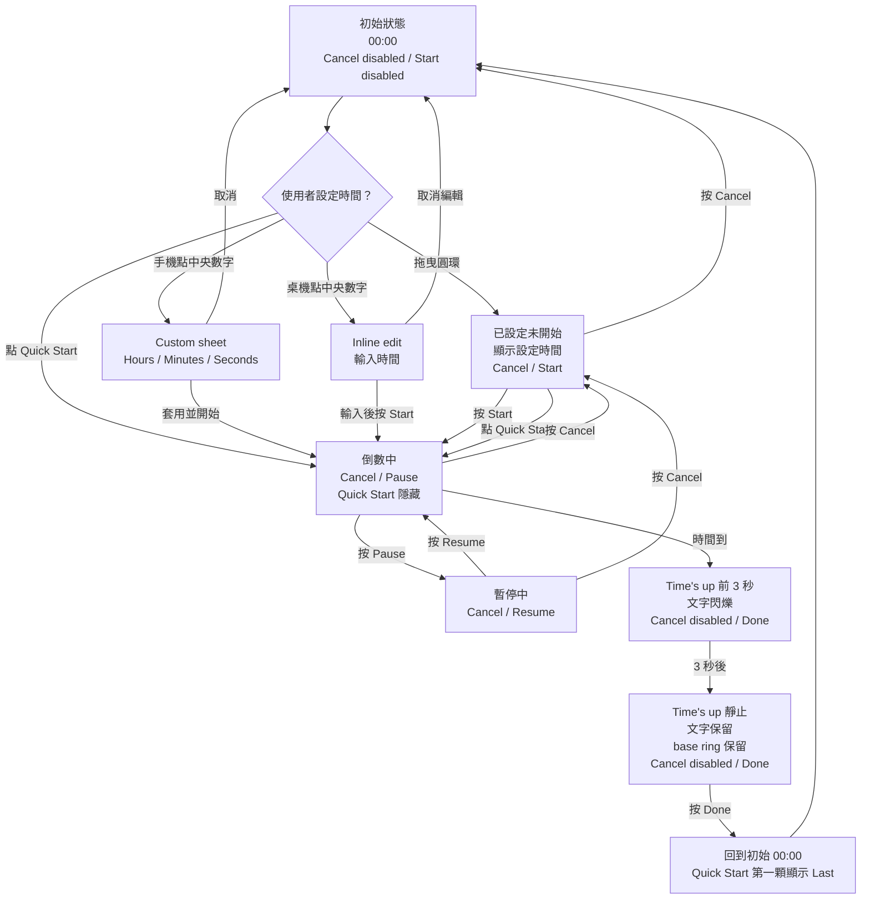

# Timiva Countdown Timer 產品規格草案

建立日期：2026-06-14
最後更新：2026-06-21
狀態：最終 accepted spec · Implementation complete · Owner real-device confirmed (2026-06-21) · Final QA PASS WITH NOTES · Not committed · Not deployed
適用工具：Timiva V1 第三個工具 — Countdown Timer / 倒數計時器

---

## 1. 工具定位

### 工具名稱

```text
EN：Countdown Timer
ZH：倒數計時器
```

### 工具目的

Countdown Timer 是 Timiva V1 的第三個工具，用於快速設定秒、分、小時的倒數時間。
它不是 Pomodoro、不是 Stopwatch，也不是 Fullscreen Timer。

核心體驗：

```text
快速開始常用時間
透過細圓環自訂時間
手機可點中央時間開啟自訂輸入 sheet
桌機可點中央時間直接 inline edit
畫面保持安靜、乾淨、第一屏可完成主要操作
```

---

## 2. V1 不做範圍

V1 不做：

```text
Pomodoro 模式
Stopwatch 秒錶
Fullscreen Timer
浮動小視窗 / mini timer / PiP
歷史紀錄列表
背景通知
鎖屏提醒
PWA / installable web app
進行中倒數重新整理後自動恢復
複雜音效設定
變速轉盤
```

PWA / Web App 可等四個 V1 工具完成後，再進入正式 launch 前討論。

---

## 3. 核心操作邏輯

### 3.1 Quick Start

Quick Start 是一鍵開始，不是快速設定，也不是累加時間。

按下任何 Quick Start 按鈕後，直接開始倒數。

時間選項：

```text
EN：Last 30s / 30s / 1m / 5m / 10m / 25m / 1h
ZH：上次 30秒 / 30秒 / 1分 / 5分 / 10分 / 25分 / 1小時
```

Last chip 顯示格式（prefix 與 duration 之間僅一個空格，不使用 `·` 或冒號）：

```text
EN：Last 30s / Last 1m 30s / Last 1h 40m 39s
ZH：上次 30秒 / 上次 1分30秒 / 上次 1小時40分39秒
```

規則：

```text
不使用 +30s、+1m 這種加號文案。
Quick Start 全部都是一鍵開始。
若沒有 Last duration，第一顆 Last 不顯示。
Last duration 只在使用者實際開始倒數後才更新。
完成後按 Done / 完成回到初始狀態，Last 顯示在 Quick Start 第一顆。
Countdown / Paused 時：Quick Start 與 Last 隱藏。
若要換另一個 preset：先 Cancel 回到 Ready → 再選擇新的 Quick Start。
```

---

## 4. 自訂時間邏輯

### 4.1 手機版

手機版點中央時間數字，開啟 Custom time bottom sheet。

Custom sheet 規格：

```text
不額外放小標題。
使用既有 Timiva 輸入格樣式。
三個輸入欄位：Hours / Minutes / Seconds。
Label 固定顯示，沿用其他工具風格。
不預設 focus。
使用者點哪一欄，就從哪一欄開始輸入。
欄位輸入完成後自動跳到下一欄。
按「套用並開始」後立即開始倒數。
Cancel 關閉 sheet，不套用。
「套用並開始」只出現在手機 bottom sheet。
```

輸入限制：

```text
Hours：0–9
Minutes：0–59
Seconds：0–59
全部為 0 時，「套用並開始」不可點
```

不顯示錯誤訊息，直接限制輸入。

### 4.2 Custom sheet 按鈕樣式

```text
Custom time bottom sheet 的 Cancel 使用純文字按鈕樣式，參考 Date Range Calculator sheet 裡的 Clear 按鈕。
「套用並開始」使用膠囊按鈕。
```

注意：這條只指 sheet 裡的 Cancel，不影響主畫面的 Cancel 控制按鈕。

### 4.3 桌機版

桌機版點中央時間數字，進入 inline edit。

輸入解析：

```text
30    → 00:30
100   → 01:00
130   → 01:30
1500  → 15:00
10000 → 1:00:00
```

桌機版不使用 Custom sheet，也不出現「套用並開始」。
桌機流程是：點中央數字編輯 → 按 Start 開始。

---

## 5. 時間顯示格式

主畫面中央時間不加「時 / 分 / 秒」單位。

顯示規則：

```text
低於 1 小時：MM:SS
1 小時以上：H:MM:SS
最大：9:59:59
```

範例：

```text
30 秒 → 00:30
15 分鐘 → 15:00
1 小時 → 1:00:00
9 小時 59 分 59 秒 → 9:59:59
```

1 小時以上時，中央數字可自動縮小，必須維持在圓環範圍內，不可超出圓軸。

單位只出現在 Custom sheet 的 Hours / Minutes / Seconds label，不出現在主畫面中央數字下方。

---

## 6. 圓環 / 轉盤規格

### 6.1 視覺方向

圓環是 Countdown Timer 的主視覺，但不能太粗壯。

```text
細線為主。
不做厚重 donut。
不做大面積發光。
軌道淡，進度稍微明顯。
整體像「時間軌道」，不是「控制面板」。
中央時間數字仍是視覺主角。
```

### 6.2 Desktop ring（非互動）

```text
Desktop 使用 48 根裝飾刻度 tick ring。
僅作 ready / progress / complete 狀態視覺。
不可拖曳、不可 tap 選分鐘、不可 snap、不使用 aria slider。
桌機自訂時間走 central inline edit，不走 ring interaction。
```

### 6.3 Mobile portrait ring（60-tick 互動）

```text
Mobile portrait 使用 60 根可見刻度；每根代表 1 分鐘（1–60）。
支援 tap 與 continuous drag；1-minute snap。
Pointer capture 綁在 ring hit area；僅 hit area 使用 touch-action: none。
Drag 不得帶動頁面捲動。
初始未操作：無 selection，中央 00:00，12 點保留 origin 提示線。
操作後：12 點位置 = 60 分；選到 60 分時 12 點 tick 成為 active main-length。
有 selection 且不是 60 分時，12 點 origin 退階為 major length。
Indicator 直接作用於既有 tick 線段；不使用圓點 handle；不使用額外 overlay radial line。
Selected / pressed tick 升級為 main-length；pressed 僅亮度 / stroke 略亮。
Cancel 回到本次原始 ring 選取；Done 清除 selection 並回 00:00。
Custom sheet 開啟或 countdown 進行中時 ring interaction 關閉。
```

### 6.4 Mobile landscape

```text
Mobile landscape 不顯示 ring、不啟用 ring interaction。
自訂時間僅能透過 central time 開啟 shared Custom sheet。
```

### 6.5 Progress ring

```text
Countdown / Paused：顯示 progress active ring。
Time's up / Done 後：僅保留淡淡 base ring。
```

### 6.6 Layout mode gating

```text
Desktop edit：min-width 768px 且非 mobile-landscape interaction mode。
Mobile landscape interaction：(orientation: landscape) and (max-height: 700px) and (max-width: 1200px) and (hover: none) and (pointer: coarse)。
Mobile portrait：其餘手機直式情境。
```

---

## 7. Sound toggle

### 7.1 預設狀態

提示音預設關閉，避免第一次使用時打擾使用者。

```text
第一次進入：Sound off / 關閉提示音
使用者點擊後：Sound on / 開啟提示音
```

可將使用者選擇儲存在 localStorage。

### 7.2 文案

```text
EN：Sound on / Sound off
ZH：開啟提示音 / 關閉提示音
```

文案表示目前狀態，不是點擊後的動作。

### 7.3 行為

```text
倒數中可以切換 Sound。
Time's up 時依當下 Sound 狀態決定是否播放聲音。
如果 Time's up 音效正在播放，使用者切成 Sound off，音效立即停止。
即使聲音關閉，Time's up 視覺提示仍然存在。
```

---

## 8. Time's up 完成狀態

倒數完成後中央顯示：

```text
EN：Time's up
ZH：時間到了
```

顯示規則：

```text
Time's up 顯示後約 4 秒 pulse，之後停止 pulse 但文字保留。
圓環進度消失。
不做整個圓環淡出。
只留下淡淡的 base ring。
Cancel 顯示但 disabled / 不可點。
原本 Pause / Resume 的右側主按鈕改成 Done / 完成。
不提供 Restart。
使用者必須按 Done / 完成回到初始 00:00 狀態。
```

完成後流程：

```text
倒數完成
→ Time's up 顯示
→ 約 4 秒 pulse，之後文字保留但不 pulse
→ Cancel disabled
→ 右側按鈕為 Done / 完成
→ 按 Done / 完成
→ 回到 00:00 初始狀態
→ Quick Start 第一顆顯示 Last duration
```

---

## 9. 按鈕狀態

### 9.1 初始狀態

```text
中央顯示：00:00
Cancel：disabled
Start：disabled
```

### 9.2 已設定未開始

```text
中央顯示：例如 15:00
Cancel：可點，回到 00:00
Start：可點，開始倒數
```

### 9.3 倒數中

```text
中央顯示：剩餘時間
Cancel：可點，回到本次原始設定時間，不自動開始
Pause：可點，暫停倒數
```

### 9.4 暫停中

```text
中央顯示：暫停時剩餘時間
Cancel：可點，回到本次原始設定時間，不自動開始
Resume：可點，繼續倒數
```

### 9.5 Time's up

```text
中央顯示：Time's up
Cancel：disabled
Done：可點，回到初始 00:00
```

---

## 10. 手機直式版面

手機直式第一屏排版：

```text
工具名稱

細圓環
  時間數字上方：Sound toggle（icon + 文案）
  中央：時間數字
  時間數字下方：微微閃爍底線

Quick Start 兩排置中

底部：
Cancel / Start 主控制按鈕
```

規則：

```text
第一屏必須不往下滑即可完成主要操作。
圓環大小可參考目前討論附圖的比例，但圓環本身更細、更輕。
Quick Start 距離圓環約 44px。
Quick Start 兩排置中，不強制補滿 8 顆。
手機直式 Quick Start 顯示。
手機主控制按鈕使用大圓角膠囊，可跟著文字長度變化。
手機主控制按鈕固定在第一屏底部操作區。
1 小時以上中央時間使用 h:mm:ss，視覺約為 short mm:ss 的 0.8×。
Quick Start 固定兩列；long Last 使用 3+4 排列，不得出现第三列。
Sheet open 主視覺約 90%；keyboard open 不二次縮放。
Start / Pause / Resume / Done 視覺層級高於 Cancel。
```

Quick Start 排列：

```text
[ 上次 15:00 ] [ 30秒 ] [ 1分 ] [ 5分 ]
[ 10分 ]      [ 25分 ] [ 1小時 ]
```

EN：

```text
[ Last 15:00 ] [ 30s ] [ 1m ] [ 5m ]
[ 10m ]        [ 25m ] [ 1h ]
```

---

## 11. 手機橫式版面

手機橫式是次要使用情境，優先避免擁擠與跑版。

版面方向：

```text
三欄配置

左欄：Cancel
中欄：中央時間（無 ring）
右欄：Start / Pause / Resume / Done
```

規則：

```text
隱藏 Quick Start、Sound UI、Last UI、ring。
點中央時間開啟 shared Custom time sheet（與 portrait 同一套 sheet）。
Keyboard closed：compact content-driven sheet 高度，避免大量空白。
Keyboard open：跟隨 visualViewport；H / M / S 與 Cancel / Apply and start 可見。
Sheet open 時中央時間微縮（約 0.9×）；keyboard open 不做二次縮放。
多語系主按鈕：content-driven width、white-space: nowrap、單行 capsule；不使用 locale 固定寬度。
Sound preference 與 Last 邏輯在背景仍生效，即使無 UI。
Desktop inline edit 在 landscape interaction mode 下不可用。
```

---

## 12. 桌機版面

桌機版主視覺與手機直式相近，但 ring 不可互動。

版面：

```text
工具名稱
Sound toggle
48-tick 裝飾 ring + 中央時間 + underline hint
Quick Start 一排置中
Cancel / Start 一般膠囊按鈕（主工具區附近，非置底）
```

規則：

```text
點中央時間進入 inline edit；不使用 Custom sheet。
Two-step Enter：第一次 Enter 套用編輯並 focus Start；第二次 Enter 才開始。
不使用 ring drag / handle / 00 overlay line。
Quick Start 為 one-tap start；active countdown 中不可直接切換 preset，需 Cancel 回 Ready。
```

---

## 13. 可編輯暗示

中央時間數字下方有淡淡的微閃底線，用來提示可編輯。

規則：

```text
Ready 狀態顯示 underline breathing hint。
Countdown / Paused / Time's up 隱藏 underline。
Ring 選取、inline edit、sheet、Quick Start 開始後依狀態更新。
倒數中、暫停中、Time's up 不顯示。
不使用 Tap to edit 文字提示。
```

減少動態時：

```text
底線不閃爍，只淡淡顯示。
```

---

## 14. 背景 / 重新整理 / localStorage

### 14.1 背景計時

倒數開始時記錄 target end time。
如果使用者切到其他 App、瀏覽器背景、螢幕鎖定後再回來，畫面用目前時間重新計算剩餘秒數。

不要單純每秒 -1。

### 14.2 重新整理頁面

重新整理不恢復進行中的倒數。

```text
如果倒數中重新整理：
→ 回到 00:00
→ 不自動繼續倒數
→ Last duration 保留
```

### 14.3 localStorage

可保存：

```text
Last duration
Sound on/off preference
```

不保存：

```text
進行中的 active countdown
完整歷史紀錄
```

---

## 15. 狀態表

| 狀態 | 中央顯示 | 圓環 | Quick Start | 左按鈕 | 右按鈕 | 可編輯時間 |
|---|---|---|---|---|---|---|
| 初始 | `00:00` | 細 base ring；portrait 12 點 origin hint | 顯示；若有紀錄，第一顆是 Last | Cancel disabled | Start disabled | 可點數字；portrait 可 ring 選分鐘 |
| 已設定未開始 | 例如 `15:00` | portrait 可 ring 選分鐘；desktop 裝飾 ring | 顯示 | Cancel | Start | 可點數字；portrait 可 ring 選分鐘 |
| Quick Start 啟動 | 直接進入倒數 | 進度 ring 開始倒數 | 隱藏 | Cancel | Pause | 不可編輯 |
| 倒數中 | 剩餘時間 | 進度 ring 動畫 | 隱藏 | Cancel | Pause | 不可編輯 |
| 暫停中 | 暫停時間 | 進度停住 | 隱藏 | Cancel | Resume | 不可編輯 |
| Time's up 前 3 秒 | `Time's up` 閃爍 | 進度消失，只留淡淡 base ring | 隱藏 | Cancel disabled | Done | 不可編輯 |
| Time's up 靜止後 | `Time's up` 保留、不閃 | 只留淡淡 base ring | 隱藏 | Cancel disabled | Done | 不可編輯 |
| 按 Done 後 | 回到 `00:00` | 回初始 base ring | 顯示，第一顆為 Last | Cancel disabled | Start disabled | 可點數字；portrait 可 ring 選分鐘 |

---

## 16. 流程圖



---

## 17. 工具文案草案

### 17.1 EN

#### H1

Countdown Timer

#### Short description

Set a timer in seconds, minutes, or hours. Start instantly with quick options, or tap the time to enter a custom duration.

#### How to use

1. Tap a quick time option to start immediately.
2. Or set a custom time (desktop: tap time to edit; mobile: tap time for sheet) and press Start.
3. On mobile, tap the time to enter a custom duration.
4. Use Pause, Done, or Cancel as needed.

#### FAQ

**Does it save my last timer?**
Yes. After you actually start a countdown, that duration appears as Last the next time you use the tool.

**Can I turn the sound off?**
Yes. The alert sound is off by default, and you can turn it on anytime.

**What happens when the timer ends?**
You’ll see Time's up. It blinks briefly, then stays visible until you tap Done.

**Does the timer continue after I refresh the page?**
No. An active countdown does not resume after refresh, but your last used duration remains available as a quick option.

#### Meta description

A simple online countdown timer for seconds, minutes, and hours. Start quickly with presets or set a custom duration on mobile and desktop.

### 17.2 ZH

#### H1

倒數計時器

#### 簡短說明

快速設定秒、分或小時倒數。你可以直接使用快捷時間開始，也可以點按時間輸入自訂時長。

#### 如何使用

1. 點選快捷時間可立即開始倒數。
2. 也可以拖曳圓環設定時間後，再按開始。
3. 手機版可點按中央時間，輸入自訂倒數時長。
4. 倒數過程中可使用暫停、完成或取消。

#### FAQ

**會記住我上次使用的時間嗎？**
會。當你實際開始一次倒數後，該時間會出現在下次使用時的上次快捷按鈕中。

**可以關閉提示音嗎？**
可以。提示音預設為關閉，你可以隨時手動開啟。

**倒數結束後會發生什麼？**
畫面會顯示 Time's up。文字會短暫閃爍，之後保留顯示，直到你按下完成。

**重新整理頁面後，倒數會繼續嗎？**
不會。進行中的倒數不會在重新整理後恢復，但你上次使用的時間仍會保留在快捷按鈕中。

#### Meta description

簡單好用的線上倒數計時器，可快速設定秒、分與小時。支援快捷時間、自訂輸入與上次時間快速開始。

---

## 18. Related Tools

目前先放：

```text
Event Countdown
Date Range Calculator
Life Progress Bar
```

Life Progress Bar 若尚未完成，可依現有工具卡規則顯示 Coming Soon。

---

## 19. QA 驗收重點

### 手機直式

```text
第一屏不需往下滑即可完成主要操作。
圓環、Quick Start、底部主控制按鈕不互相擠壓。
Quick Start 兩排置中，不硬補第 8 顆。
點中央時間可開啟 Custom sheet。
Custom sheet 輸入限制正確。
Custom sheet 的 Cancel 是純文字按鈕，參考 Date Range Calculator sheet 裡的 Clear 按鈕。
Custom sheet 的「套用並開始」是膠囊按鈕。
「套用並開始」可直接開始倒數。
```

### 手機橫式

```text
Quick Start 隱藏。
三欄配置不跑版。
左下 Cancel、右下主按鈕可點。
中央數字與圓環縮小後仍清楚。
點中央時間仍可開啟 Custom sheet。
```

### 桌機

```text
Quick Start 一排。
點中央時間可 inline edit。
Cancel / Start 使用一般膠囊按鈕。
按鈕不置底、不左右拉太遠。
handle / 00 指引線顯示正確。
Desktop tick ring 是純狀態視覺，不支援 drag、snap、pointer interaction 或 aria slider。
手機刻度環互動屬於後續 Mobile 階段。
```

### Desktop V1 實作決策（2026-06）

```text
Countdown / Paused 時：Quick Start 與 Last 隱藏。
若要換另一個 preset：先 Cancel 回到 Ready → 再選擇新的 Quick Start。
不在 Countdown / Paused 中直接點另一個 Quick Start 切換。
Desktop tick ring 是純狀態視覺，不支援 drag、snap、pointer interaction 或 aria slider。
中文完成狀態顯示「時間到了」；英文維持 Time's up。
```

### 狀態

```text
初始 00:00 時 Cancel / Start disabled。
已設定時間後 Start 可點。
Quick Start 直接開始倒數。
Countdown / Paused 時 Quick Start 與 Last 隱藏；換 preset 需先 Cancel 回到 Ready。
倒數中 Pause / Cancel 正確。
暫停中 Resume / Cancel 正確。
Time's up 前 3 秒閃爍。
Time's up 後文字保留、不閃。
Time's up 狀態 Cancel disabled，Done 可點。
按 Done 回到 00:00，Last 出現在 Quick Start 第一顆。
```

### Sound

```text
預設 Sound off。
可切換 Sound on/off。
倒數中可切換。
Time's up 播放中切 Sound off，音效立即停止。
Sound off 時仍有視覺提示。
```

### 儲存與背景

```text
Last duration 只在實際開始倒數後更新。
Sound preference 可保存。
重新整理不恢復 active countdown。
背景回來後用 target end time 重新計算剩餘時間。
```
