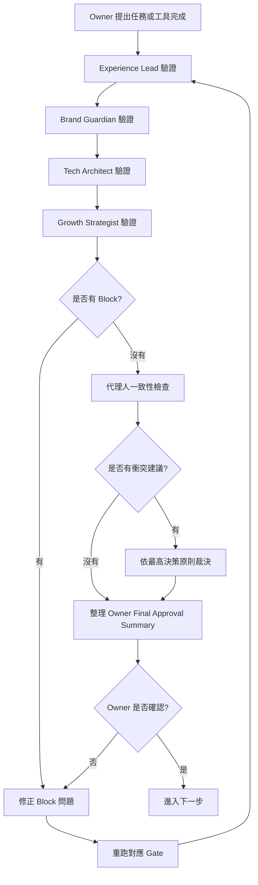

# Timiva Decision Validation Flow V1

## 文件目的

本文件定義 Timiva 的決策驗證流程、Agents 審查順序、Pass / Block 規則、衝突裁決方式與 Owner Final Approval 規則。

目前 Timiva 採用 Phase A：Owner 主導確認期。

也就是：

```text
Agents 負責審查
Skills 負責流程
Cursor 負責執行與回報
Owner 前期負責最終確認
```

---

## 1. 最高決策原則

當 Agents 意見衝突時，必須回到 Timiva 的最高決策順位。

決策順位：

```text
1. 使用者能不能在手機上舒服完成主要任務
2. 是否符合 Timiva 的品牌核心與 Widget-like 感
3. 是否能低維護、穩定、純前端運作
4. 是否有 SEO / AEO / 搜尋流量價值
5. 是否不破壞未來廣告與變現空間
```

如果 SEO 想加很多文字，但 UX 認為會干擾工具操作，應以使用者體驗優先。

如果視覺想加複雜效果，但技術認為高維護，應以低維護優先。

如果技術想用最簡單表單，但視覺與 UX 都認為不像 Timiva，則應在低維護前提下調整成符合 Timiva 的元件風格。

---

## 2. 決策驗證流程圖



---

## 3. Gate 1：Experience Lead 驗證

主導角色：Experience Lead

檢查：

```text
手機操作是否直覺
觸控目標是否合理
主要流程是否簡單
是否符合減法設計
是否避免功能堆疊
Bottom Sheet 是否順手
廣告或 SEO 是否干擾主任務
```

通過標準：

```text
主要任務一句話說得清楚
手機上可以快速完成
沒有讓使用者迷路的設定
主結果不被遮住
```

可以 Block：

```text
手機主流程無法完成
主要 CTA 不清楚
觸控目標太小
使用者會迷路
廣告或 SEO 壓過工具操作
手機橫式嚴重跑版
```

---

## 4. Gate 2：Brand Guardian 驗證

主導角色：Brand Guardian

檢查：

```text
這個畫面像 Timiva 嗎？
是否符合 Bento / card-based / Widget-like 方向？
主結果是否一眼看懂？
按鈕、卡片、輸入欄位是否一致？
是否出現樣式漂移？
廣告容器是否破壞畫面？
```

通過標準：

```text
視覺層級清楚
主工具是焦點
元件和既有頁面一致
桌機、手機直式、手機橫式有一致語言
```

可以 Block：

```text
畫面明顯不像 Timiva
元件樣式和既有頁面不一致
layout 嚴重失衡
Bento / card 結構混亂
廣告容器破壞畫面
```

---

## 5. Gate 3：Tech Architect 驗證

主導角色：Tech Architect

檢查：

```text
是否使用 Astro component 重用？
是否避免重複 layout？
HTML 是否語意化？
Tailwind 是否符合規範？
JS 計算是否正確？
LocalStorage 是否有 fallback？
重新整理是否不會壞？
有沒有改壞既有工具？
```

通過標準：

```text
npm run build 成功
沒有 console error
沒有 inline style
沒有 !important
沒有 CSS id selector
共用元件沒有被破壞
```

可以 Block：

```text
build 失敗
console error
計算邏輯錯誤
LocalStorage 導致 crash
修改共用元件導致既有工具壞掉
違反 Tailwind / CSS 核心規範
```

---

## 6. Gate 4：Growth Strategist 驗證

主導角色：Growth Strategist

檢查：

```text
H1 是否清楚？
Meta title 是否合理？
Meta description 是否自然？
FAQ 是否回答真問題？
FAQ Schema 是否正確？
Related Tools 是否合理？
內容是否能被 AI Search 理解？
SEO 區塊有沒有壓過主工具？
```

通過標準：

```text
工具主體在前
FAQ / SEO 在後
內容自然不堆關鍵字
中英文不混雜
Related Tools 有助於探索
```

可以 Block：

```text
H1 / title / description 缺失
FAQ 與工具功能不一致
FAQ Schema 錯誤
中英文混雜
SEO 區塊放錯位置
內部連結明顯錯誤
```

---

## 7. 結果定義

每個 Gate 只能回傳以下三種結果：

```text
Pass
Pass with minor notes
Block
```

### 7.1 Pass

表示符合該角色負責範圍，可以進入下一階段。

### 7.2 Pass with minor notes

表示可以進入下一階段，但有小問題可後續優化。

Minor notes 不阻擋 Owner 確認或後續開發。

### 7.3 Block

表示有重大問題，不能進入下一階段。

必須修正後重跑對應 Gate。

---

## 8. 常見衝突與裁決方式

| 衝突 | 裁決方式 |
|---|---|
| SEO 想加更多內容，UX 覺得干擾 | 工具體驗優先，內容下移或收斂 |
| 視覺想加動畫，Tech 覺得高維護 | 低維護優先，改成 CSS 輕量效果 |
| Tech 想用最簡表單，Brand 覺得太傳統 | 保留低維護，但要符合 Timiva 元件風格 |
| Growth 想做大量長尾頁，Owner 擔心品質 | 先做少量高品質模板，不做大量低品質頁 |
| 廣告想放結果上方，UX 覺得干擾 | 不放，改放結果後或內容區附近 |

---

## 9. Owner Final Approval Rule

四個 Agents 負責審查、驗證與風險提示，但不擁有最終產品決策權。

當 Experience Lead、Brand Guardian、Tech Architect、Growth Strategist 四個角色都回傳 `Pass` 或 `Pass with minor notes` 後，Cursor 必須整理一份 Owner Final Approval Summary 給 Owner 最終確認。

在 Owner 明確確認前，不得進入：

```text
implementation
commit
deploy
重大結構調整
locked components 修改
```

若任一 Agent 回傳 `Block`，Cursor 必須先修正問題，並重新執行對應驗證 Gate，不能直接要求 Owner 確認。

---

## 10. 決策權限階段

Timiva 採用分階段決策權限。

### Phase A：Owner 主導確認期

目前使用。

適用於：

```text
視覺系統尚未穩定
UX 流程仍在測試
新工具模式仍在探索
廣告版位仍在驗證
Owner 仍需要判斷工具是否達到期待的使用感與視覺感
```

規則：

```text
Agents 只負責審查
Owner 保有最終確認權
Agents 全部 Pass 不代表自動上線
```

### Phase B：共同確認期

適用於：

```text
Layout system 已穩定
Visual system 已穩定
QA flow 已多次驗證
2 到 4 個工具已完成
```

規則：

```text
低風險小修改可由 Agents 驗證後通過
重大產品 / layout / 視覺 / 廣告 / SEO 決策仍需 Owner 確認
```

### Phase C：代理人例行確認期

適用於：

```text
代理人多次驗證結果與 Owner 期待一致
工具頁模板成熟
QA 流程穩定
```

規則：

```text
代理人可確認低風險例行修改與部署
Owner 仍審重大方向變更
```

---

## 11. Owner Final Approval Summary 格式

Cursor 應整理：

```text
1. 本次完成項目
2. 4 個 Agents 驗證結果
3. 是否有 Block
4. 是否有衝突建議
5. 衝突如何裁決
6. 仍存在的 minor notes
7. 是否符合 Timiva 產品原則
8. 是否符合線稿
9. 是否符合手機直式 / 橫式
10. 是否符合 SEO / 內容策略
11. 是否可進入下一步
12. 需要 Owner 確認的最後問題
```

---

## 12. 結論

Timiva 的決策驗證流程不是讓 AI 自動決定，而是讓每次開發都有固定檢查順序。

最終規則：

```text
前期由 Owner 最終確認
Agents 只負責審查
Skills 負責固定流程
Cursor 負責執行與報告
```
