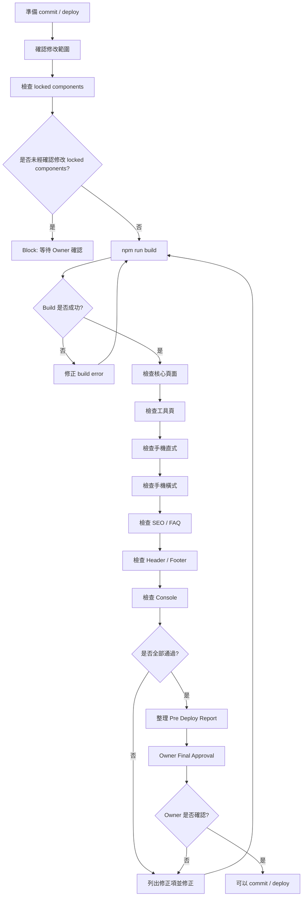

# Timiva Pre Deploy Checklist V1

## 文件目的

本文件定義 Timiva 在 commit 或 deploy 前必須完成的總檢查。

本文件是 `agents/skills/pre-deploy-check-skill.md` 的正式規範來源。

目前 Timiva 採用 Phase A：Owner 主導確認期。  
因此即使所有檢查通過，也必須等待 Owner 明確確認後，才可 commit / deploy。

---

## 1. Pre-deploy 核心原則

Pre-deploy 的目的不是拖慢開發，而是避免：

```text
小修改改壞全站
手機橫式漏測
SEO 缺漏
Footer / Header 漂移
未經確認就 deploy
```

---

## 2. Pre-deploy 流程圖



---

## 3. 必檢指令

至少執行：

```bash
npm run build
```

若專案有 lint / format / typecheck，也應執行：

```bash
npm run lint
npm run format
npm run check
```

實際指令依專案設定為準。

---

## 4. 修改範圍檢查

先確認本次修改是否包含：

```text
新頁面
新工具
新元件
Header
Footer
Base Layout
全站背景
共用容器
Tailwind theme
SEO / FAQ
廣告版位
```

如果有修改 locked components，必須確認 Owner 是否已同意。

---

## 5. Locked Components 檢查

以下元件完成並經 Owner 確認後，視為 locked components：

```text
Header
Footer
Base Layout
全站背景
共用容器
```

未經確認修改 locked components 應 Block。

---

## 6. 核心頁面檢查

Pre-deploy 前至少檢查：

```text
Home Page
All Tools Page
Privacy Policy
Terms of Use
Contact
English routes
繁體中文 routes
```

---

## 7. 工具頁檢查

檢查所有已完成工具頁：

```text
Event Countdown
Date Range Calculator
Countdown Timer
Life Progress Bar
```

依實際已完成工具調整。

每個工具頁確認：

```text
主要功能正常
主結果正確
手機直式正常
手機橫式正常
桌機版正常
FAQ / SEO 正常
Related Tools 正常
Footer 正常
```

---

## 8. 手機直式檢查

檢查：

```text
主結果可見
主要 CTA 可點擊
輸入欄位不超出
Bottom Control 正常
Bottom Sheet 正常
頁面可以滑動
Footer 不突兀
```

---

## 9. 手機橫式檢查

手機橫式必須獨立檢查。

檢查：

```text
主結果可見
輸入欄位不跑版
Bottom Sheet 不過高
Bottom Control 不貼 Footer
轉回直式後 layout 恢復
廣告不壓縮主工具
```

---

## 10. 桌機版檢查

檢查：

```text
主工具仍是焦點
內容寬度合理
Header 對齊正常
Footer 對齊正常
Related Tools 不搶主工具
FAQ / SEO 在工具後方
```

---

## 11. SEO / FAQ 檢查

檢查：

```text
每頁 title
每頁 meta description
工具頁 H1
工具頁 FAQ
工具頁 FAQ Schema
Related Tools
語意化 HTML
中英文不混雜
```

---

## 12. Tailwind / HTML 檢查

檢查：

```text
無 inline style
無 !important
無 CSS id selector
主要區塊有中文註解
HTML 語意化
RWD 以元件分段
沒有不必要 hard-code
```

---

## 13. Console / Runtime 檢查

檢查：

```text
沒有明顯 console error
LocalStorage 不 crash
URL 參數錯誤時不 crash
頁面重新整理正常
語系切換正常
```

---

## 14. 廣告檢查

若本次涉及廣告版位，檢查：

```text
不在主結果上方
不在輸入區中間
不在 Bottom Sheet
不靠近 Bottom Control
不造成誤觸
純文字頁不放廣告
```

---

## 15. Block 條件

以下任一項目應 Block：

```text
build 失敗
主要頁面無法開啟
工具主要功能錯誤
手機直式無法完成任務
手機橫式嚴重跑版
Header / Footer 被改壞
FAQ Schema 錯誤
未經確認修改 locked components
廣告放在禁止位置
```

---

## 16. Pre Deploy Report 格式

```text
# Timiva Pre Deploy Report

Date:
Scope:
Reviewer:

## Result
Pass / Pass with minor notes / Block

## Build
- npm run build: Pass / Block

## Pages checked
- Home Page:
- All Tools Page:
- Tool Pages:
- Legal Pages:

## Device checks
- Mobile portrait:
- Mobile landscape:
- Desktop:

## SEO checks
- H1:
- Meta:
- FAQ:
- FAQ Schema:
- Related Tools:

## Locked components
- Modified: Yes / No
- Owner approved: Yes / No / N/A

## Required fixes
- ...

## Minor notes
- ...

## Owner approval required
- Yes / No
```

---

## 17. 結論

Pre-deploy 檢查的目標是確保：

```text
功能可用
手機穩定
SEO 完整
共用元件沒壞
build 成功
Owner 已確認
```

Phase A 期間，即使 Pre-deploy Check 通過，也必須等待 Owner 確認。
