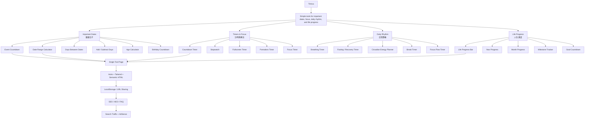

# Timiva Product Architecture V3

## 文件目的

本文件定義 Timiva 的產品功能架構、工具分類、優先順序與功能邊界。

本文件用來回答：

```text
Timiva 有哪些工具？
工具如何分類？
哪些工具先做？
哪些工具延後？
哪些工具不適合早期做？
```

---

## 1. 產品定位

Timiva 是一個簡單、舒服、手機好用的時間與生活節奏工具網站。

Timiva 的核心不是做很多工具，而是打造少量但高度打磨、手機使用非常舒服的工具。

英文定位：

```text
Simple tools for important dates, focus, daily rhythm, and life progress.
```

中文定位：

```text
簡單、舒服、手機好用的時間與生活節奏工具。
```

---

## 2. 四大分類

Timiva 正式採用以下情境化分類名稱：

```text
1. Important Dates
2. Timers & Focus
3. Daily Rhythm
4. Life Progress
```

中文對應：

```text
1. 重要日子
2. 計時與專注
3. 日常節奏
4. 人生進度
```

分類定位：

```text
Important Dates = 處理重要日期、事件倒數與日期計算
Timers & Focus = 處理正在進行的一段時間，例如計時、碼表與專注
Daily Rhythm = 處理每天的節奏、專注、休息、能量與恢復
Life Progress = 處理年度、月份、人生與目標的長期進度
```

正式文件、線稿、工具索引、首頁分類、相關工具區與程式資料命名，都應統一使用以上 4 個分類名稱。

---

## 3. 架構總覽流程圖



---

## 4. 優先級定義

| 標記 | 意義 | 說明 |
|---|---|---|
| P0 | V1 核心優先 | 最應該優先開發，能建立品牌核心、SEO 流量或 App 感 |
| P1 | 下一波高價值 | 完成 P0 後優先補齊，能提高差異化或擴充流量 |
| P2 | 中期擴充 | 有價值，但可以等產品穩定後再做 |
| P3 | 後期或選配 | 可延伸，但需避免增加維護成本或偏離品牌核心 |

---

## 5. Important Dates

中文名稱：重要日子

### 分類定位

處理重要日期、事件倒數與日期計算。

這是 Timiva 最穩定的 SEO 流量來源，也是最接近使用者日常搜尋需求的分類。

### 工具清單

| 優先級 | 工具名稱 | 中文名稱 | 核心用途 | 維護成本 |
|---|---|---|---|---|
| P0 | Event Countdown | 事件倒數 | 為生日、旅行、節日、重要日子建立倒數 | 低 |
| P0 | Date Range Calculator | 日期區間計算 | 計算兩個日期之間的天數、週數、月數 | 低 |
| P1 | Days Between Dates | 日期差計算 | 更聚焦的兩日期相差天數工具 | 低 |
| P1 | Add / Subtract Days | 日期加減 | 計算 N 天後或 N 天前是哪一天 | 低 |
| P1 | Age Calculator | 年齡計算 | 計算年齡、生日與出生日期差 | 低 |
| P2 | Birthday Countdown | 生日倒數 | 針對生日情境的倒數工具 | 低 |
| P3 | Holiday Countdown | 節日倒數 | 節日情境倒數，可延伸長尾 SEO | 中 |
| P3 | Anniversary Countdown | 週年倒數 | 週年紀念日倒數 | 低 |

### 注意事項

Holiday Countdown 若牽涉各國節日資料，會增加維護成本。早期建議只做固定或手動輸入版本，不要自建完整全球節日資料庫。

---

## 6. Timers & Focus

中文名稱：計時與專注

### 分類定位

處理正在進行的一段時間，例如工作、運動、煮飯、讀書、開會、簡報或專注時，需要掌握時間。

這類工具讓 Timiva 更像 App，而不只是 SEO 工具站。

### 工具清單

| 優先級 | 工具名稱 | 中文名稱 | 核心用途 | 維護成本 |
|---|---|---|---|---|
| P0 | Countdown Timer | 一般倒數計時器 | 快速設定一段時間並倒數 | 低 |
| P1 | Stopwatch | 碼表 | 計算一件事實際花多久 | 低 |
| P1 | Fullscreen Timer | 全螢幕計時器 | 提供大畫面、低干擾的計時顯示 | 低 |
| P2 | Pomodoro Timer | 番茄鐘 | 25/5 或自訂專注週期 | 低 |
| P2 | Focus Timer | 專注計時 | 更輕量的專注計時工具 | 低 |
| P3 | Interval Timer | 間歇計時器 | 運動、訓練、循環計時 | 中 |
| P3 | Meeting Timer | 會議計時器 | 控制會議或簡報時間 | 低 |

### 注意事項

早期避免做複雜通知、背景執行、跨裝置同步或生產力報表。優先維持純前端、單頁工具、手機好操作。

---

## 7. Daily Rhythm

中文名稱：日常節奏

### 分類定位

處理每天的身體節奏、能量安排、呼吸、休息與恢復。

此分類是 Timiva 的品牌差異化來源之一，但必須避免走向健康醫療 App。

工具應定位為：

```text
時間追蹤
節奏提示
狀態安排
```

而不是：

```text
醫療建議
健康診斷
營養建議
療效承諾
```

### 工具清單

| 優先級 | 工具名稱 | 中文名稱 | 核心用途 | 維護成本 |
|---|---|---|---|---|
| P1 | Breathing Timer | 呼吸節奏計時 | 以簡單節奏引導呼吸與休息 | 低 |
| P1 | Fasting / Recovery Timer | 斷食 / 恢復計時器 | 以進度條追蹤斷食或恢復剩餘時間 | 低 |
| P2 | Circadian Energy Planner | 生理能量排程器 | 輸入起床時間，推估今日專注與休息區間 | 中 |
| P2 | Break Timer | 休息提醒 | 讓使用者設定工作後休息節奏 | 低 |
| P2 | Focus Flow Timer | 專注流計時 | 結合專注與休息節奏 | 低 |
| P3 | Energy Reset Timer | 能量重置計時 | 短時間重置狀態的引導型計時工具 | 低 |
| P3 | Stretch Timer | 伸展計時 | 簡單伸展節奏計時 | 低 |

### 注意事項

Daily Rhythm 類工具必要時應加入聲明：

```text
本工具僅用於時間追蹤與節奏參考，不提供醫療、營養或健康建議。
```

---

## 8. Life Progress

中文名稱：人生進度

### 分類定位

處理年度、月份、人生、自訂時間範圍與目標里程碑的長期進度。

Life Progress 的核心不是大型目標管理，而是讓使用者看見自己在時間中的位置，以及目前是否正在朝目標前進。

### 工具清單

| 優先級 | 工具名稱 | 中文名稱 | 核心用途 | 維護成本 |
|---|---|---|---|---|
| P0 | Life Progress Bar | 人生 / 時間進度條 | 將年份、月份、人生或自訂時間範圍線性化成進度條 | 低 |
| P1 | Year Progress | 年度進度 | 顯示今年已過與剩餘比例 | 低 |
| P1 | Milestone Tracker | 目標里程碑追蹤 | 根據日期、期限與目標總量計算是否超前或落後 | 中 |
| P2 | Month Progress | 月份進度 | 顯示本月已過與剩餘比例 | 低 |
| P2 | Goal Countdown | 目標倒數 | 距離目標期限剩多久 | 低 |
| P3 | Habit Streak Counter | 習慣連續天數 | 記錄連續完成天數 | 中 |
| P3 | Personal Timeline | 個人時間軸 | 可視化長期人生或目標時間線 | 中到高 |

### 注意事項

Milestone Tracker 不建議早期做成大型目標管理系統。

避免：

```text
登入帳號
雲端同步
多目標管理後台
每日提醒
複雜報表
社群打卡
排行榜
```

建議：

```text
單一目標輸入
LocalStorage 保存
簡單進度計算
可重設
可截圖分享
```

---

## 9. 建議開發優先順序

### Phase 1：V1 核心工具

```text
1. Event Countdown
2. Date Range Calculator
3. Countdown Timer
4. Life Progress Bar
```

目的：

```text
建立 Timiva 的品牌核心
同時涵蓋重要日子、計時與專注、人生進度
兼顧 SEO 流量與 App 感
```

---

### Phase 2：V1.5 差異化工具

```text
5. Breathing Timer
6. Fasting / Recovery Timer
7. Year Progress
8. Days Between Dates
9. Add / Subtract Days
10. Age Calculator
```

目的：

```text
強化 Daily Rhythm 與 Life Progress 的品牌差異化
補齊 Important Dates 的搜尋流量
```

---

### Phase 3：V2 擴充工具

```text
11. Stopwatch
12. Fullscreen Timer
13. Milestone Tracker
14. Month Progress
15. Circadian Energy Planner
16. Pomodoro Timer
```

目的：

```text
強化 App 感
補足 Timers & Focus 工具線
提升 Timiva 的生活節奏品牌感
```

---

### Phase 4：後期延伸工具

```text
17. Birthday Countdown
18. Holiday Countdown
19. Goal Countdown
20. Break Timer
21. Focus Flow Timer
22. Habit Streak Counter
23. Interval Timer
```

目的：

```text
延伸長尾 SEO
擴充使用情境
但需控制維護成本
```

---

## 10. 低維護邊界

### 可以做

```text
時間計算
倒數
計時
進度條
節奏提示
起床時間推估
目標期限進度
LocalStorage 本機保存
URL sharing
可截圖分享
簡單模板
PWA
```

### 不建議做

```text
會員系統
雲端同步
大型目標管理
每日任務清單
AI 教練
健康診斷
營養建議
睡眠分析
醫療暗示
社群打卡
排行榜
複雜報表
即時推播後端
```

---

## 11. 結論

Timiva 的產品架構應保持：

```text
Important Dates = 重要日子
Timers & Focus = 計時與專注
Daily Rhythm = 日常節奏
Life Progress = 人生進度
```

只要每個工具都維持以下條件，Timiva 就能保持低成本、低維護、單人與 AI 可持續開發：

```text
以時間、節奏、進度為核心
手機上可以快速完成
盡量純前端完成
不依賴大量資料庫
不碰健康診斷或醫療建議
不變成大型生產力平台
```
