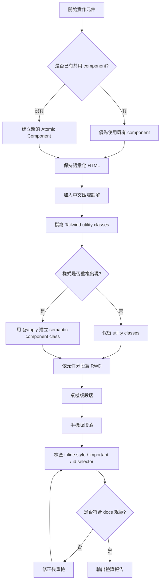

# Timiva Tailwind CSS Guidelines V2

## 文件目的

本文件定義 Timiva 使用 Tailwind CSS 時的實作規則。

Timiva 採用 Tailwind CSS 是為了提高開發效率與維持一致性，但 Tailwind 不應破壞 HTML 語意、元件可讀性、RWD 結構與 Timiva 的 Widget-like 品牌感。

---

## 1. 核心原則

Timiva 的 CSS 實作原則如下：

```text
1. Tailwind 負責樣式
2. HTML 保持語意化
3. Component 維持可重用
4. 中文註解提升可讀性
5. RWD 以元件為單位分段書寫
6. 不為了方便而犧牲結構清楚度
```

---

## 2. Tailwind 實作流程圖



---

## 3. 語意化 HTML 規則

即使使用 Tailwind，也必須優先使用語意化 HTML。

應使用：

```html
<header>
<nav>
<main>
<section>
<article>
<footer>
```

避免整頁都使用：

```html
<div>
```

原則：

```text
如果區塊有明確語意，就使用對應 HTML tag。
如果只是排版容器，才使用 div。
```

範例：

```astro
<!-- Header｜全站主導覽 -->
<header class="...">
  <nav class="..." aria-label="Main navigation">
    ...
  </nav>
</header>

<!-- Main｜頁面主要內容 -->
<main class="...">
  ...
</main>

<!-- Footer｜全站頁尾 -->
<footer class="...">
  ...
</footer>
```

---

## 4. 中文註解規則

每個主要段落都必須加入中文註解，方便 Owner、Cursor、Agents 與後續維護者理解。

註解格式建議：

```astro
<!-- Header｜桌機版主導覽 -->
<!-- Header｜手機版主導覽 -->
<!-- Tool｜桌機版工具主體 -->
<!-- Tool｜手機版工具主體 -->
<!-- Footer｜桌機版頁尾 -->
<!-- Footer｜手機版頁尾 -->
```

註解應該說明：

```text
這是哪個區塊
這是桌機版還是手機版
這個區塊的主要用途
```

不要寫過度模糊的註解，例如：

```astro
<!-- section -->
<!-- div -->
<!-- layout -->
```

---

## 5. Tailwind 與 @apply 使用規則

Tailwind utility class 可以直接寫在元件上，但如果同一組樣式重複出現，應整理成語意化 component class。

可以使用：

```css
@layer components {
  .timiva-card {
    @apply rounded-3xl border border-white/10 bg-white/8 shadow-sm;
  }

  .timiva-button-primary {
    @apply inline-flex items-center justify-center rounded-full px-5 py-3 text-sm font-medium;
  }
}
```

使用原則：

```text
常用元件可用 @apply
一次性 layout 可用 utility class
不要為了少寫 class 而抽象過度
不要建立看不懂用途的 class 名稱
```

class 命名應語意化：

```text
timiva-card
timiva-button-primary
timiva-tool-shell
timiva-tool-panel
timiva-result-card
timiva-bottom-control
```

避免：

```text
box1
blue-card
style-a
new-layout
```

---

## 6. 禁止事項

Timiva CSS 禁止：

```text
inline style
!important
CSS id selector
任意 hard-code 顏色
每個頁面各自寫一套 layout
為了快速修正而破壞共用元件
```

id 可以用於：

```text
aria-labelledby
form label 關聯
JavaScript 查找元素
```

但不能用於 CSS selector。

---

## 7. Tailwind Theme Token 規則

Timiva 應透過 Tailwind theme 管理核心設計值。

建議納入 theme 的項目：

```text
color tokens
font family
spacing scale
border radius
shadow
max width
z-index
```

如果需要新增顏色或尺寸，應優先確認是否能使用既有 token。

不要在頁面中大量新增隨機值，例如：

```text
bg-[#123456]
rounded-[19px]
mt-[37px]
```

必要時可以使用 arbitrary values，但應限制在少數特殊情境，並加上原因說明。

---

## 8. RWD 書寫順序

Timiva 的 RWD 寫法必須以元件為單位分段書寫。

正確順序：

```text
Header
├── Header desktop
└── Header mobile

Tool
├── Tool desktop
└── Tool mobile

Footer
├── Footer desktop
└── Footer mobile
```

不要採用：

```text
全部 desktop 寫完
再把全部 mobile 集中寫在最後
```

原因：

```text
1. Cursor 比較容易理解單一元件的完整行為
2. Owner 比較容易對照線稿
3. 修改 Header 時不會誤動 Tool 或 Footer
4. 手機版與桌機版不會脫節
5. 後續維護比較清楚
```

---

## 9. Header RWD 書寫規則

Header 應先寫桌機版，再緊接著寫手機版。

建議段落順序：

```astro
<!-- Header｜桌機版主導覽 -->
<header class="hidden md:block ...">
  ...
</header>

<!-- Header｜手機版主導覽 -->
<header class="block md:hidden ...">
  ...
</header>
```

不要把手機 Header 寫到整個頁面最後。

---

## 10. Tool RWD 書寫規則

Tool 區塊應先寫桌機版，再緊接著寫手機版。

建議段落順序：

```astro
<!-- Tool｜桌機版工具主體 -->
<section class="hidden md:block ...">
  ...
</section>

<!-- Tool｜手機版工具主體 -->
<section class="block md:hidden ...">
  ...
</section>
```

如果桌機與手機共用大部分結構，則可以用同一組語意化 HTML 搭配 Tailwind responsive class。

但如果手機版需要 Bottom Sheet、Bottom Control 或不同操作順序，可以拆成桌機與手機兩段，並加上清楚中文註解。

---

## 11. Footer RWD 書寫規則

Footer 應先寫桌機版，再緊接著寫手機版。

建議段落順序：

```astro
<!-- Footer｜桌機版頁尾 -->
<footer class="hidden md:block ...">
  ...
</footer>

<!-- Footer｜手機版頁尾 -->
<footer class="block md:hidden ...">
  ...
</footer>
```

Footer 必須保持全站一致，不可在不同頁面各自改版。

---

## 12. 元件共用規則

若 Header、Footer、Tool Shell、Related Tools、FAQ、Bottom Control 重複出現，應整理成 Astro component。

建議元件：

```text
Header.astro
Footer.astro
BaseLayout.astro
ToolShell.astro
ToolHero.astro
ToolResultCard.astro
RelatedTools.astro
FAQSection.astro
BottomControl.astro
```

共用元件修改後，必須回歸檢查：

```text
首頁
工具頁
全部工具頁
Legal / Text Page
手機直式
手機橫式
桌機版
```

---

## 13. Locked Components 規則

以下元件完成並經 Owner 確認後，應視為 locked components：

```text
Header
Footer
Base Layout
全站背景
共用容器
```

除非 Owner 明確要求，Cursor 不得修改 locked components。

若 Cursor 認為必須修改，需先回報：

```text
修改原因
影響範圍
替代方案
是否需要回歸測試
```

---

## 14. 驗證報告要求

每次完成 Tailwind 實作後，Cursor 應回報：

```text
1. 修改了哪些檔案
2. 是否新增 / 修改共用 component
3. 是否使用語意化 HTML
4. 是否加入中文註解
5. 是否有 inline style
6. 是否有 !important
7. 是否有 CSS id selector
8. RWD 是否依元件分段
9. 是否需要 Owner Final Approval
```

---

## 15. 結論

Timiva 可以使用 Tailwind CSS，但不能讓 Tailwind 變成無結構的 class 堆疊。

最終目標是：

```text
語意清楚
樣式一致
RWD 好維護
元件可重用
手機體驗穩定
Cursor 容易理解與修改
```
