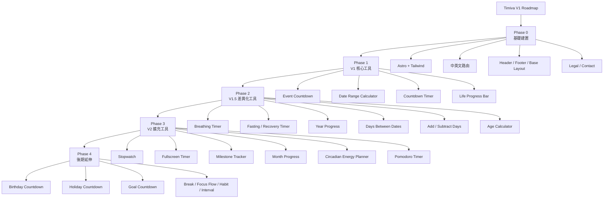

# Timiva V1 Roadmap V2

## 文件目的

本文件整理 Timiva V1 到 V2 的開發順序與上線準備方向，作為後續開發、部署、測試與功能取捨的共同依據。

本文件先不定義精準 typography、spacing、component token 等 UI 數值。版面、視覺與 Tailwind token 細節應由後續 Design System 與 Tailwind CSS Guidelines 定義。

---

## 1. V1 上線核心目標

Timiva V1 的目標不是一次做很多工具，而是先完成一組可以代表品牌方向的核心工具。

V1 應該同時建立：

```text
重要日子的搜尋流量基礎
倒數與計時的 App 感
長期進度的品牌差異化
手機優先的使用體驗
低維護的純前端架構
中英文基本架構
全站一致的 Header / Footer / Layout
```

V1 的成功標準：

```text
1. 使用者打開頁面後能在幾秒內理解用途
2. 手機直式與橫式都能穩定操作
3. 每個工具都像獨立小 App，而不是傳統工具表單
4. SEO / FAQ 有補充價值，但不壓過主工具體驗
5. 部署後即使短期不頻繁維護，也能穩定運作
```

---

## 2. Roadmap 快速流程圖



---

## 3. Phase 0：基礎建置

### 3.1 必備基礎項目

| 項目 | 狀態方向 | 備註 |
|---|---|---|
| 網域 | timiva.app | Porkbun 購買 |
| 部署 | Cloudflare Pages | 適合 Astro 靜態站 |
| 框架 | Astro | 以純前端工具為主 |
| Styling | Tailwind CSS | 搭配語意化 HTML |
| 語系 | English / 繁體中文 | V1 建議先建立雙語架構 |
| Header | 全站一致 | 完成後視為 locked component |
| Footer | 全站一致 | 完成後視為 locked component |
| Base Layout | 全站一致 | 完成後視為 locked component |
| Legal pages | 必備 | Privacy Policy / Terms of Use |
| Contact | hello@timiva.app | 初期主要作為信任感與回報問題管道 |

---

### 3.2 Phase 0 開發順序

```text
1. 建立 Astro 專案
2. 安裝與設定 Tailwind CSS
3. 建立 docs/、.agents/、.cursor/rules/ 資料夾
4. 建立中英文路由基礎
5. 建立 Base Layout
6. 建立 Header
7. 建立 Footer
8. 建立 Home Page 骨架
9. 建立 All Tools Page 骨架
10. 建立 Privacy / Terms / Contact 頁
```

---

### 3.3 Phase 0 要避免的事

```text
不要先加入會員系統
不要先做後台
不要先做大型資料庫
不要先接複雜通知
不要先放干擾性的廣告版位
不要一次叫 Cursor 做完整網站
不要先制定尚未驗證的精準 typography / spacing 數值
```

---

## 4. Phase 1：V1 核心工具

Phase 1 建議完成四個工具：

| 順序 | 工具 | 分類 | 目的 | 優先理由 |
|---|---|---|---|---|
| 1 | Event Countdown | Important Dates | 事件倒數 | 建立情緒感、事件感與倒數核心體驗 |
| 2 | Date Range Calculator | Important Dates | 日期區間計算 | 穩定 SEO 流量需求，低維護 |
| 3 | Countdown Timer | Timers & Focus | 一般倒數計時器 | 強化 App 感與即時使用情境 |
| 4 | Life Progress Bar | Life Progress | 人生 / 時間進度條 | 強化品牌差異化與長期時間感 |

Phase 1 完成後，Timiva 會同時涵蓋：

```text
Important Dates = 重要日子
Timers & Focus = 計時與專注
Life Progress = 人生進度
```

---

## 5. Phase 1 每個工具的完成標準

每個 V1 工具至少要完成：

```text
1. 工具主體
2. 主結果 / 狀態區
3. 必要輸入與控制
4. 手機直式可用
5. 手機橫式不跑版
6. 桌機版正常
7. Related Tools
8. FAQ
9. Meta title / description
10. FAQ Schema
11. Footer 一致
12. npm run build 成功
```

---

## 6. Phase 2：V1.5 差異化工具

Phase 2 的目的，是在 V1 穩定後補上品牌差異化與日期工具長尾流量。

| 順序 | 工具 | 分類 | 目的 |
|---|---|---|---|
| 5 | Breathing Timer | Daily Rhythm | 建立日常節奏與休息感 |
| 6 | Fasting / Recovery Timer | Daily Rhythm | 以時間追蹤角度切入，不做健康建議 |
| 7 | Year Progress | Life Progress | 低維護、品牌一致、適合首頁卡片 |
| 8 | Days Between Dates | Important Dates | 補日期差長尾搜尋 |
| 9 | Add / Subtract Days | Important Dates | 補日期加減長尾搜尋 |
| 10 | Age Calculator | Important Dates | 補年齡、生日、出生日期相關搜尋需求 |

Phase 2 注意事項：

```text
Daily Rhythm 工具必須避免醫療、健康診斷或療效暗示。
Age Calculator 屬於低維護、高搜尋需求工具，但仍應維持 Timiva 的 App-like 介面。
```

---

## 7. Phase 3：V2 擴充工具

Phase 3 主要補足 Timers & Focus 工具線與 Life Progress 的進度工具。

| 順序 | 工具 | 分類 | 目的 |
|---|---|---|---|
| 11 | Stopwatch | Timers & Focus | 補足基本計時需求 |
| 12 | Fullscreen Timer | Timers & Focus | 強化低干擾、大畫面 App 感 |
| 13 | Milestone Tracker | Life Progress | 強化目標進度感，但避免大型目標管理 |
| 14 | Month Progress | Life Progress | 補足短期進度感 |
| 15 | Circadian Energy Planner | Daily Rhythm | 差異化，但需避免健康承諾 |
| 16 | Pomodoro Timer | Timers & Focus | 常見需求，但不急於 V1 |

---

## 8. Phase 4：後期延伸

Phase 4 屬於後期擴充，用於補長尾搜尋與更多使用情境。

```text
Birthday Countdown
Holiday Countdown
Anniversary Countdown
Goal Countdown
Break Timer
Focus Flow Timer
Habit Streak Counter
Interval Timer
Meeting Timer
```

這些工具可以做，但要注意：

```text
節日資料不要早期就做成高維護資料庫
習慣與目標不要變成大型生產力平台
計時類工具不要過度依賴通知與背景執行
```

---

## 9. CEO Workflow 開發方式

Timiva 不應一次叫 Cursor 完成完整網站或完整工具。

每次任務應限制在：

```text
一個 Atomic Component
一個頁面區塊
一個工具功能
一個 SEO / FAQ 補強任務
一個 layout 調整任務
一個 QA 修正任務
```

開發流程：

```text
Owner 拆任務
↓
Cursor 做單一 Atomic Component
↓
Agents 依角色審查
↓
Skills 執行固定檢查
↓
Cursor 輸出驗證報告
↓
Owner 最終確認
↓
進入下一步
```

---

## 10. V1 上線前檢查清單

### 10.1 內容與頁面

```text
首頁完成
全部工具頁完成
至少 2 到 4 個核心工具完成
隱私權政策完成
使用條款完成
聯絡方式完成
English / 繁體中文基本架構完成
Footer 全站一致
```

---

### 10.2 技術與部署

```text
Astro build 成功
Cloudflare Pages 部署成功
路由正常
手機與桌機可開啟
主要工具無 console error
LocalStorage 不造成錯誤
基本 metadata 完成
Tailwind 設定正常
```

---

### 10.3 體驗與品牌

```text
手機直式可順暢操作
手機橫式不跑版
主結果一眼看懂
輸入欄位不會遮住結果
Bottom sheet 可正常開關
SEO 區塊不壓過主工具
頁面看起來不像傳統工具站
Header / Footer / Layout 全站一致
```

---

## 11. 暫緩項目

以下項目先不放入 V1：

```text
正式廣告版位
會員系統
雲端同步
大型資料庫
高維護節日資料
AI 教練
健康診斷或營養建議
複雜報表
社群功能
排行榜
推播後端
完整 typography / spacing 數值規範
```

---

## 12. 結論

Timiva V1 應以「少量、高完成度、手機舒服、低維護」為核心。

建議先完成：

```text
Event Countdown
Date Range Calculator
Countdown Timer
Life Progress Bar
```

等核心體驗穩定後，再逐步補上 Daily Rhythm、Life Progress 與 Important Dates 長尾工具。
