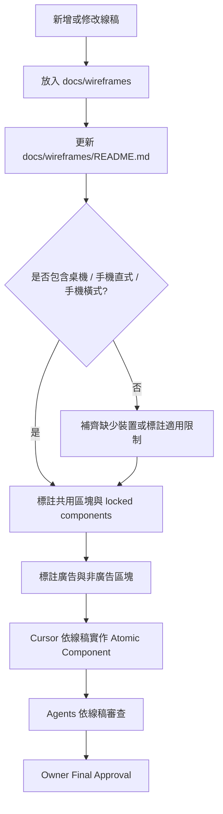

# Timiva Wireframe Index V1

## 文件目的

本文件定義 Timiva 線稿管理、命名、標註與使用規則。

線稿不是單純圖片，而是 Cursor、Agents、Owner 檢查 layout、視覺、廣告與 RWD 的依據。

---

## 1. 線稿使用原則

所有線稿都應服務以下目標：

```text
1. 讓 Cursor 知道畫面結構
2. 讓 Owner 可以對照實作結果
3. 讓 Agents 可以進行體驗與視覺審查
4. 避免每個頁面各自長一套
5. 避免桌機、手機直式、手機橫式規則混亂
```

---

## 2. 建議資料夾位置

線稿放在：

```text
docs/wireframes/
```

建議結構：

```text
docs/wireframes/
├── README.md
├── home-desktop.png
├── home-mobile-portrait.png
├── home-mobile-landscape.png
├── tool-desktop.png
├── tool-mobile-portrait.png
├── tool-mobile-landscape.png
├── all-tools-desktop.png
├── all-tools-mobile-portrait.png
├── legal-desktop.png
├── legal-mobile-portrait.png
└── ad-placement-reference.png
```

---

## 3. 線稿對照表

| 檔案 | 頁面 | 裝置 | 用途 |
|---|---|---|---|
| home-desktop.png | Home Page | 桌機 | 首頁桌機版 layout |
| home-mobile-portrait.png | Home Page | 手機直式 | 首頁手機直式 layout |
| home-mobile-landscape.png | Home Page | 手機橫式 | 首頁手機橫式 layout |
| tool-desktop.png | Tool Page | 桌機 | 工具頁桌機版 layout |
| tool-mobile-portrait.png | Tool Page | 手機直式 | 工具頁手機直式 layout |
| tool-mobile-landscape.png | Tool Page | 手機橫式 | 工具頁手機橫式 layout |
| all-tools-desktop.png | All Tools Page | 桌機 | 全部工具頁桌機版 layout |
| all-tools-mobile-portrait.png | All Tools Page | 手機直式 | 全部工具頁手機版 layout |
| legal-desktop.png | Legal / Text Page | 桌機 | 純文字頁桌機版 layout |
| legal-mobile-portrait.png | Legal / Text Page | 手機直式 | 純文字頁手機版 layout |
| ad-placement-reference.png | Tool / All Tools | 多裝置 | 廣告位置參考 |

---

## 4. 線稿命名規則

命名格式：

```text
[page]-[device].png
```

範例：

```text
home-desktop.png
home-mobile-portrait.png
tool-mobile-landscape.png
```

頁面名稱建議：

```text
home
tool
all-tools
legal
ad-placement
```

裝置名稱建議：

```text
desktop
mobile-portrait
mobile-landscape
```

---

## 5. 每張線稿必須標註的內容

每張線稿應在 `docs/wireframes/README.md` 中補充說明：

```text
1. 對應頁面
2. 對應裝置
3. 主要區塊
4. 哪些是共用 layout
5. 哪些是 locked components
6. 哪些是廣告位置
7. 哪些只是示意
8. 哪些不能任意修改
```

---

## 6. 共用區塊標註

線稿中應清楚標註共用區塊：

```text
Header
Footer
Base Layout
Tool Shell
Related Tools
FAQ Section
Ad Container
```

完成並經 Owner 確認後，以下視為 locked components：

```text
Header
Footer
Base Layout
全站背景
共用容器
```

---

## 7. 裝置規則

### 7.1 桌機版

桌機版線稿應標示：

```text
主內容寬度
Header 對齊方式
Footer 對齊方式
工具主體位置
是否有側欄
廣告位置
Related Tools 位置
FAQ 位置
```

---

### 7.2 手機直式

手機直式線稿應標示：

```text
主工具區
主結果
Bottom Control
Bottom Sheet
輸入區
Related Tools
FAQ
Footer
```

手機直式是 Timiva 的核心體驗，必須最優先確認。

---

### 7.3 手機橫式

手機橫式線稿應標示：

```text
主結果是否縮小
輸入區是否改成橫向
Bottom Sheet 高度
主內容是否可見
Footer 是否需要下移
廣告是否隱藏或延後
```

手機橫式必須獨立設計與測試，不可假設手機直式正常就代表橫式正常。

---

## 8. 線稿使用流程圖



---

## 9. 給 Cursor 的線稿使用規則

Cursor 使用線稿時必須遵守：

```text
1. 不要自由重新設計 layout
2. 不要修改 locked components
3. 不要把桌機線稿套到手機版
4. 不要把手機直式線稿當成手機橫式
5. 不要自行新增廣告位置
6. 不要為了方便而改變頁面順序
7. 若線稿不清楚，先回報不確定處
```

---

## 10. 線稿與 Tailwind RWD 的關係

Tailwind RWD 實作應依線稿分段：

```text
Header desktop
Header mobile

Tool desktop
Tool mobile

Footer desktop
Footer mobile
```

不要採用：

```text
全部 desktop 寫完
再把全部 mobile 集中寫在最後
```

---

## 11. 線稿與廣告規則

線稿中的廣告位置僅作為版位參考，仍必須符合 `timiva-ad-layout-guidelines-v1.md`。

廣告不得放在：

```text
主結果上方
主要輸入區中間
Bottom Sheet 內
固定底部操作列附近
容易造成誤觸的位置
```

純文字頁不放廣告。

---

## 12. 線稿驗收問題

實作完成後，應對照線稿檢查：

```text
1. Header 是否一致
2. Footer 是否一致
3. Main 區塊是否一致
4. 工具主體是否符合線稿
5. 手機直式是否符合線稿
6. 手機橫式是否符合線稿
7. Related Tools 位置是否正確
8. FAQ / SEO 位置是否正確
9. 廣告位置是否符合規範
10. 是否有非預期樣式漂移
```

---

## 13. 結論

Timiva 線稿是新專案開發的重要依據。

線稿的目的不是限制細節，而是確保：

```text
版型一致
手機優先
視覺不漂移
Cursor 不自由發揮
Owner 能快速確認
Agents 能依據同一標準審查
```
