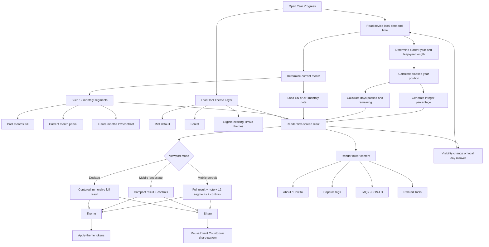
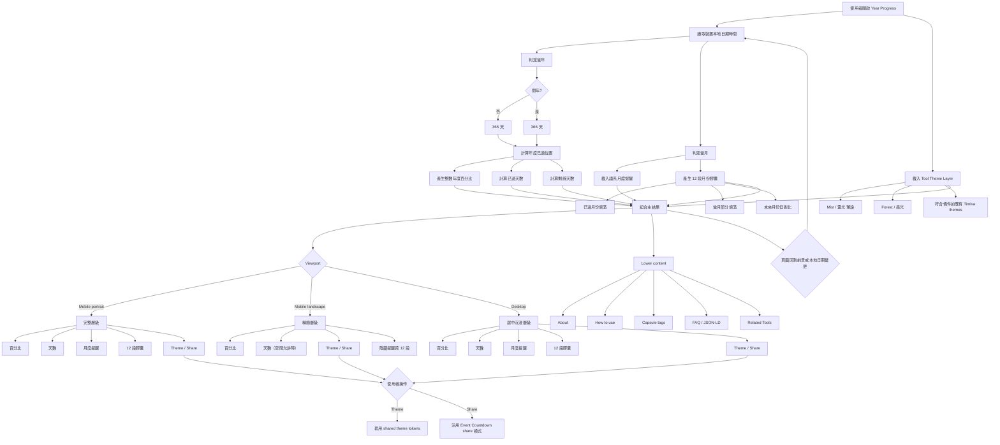
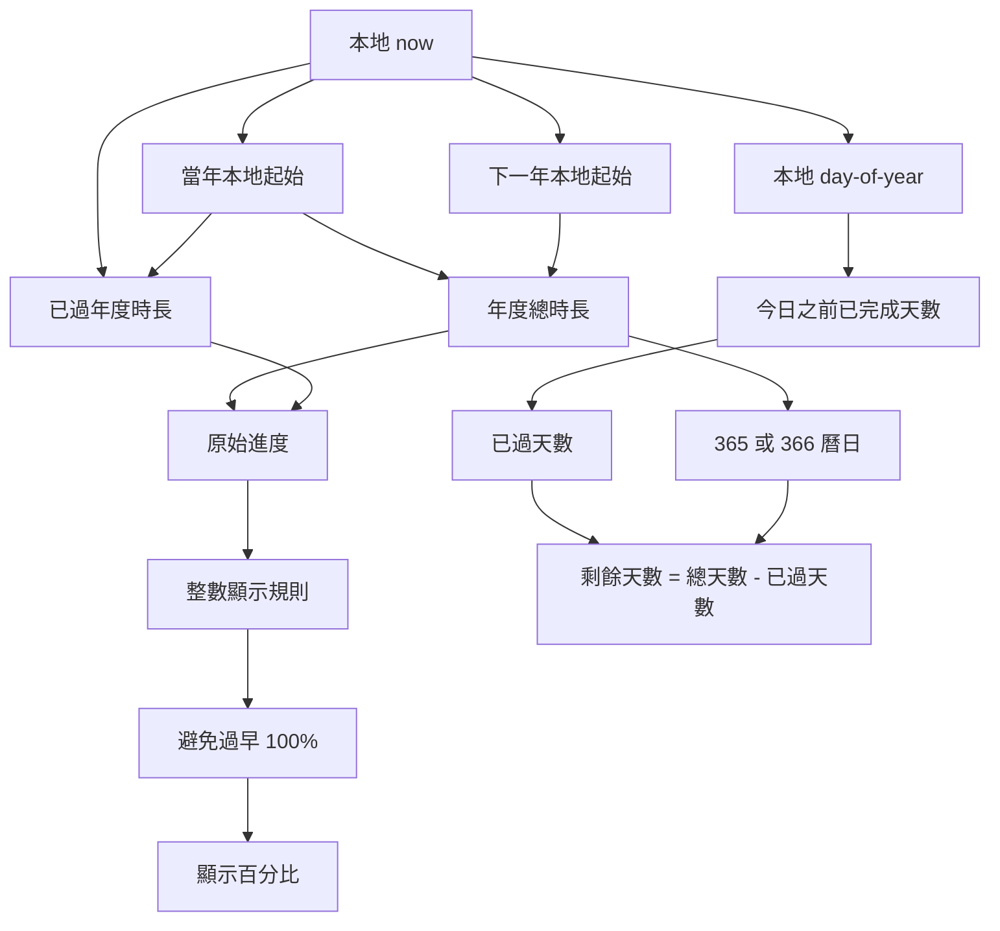
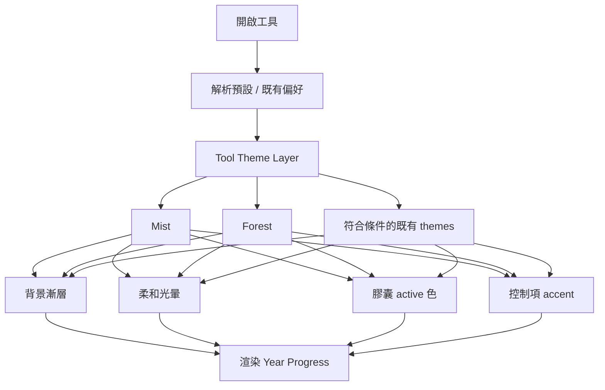
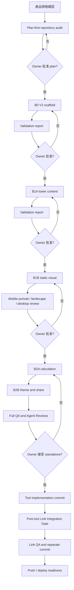

# Timiva Year Progress Product Spec V1

Date: 2026-06-21  
Last updated: 2026-06-27  
Owner: Jane / Timiva  
Status: Implementation complete · Link integration complete（rebuild/main local commits `f39f8bc`, `20c379d`）· Not pushed · Not deployed

Related docs:

```text
docs/tools/year-progress/README.md
docs/core/product-architecture.md
docs/workflow/tool-link-integration.md
docs/project/current-status.md
```

---

## 1. Tool overview

### Public name

```text
English: Year Progress
繁體中文：今年進度
```

### Internal concept

```text
Year Progress Card
今年進度卡
```

「Card」只代表結果具有可截圖、可分享的完整感，不代表主畫面要放在實體卡片容器裡。

### Routes

```text
/en/year-progress/
/zh/year-progress/
```

### Category

```text
Life Progress / 人生進度
```

Timiva 四大分類名稱維持不變：

```text
Important Dates / 重要日子
Timers & Focus / 計時與專注
Daily Rhythm / 日常節奏
Life Progress / 人生進度
```

---

## 2. Product positioning

Year Progress 是 Timiva V1 第四個核心工具，也是 Life Progress 類別在 V1 的代表工具。

核心體驗：

```text
打開頁面。
看見今年已經走到哪裡。
讀到一句當月提醒。
用 12 段柔和膠囊感受年度節奏。
切換心情。
分享當下。
```

產品特性：

```text
Zero-input
Mobile-first
Full-bleed
Calm
Low-maintenance
Widget-like
Pure frontend first
```

它不是：

```text
Life countdown
Goal management
Milestone tracker
Habit tracker
Productivity dashboard
Multi-mode progress calculator
```

---

## 3. MVP scope

### Included

```text
1. Current year
2. Integer year-progress percentage
3. Days passed / days remaining
4. One monthly note
5. 12-segment monthly pill progress
6. Theme switching
7. Share behavior aligned with Event Countdown
8. EN / ZH
9. About / How to use / capsule tags
10. FAQ / FAQ JSON-LD / metadata
11. Related Tools
12. ToolAdSlot in disabled state
```

### Explicitly excluded

```text
Life mode
Custom timeline
Birth date input
Goal date input
Milestone input
Multi-mode switch
Goal tracking
Task tracking
Daily notes
AI-generated notes
User-uploaded notes
Backend
CMS
Database
Image export
Account / cloud sync
```

Future extensions should be separate small tools:

```text
Month Progress
Milestone Progress（working name）
Life Timeline
Goal Countdown
```

---

## 4. Main visual direction

The first-screen tool experience should be:

```text
Full-bleed
Fullscreen-like
Immersive
Large centered percentage
Soft themed background
No visible card shell
No obvious bordered panel
```

Do not change the protected global background or BaseLayout.
The themed visual belongs to the tool’s own first-screen visual layer.

---

## 5. Main result copy

### Traditional Chinese

```text
2026 年已經走過

46%
```

### English

```text
2026 has unfolded

46%
```

The year is dynamic.
The large percentage is the primary result.

Tone:

```text
Calm
Observational
Not judgmental
Not productivity pressure
Not a completion score
```

---

## 6. First-screen hierarchy

### Mobile portrait and desktop

```text
1. Tool name / year context
2. “2026 年已經走過” / “2026 has unfolded”
3. Large percentage
4. Days passed / days remaining
5. Monthly note
6. 12-segment pill progress
7. Theme / Share
```

Information roles:

```text
Percentage = primary visual result
Days = rational supporting information
Monthly note = emotional layer
12 segments = annual rhythm
Theme / Share = secondary controls
```

### Desktop intent

```text
Keep the main visual centered within the first-screen stage.
The exact vertical offset, max width, type scale, and control spacing are implementation-level decisions.
Cursor must propose them during Plan-first by comparing existing V2 tools.
```

---

## 7. Date and progress rules

### Time basis

```text
Use the user device’s local date and local time.
Do not require a timezone input.
```

### Year length

```text
Normal year: 365 days
Leap year: 366 days
Leap-year February: 29 days
```

### Days passed / remaining

Recommended semantic baseline:

```text
daysPassed = fully elapsed calendar days before today
daysRemaining = total days in year - daysPassed
```

Examples:

```text
Jan 1:
0 days passed
365 or 366 days remaining

Dec 31 in a normal year:
364 days passed
1 day remaining
```

The current day is included in “days remaining.”

### Percentage

```text
Calculate progress from the start of the local year to the start of the next local year.
Display an integer percentage.
Do not show 100% early on Dec 31.
```

Required edge behavior:

```text
The active year should remain below 100% until the year is effectively complete.
At year rollover, the page should switch to the new year rather than keep showing the previous year at 100%.
```

The exact rounding / clamping formula is an implementation-level rule.
Cursor must propose one testable formula during Plan-first and include Jan 1, leap day, Dec 31, and year-rollover tests.

### Refresh and update behavior

```text
Recalculate on page load.
Recalculate when the page becomes visible again.
Update when the local calendar day changes.
No second-by-second countdown animation is required.
```

---

## 8. 12-segment pill progress

### Structure

```text
12 segments
1 segment = 1 calendar month
January to December, left to right
Pill-shaped
No dots
No circular progress as the primary year visualization
```

### States

```text
Completed months: fully filled
Current month: partially filled
Future months: low contrast / unfilled
```

### Current-month fill

```text
Use actual progress within the current calendar month.
Use the actual number of days in that month.
Leap-year February uses 29 days.
```

The current-month partial fill should remain visually consistent with the annual percentage.

Mobile does not need visible month labels unless a later QA task proves they are necessary.

---

## 9. Monthly notes

### Recommended content path

```text
src/content/year-progress/monthly-notes.json
```

Rules:

```text
EN and ZH in the same data file
One note per month
Internal project content only
No CMS
No backend
No daily randomization
No AI generation
No user customization
Easy annual review by editing one file
```

### Confirmed monthly notes V1

| Month | 繁體中文 | English |
|---:|---|---|
| 1 | 讓這一年，從一小步開始。 | Let the year begin with one small step. |
| 2 | 小小的前進，也算數。 | Small steps still count. |
| 3 | 留意那些正在慢慢長出來的事。 | Notice what is beginning to grow. |
| 4 | 調整一下節奏，也是一種前進。 | A small adjustment is still progress. |
| 5 | 把注意力留給真正重要的事。 | Keep your attention on what matters. |
| 6 | 這一年走到一半，還有一半可以慢慢使用。 | Half the year has passed, and half is still yours to use. |
| 7 | 重新開始，不一定要等到明年。 | You can begin again before a new year arrives. |
| 8 | 慢慢維持，也是一種力量。 | Keeping a gentle rhythm is its own strength. |
| 9 | 收斂一些，讓重點變清楚。 | Narrow the noise. Let the focus become clear. |
| 10 | 看看已經完成的，也看看還想留下的。 | Notice what is done, and what still matters. |
| 11 | 放慢一點，把剩下的時間用得剛好。 | Slow down a little. Use what remains gently. |
| 12 | 慢慢收尾，也記得看看自己走過的路。 | Close the year gently, and notice how far you came. |

---

## 10. Theme direction

Theme should extend Timiva’s existing Event Countdown visual language.

### Year Progress additions

```text
Mist / 霧光
Forest / 森光
```

### Mist / 霧光

```text
Recommended default feeling
Blue-gray / soft purple-gray
Mist-like
Low contrast
Soft glow
```

### Forest / 森光

```text
Natural forest feeling
Deep green / gray green
Low saturation
Soft forest-like glow
No literal forest image
No leaf pattern
No bright or neon green
```

### Theme affects

```text
Tool-specific background gradient
Soft glow
Pill active color
Button / chip accent detail
```

### Theme does not affect

```text
Typography
Layout
Button dimensions
Calculation
Monthly note
Content order
```

---

## 11. Reusable Tool Theme Layer

Create a reusable:

```text
Tool Theme Layer
工具主視覺主題層
```

It is for tool-specific hero / first-screen visual themes.
It is not the global site background.

It may govern:

```text
Theme tokens
Tool visual gradients
Glow tokens
Progress active colors
Control accent details
```

It must not govern or modify:

```text
Global background
BaseLayout
Header
Footer
Whole-site page shell
```

Implementation boundary:

```text
Year Progress should be the first new tool to use this shared layer.
Event Countdown themes are the visual source and architecture reference.
Do not refactor the accepted Event Countdown implementation in the same task.
Any later Event Countdown migration needs a separate Owner-approved task.
```

Possible files are not product decisions:

```text
src/styles/tool-themes.css
src/lib/toolThemes.ts
```

Cursor must inspect the repository and propose the actual file structure during Plan-first.

---

## 12. Responsive behavior

### Mobile portrait

Keep:

```text
Tool name / year
Main copy
Large percentage
Days passed / remaining
Monthly note
12-segment pill progress
Theme / Share
```

Goals:

```text
Main result is immediately understandable.
Controls are comfortably reachable.
No unnecessary first-screen density.
```

### Mobile landscape

Intentionally reduce content.

Keep:

```text
Tool name / year context
Main percentage
Compact days information if it remains visually comfortable
Theme / Share controls
```

Remove from the first screen:

```text
Monthly note
12-segment pill progress
```

Rules:

```text
Primary number remains dominant.
Controls stay near the bottom of the first screen.
Do not reuse the full portrait stack.
Do not force hidden content into a cramped landscape layout.
```

### Desktop

```text
Centered immersive main visual
No literal card container
Monthly note and 12-segment progress remain visible
Theme / Share remain secondary
```

Exact dimensions belong to the B1B static-visual task.

---

## 13. Controls and persistence

### Controls

```text
Theme / 主題
Share / 分享
```

### Theme preference

Product requirement:

```text
Default theme: Mist / 霧光
```

Repository-alignment rule:

```text
During Plan-first, Cursor must inspect Event Countdown’s actual theme persistence pattern.
It must recommend whether Year Progress should reuse that same local persistence behavior.
Do not invent an unrelated theme-storage system.
```

### Share

```text
Reuse Event Countdown’s established share pattern.
Do not build a separate sharing system.
No image download / generated share card in MVP.
```

Exact share copy and fallback behavior must be proposed after repository inspection.

---

## 14. Lower content

### Capsule tags

Suggested:

```text
Yearly reflection / 年度回顧
Time awareness / 時間感
Gentle reminder / 輕量提醒
```

### About draft

#### 繁體中文

```text
今年進度讓你快速看見今年已經走過多少、還剩多少。頁面會依照裝置的本地時間自動更新，不需要輸入日期或設定目標。
```

#### English

```text
Year Progress gives you a quiet glance at how much of the current year has passed and how much remains. It updates from your device’s local time with no setup required.
```

### How to use draft

#### 繁體中文

```text
打開頁面即可查看今年進度、已過天數與剩餘天數。當月提醒和 12 段月份進度會自動更新。你也可以切換主題，或分享目前的年度進度。
```

#### English

```text
Open the page to see the current year percentage, days passed, and days remaining. The monthly note and 12-month progress update automatically. You can also change the theme or share the current progress.
```

### FAQ draft

#### 1. 今年進度是怎麼計算的？

```text
工具會依照你裝置的本地日期與時間，計算從今年開始到明年開始之間已經經過的比例。
```

```text
The tool uses your device’s local date and time to calculate the elapsed portion between the start of this year and the start of the next year.
```

#### 2. 閏年會怎麼計算？

```text
閏年會以 366 天計算，2 月使用 29 天。畫面仍維持 12 段月份進度，不會增加第 13 段。
```

```text
Leap years use 366 days and February uses 29 days. The visual still keeps 12 monthly segments.
```

#### 3. 為什麼 12 月 31 日不會太早顯示 100%？

```text
為了避免在一年真正結束前就顯示完成，工具會讓進度在年末持續接近 100%，並在跨年後切換到新年度。
```

```text
To avoid showing completion before the year has actually ended, progress stays below 100% through the active year and switches to the new year at rollover.
```

#### 4. 需要輸入個人資料嗎？

```text
不需要。工具會直接使用裝置的本地時間計算，不需要生日、帳號或其他個人資料。
```

```text
No. The tool calculates from your device’s local time and does not require a birthday, account, or other personal information.
```

#### 5. 可以在手機上使用嗎？

```text
可以。手機直式會顯示完整年度資訊；手機橫式會保留主要數字與控制，減少畫面擁擠。
```

```text
Yes. Mobile portrait shows the full year view, while mobile landscape keeps the primary result and controls compact.
```

### Related Tools

Initial:

```text
Event Countdown
Date Range Calculator
Countdown Timer
```

Future replacement candidates:

```text
Month Progress
Milestone Progress
Goal Countdown
```

---

## 15. SEO baseline

### English

```text
H1: Year Progress
Meta title: Year Progress — See How Much of the Year Has Passed | Timiva
Meta description: See the current year’s progress, days passed, days remaining, monthly rhythm, and a calm reminder—automatically based on your local time.
```

### Traditional Chinese

```text
H1：今年進度
Meta title：今年進度－查看今年已過與剩餘比例 | Timiva
Meta description：快速查看今年已經走過多少、還剩多少天，以及 12 個月份的年度節奏。依照你的本地時間自動更新。
```

SEO content must remain below the primary tool experience.
Do not turn the page into a long-form SEO article.

---

## 16. Product function flow



---

## 17. Development sequence

Use Timiva’s layout-first workflow:

```text
Plan-first: repository audit and batch proposal

B0:
V2 tool page scaffold

B1A:
Lower content
About / How to / capsule tags / FAQ / JSON-LD / Related Tools / EN / ZH

B1B:
Upper static visual
Percentage / days / note / 12 segments / Theme and Share controls
Mobile portrait / mobile landscape / desktop

B2A:
Date calculation and automatic update behavior

B2B:
Tool Theme Layer / theme switching / persistence alignment / share behavior

B3:
Cross-device QA / regression / docs / validation report

Post-tool Link Integration:
Run only after the standalone tool is accepted and committed
```

Each batch requires a completion report and Owner approval before the next batch.

---

## 18. Locked and protected scope

Do not modify without explicit Owner approval:

```text
Header
Footer visual layout
BaseLayout
Global background
ToolCard baseline
RelatedToolRow baseline
Tool Drawer baseline
LegalTextLayout
Event Countdown core logic
Event Countdown theme / share behavior
Date Range calculation core
Countdown Timer accepted implementation
ToolAdSlot visual style
```

ToolAdSlot remains disabled.
No live AdSense integration.

---

## 19. Ready-for-plan conclusion

Product decisions are complete enough to enter Plan-first.

The following are repository / implementation decisions, not unresolved product questions:

```text
Exact shared theme file names
Exact component hierarchy
Exact CSS class and token names
Whether existing theme persistence can be reused directly
Exact Event Countdown share helper reuse
Exact desktop measurements
```

Cursor must inspect the repository and propose these before editing files.

---

## 產品流程

> 本章節整合自原 `timiva-year-progress-product-flow-v1.md`，作為實作與 QA 的流程參考。  
> 狀態：產品流程已確認 · B0–B3 與 Link Integration 已於 rebuild/main 完成本地 commit。

### 主要使用流程



### 計算流程



實作必須測試：

```text
Jan 1
Feb 28
Feb 29（閏年）
Mar 1（閏年後）
Dec 31
本地跨年
跨午夜開啟
背景化後恢復
```

### Theme 流程



Tool Theme Layer **不得**修改：

```text
BaseLayout
Global background
Header
Footer
Whole-site page shell
```

Theme 持久化與 URL share 參數見 B2B2 / B2B3 驗收報告（`local-docs/reports/year-progress/`）。

### 開發 Gate 流程



目前進度（2026-06-27）：

```text
B0–B3 standalone：完成（commit f39f8bc）
Post-tool Link Integration：完成（commit 20c379d）
Automated validation：node scripts/validate-tool-link-integration.mjs — passed
Push / deploy：待 Owner 授權
HTTPS Share 成功驗證：deploy 後 non-blocking follow-up
```

Link Integration 規則與 checklist：`docs/workflow/tool-link-integration.md`
