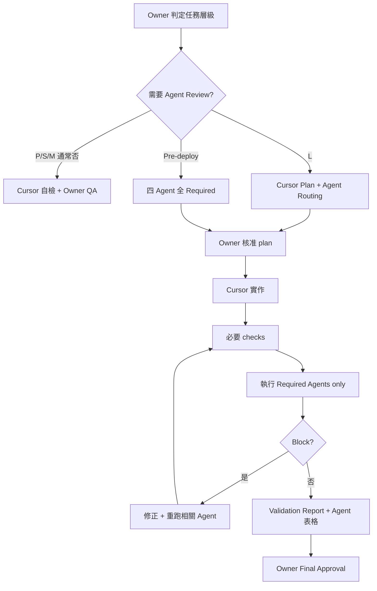

# Timiva Agent Review Workflow

## 文件目的

本文件定義 Timiva **Targeted Agent Review** 模型：不是每個任務都跑四個代理人，而是依 **P/S/M/L 層級**與任務性質，只啟用需要的 Agent。

它用來回答：

```text
什麼時候需要 Agent Review？
Cursor 在 plan 階段怎麼寫 Agent Routing？
Pass / Block 怎麼處理？
Validation report 怎麼整合 Agent 結果？
```

相關文件：

- 任務分級與 Owner 授權：[`docs/workflow/owner-workflow.md`](owner-workflow.md)
- 角色定義：`agents/README.md`、`agents/*.md`
- Cursor 任務入口：根目錄 `AGENTS.md`

> 根目錄 `AGENTS.md` 是 Cursor 任務入口。  
> `agents/*.md` 是角色定義。  
> 舊版 monolithic agents 封存於 `local-docs/archive/legacy-agents-v1.md`，不可放回根目錄。

---

## 1. Review 強度與任務層級

| 任務層級 | Agent Review |
|---|---|
| **P** Polish | ❌ 不需要 |
| **S** Small | ❌ 不需要 |
| **M** Medium | 通常 ❌；plan 中仍須列出 Agent Routing（通常全 N/A） |
| **L** Large | ✅ **Targeted Agent Review** |
| **Pre-deploy** | ✅ **四代理人完整審查** |

**Targeted** = 只跑 plan 中標記 `Required` 的 Agent，不必四個都跑。

---

## 2. Four-Agent 模型

Timiva 使用 4 個固定代理人：

| Agent | 中文角色 | 核心責任 | 守住的問題 |
|---|---|---|---|
| Experience Lead | UI/UX 體驗長 | 手機操作、觸控目標、使用流程、減法設計 | 使用者能不能直覺完成任務 |
| Brand Guardian | 視覺風格官 | 視覺一致性、Widget-like 品牌感、樣式漂移 | 畫面是否像 Timiva |
| Tech Architect | 技術架構師 | Astro、Tailwind、語意化 HTML、JS 穩定、低維護 | 程式是否穩定低維護 |
| Growth Strategist | SEO 與增長駭客 | SEO、AEO、FAQ Schema、Related Tools、內部連結 | 工具是否能被搜尋與理解 |

角色檔位置：

```text
agents/README.md
agents/experience-lead.md
agents/brand-guardian.md
agents/tech-architect.md
agents/growth-strategist.md
```

---

## 3. Agent Review 流程



---

## 4. Plan-first Agent Routing

M / L / Pre-deploy 任務的 Implementation Plan **必須**包含 Agent Routing。

固定格式：

```text
## Agent Routing

Experience Lead: Required / N/A
Reason:

Brand Guardian: Required / N/A
Reason:

Tech Architect: Required / N/A
Reason:

Growth Strategist: Required / N/A
Reason:
```

### Default rules

```text
改 code → Tech Architect 通常 Required
改 UI / layout / mobile / flow → Experience Lead + Brand Guardian 通常 Required
改 SEO / FAQ / meta / internal links / ads → Growth Strategist Required
純 docs 搬移、無產品判斷 → 四 Agent 可全 N/A（註明原因）
```

### M 層

```text
通常四 Agent 全 N/A
若任務涉及 UI + SEO 同時變更，應升級至 L 並啟用 targeted review
```

---

## 5. 各情境的 Targeted 建議

### 5.1 UI / layout / visual（L 層）

通常 Required：

```text
Experience Lead
Brand Guardian
Tech Architect
```

視情況：

```text
Growth Strategist — 若影響 H1、FAQ、Related Tools、SEO content、內部連結
```

### 5.2 新工具 MVP / 工具頁完整交付（L 層）

通常 Required：

```text
Experience Lead
Brand Guardian
Tech Architect
Growth Strategist
```

### 5.3 跨工具共用 baseline（L 層）

範例：Global Interactive Cursor、Utility Capsule Control

通常 Required：

```text
Brand Guardian — 跨工具視覺一致
Experience Lead — 互動層級、touch、focus、reduced-motion
Tech Architect — 共用 CSS 架構、validator 邊界
Growth Strategist — 通常 N/A
```

### 5.4 Legal / Text page（M 或 L）

通常 Required：

```text
Tech Architect
Growth Strategist
```

視情況：

```text
Experience Lead — 閱讀動線、手機排版
Brand Guardian — LegalTextLayout 視覺
```

### 5.5 Ads 任務（L 層）

通常 Required：

```text
Experience Lead
Brand Guardian
Growth Strategist
Tech Architect
```

### 5.6 Pre-deploy / final check

**必跑四代理人全部 Required**，不採 targeted 省略。

---

## 6. P / S 層：不需要 Agent Review

P / S 層 **不執行** Agent Review。

Cursor 仍應在回報中註明：

```text
任務層級：P / S
Agent Review：N/A — 層級不需要 Agent Review
```

若 P/S 實作過程發現需要 cross-tool 或 SEO 結構變更，**停止並建議升級至 M 或 L**。

---

## 7. Gate 檢查重點（L / Pre-deploy 用）

各 Agent 的 Gate 檢查重點摘要；完整定義見 `agents/*.md`。

### Experience Lead

```text
手機主流程可完成 · 觸控目標合理 · 減法設計
Bottom Sheet 順手 · 廣告/SEO 不壓過主任務
```

可 Block：主流程無法完成、CTA 不清、觸控太小、橫式嚴重跑版。

### Brand Guardian

```text
像 Timiva · Widget-like · Bento/card 一致 · 無樣式漂移
```

可 Block：明顯不像 Timiva、元件與既有頁不一致、layout 失衡。

### Tech Architect

```text
build 成功 · 無 console error · 語意 HTML · Tailwind 合規
無 inline style / !important / id selector · 共用元件未破壞
```

可 Block：build 失敗、邏輯錯誤、LocalStorage crash、破壞既有工具。

### Growth Strategist

```text
H1 / meta 合理 · FAQ 真問題 · Schema 正確
Related Tools 合理 · SEO 區塊在工具之後
```

可 Block：meta 缺失、FAQ 與功能不符、Schema 錯誤、中英文混雜。

---

## 8. 結果定義

每個 Agent 只能回傳：

```text
Pass
Pass with minor notes
Block
N/A（未 Required 時）
```

| 結果 | 意義 |
|---|---|
| **Pass** | 可進入下一 Agent 或 Owner Final Approval |
| **Pass with minor notes** | 可繼續；minor notes 不阻擋 Owner 確認 |
| **Block** | 不得要求 Owner Final Approval；不得 commit / deploy |
| **N/A** | 本次未 Required；须写原因 |

---

## 9. Block handling

任一 Required Agent 回傳 `Block` 時：

```text
1. 不得要求 Owner Final Approval
2. 不得 commit / deploy
3. 必須列出 Block 原因
4. 修正後只需重跑相關 Agent
5. Pre-deploy 任務建議 Block 修正後四 Agent 全部重跑
```

Block 回報格式：

```text
Blocking Agent:
Block reason:
Affected files:
Required fix:
Retest needed:
Owner decision needed:
```

---

## 10. Agent 衝突裁決

依 Timiva 最高決策順位：

```text
1. 使用者能不能在手機上舒服完成主要任務
2. 是否符合 Timiva Widget-like 品牌核心
3. 是否能低維護、穩定、純前端運作
4. 是否有 SEO / AEO 價值
5. 是否不破壞未來廣告與變現空間
```

| 衝突 | 裁決 |
|---|---|
| SEO 想加更多文字，UX 覺得干擾 | UX 優先，SEO 下移或收斂 |
| 視覺想加動畫，Tech 覺得高維護 | 低維護優先，改成輕量效果 |
| Tech 想用最簡表單，Brand 覺得太傳統 | 保留低維護，調整成 Timiva 元件風格 |
| 廣告想放高流量位置，UX 覺得干擾 | 不放，改放任務完成後 |

---

## 11. Validation Report 整合

M 層以上（及 Pre-deploy）的 validation report 必須包含：

```text
| Agent | Required? | Result | Notes |
|---|---|---|---|
| Experience Lead | Yes / No | Pass / Minor / Block / N/A | |
| Brand Guardian | Yes / No | Pass / Minor / Block / N/A | |
| Tech Architect | Yes / No | Pass / Minor / Block / N/A | |
| Growth Strategist | Yes / No | Pass / Minor / Block / N/A | |
```

若 Agent 為 N/A，**必须**写原因。

P/S 層可整段省略或一行註明「層級不需要 Agent Review」。

---

## 12. Owner Final Approval

Phase A 規則：

```text
Targeted Agents Pass ≠ 可以 commit
四 Agents 全 Pass ≠ 可以 deploy
Cursor 必須整理 Owner Final Approval Summary
Owner 明確確認前，不得 commit / push / deploy / 改 locked components
```

Owner 確認語句示例：

```text
確認，可以進入下一步。
```

Push / deploy 需 Owner **另外明示**。

---

## 13. Owner Final Approval Summary 格式

L 層與 Pre-deploy 建議包含：

```text
1. 任務層級與 scope
2. Required Agents 驗證結果
3. 是否有 Block（应已清零）
4. 是否有衝突建議及裁決
5. 仍存在的 minor notes
6. 是否符合 product-principles
7. 是否符合 wireframe（若适用）
8. 手機直式 / 橫式（若涉及 UI）
9. SEO / 內容（若 Required Growth Strategist）
10. 是否可進入 commit 授權範圍
11. 需要 Owner 確認的最後問題
```

---

## 14. 與舊版 workflow 的差異

| 舊版 | 現版 |
|---|---|
| 幾乎每個 code 任務都暗示四 Agent | P/S 不需要；M 通常不需要 |
| CEO Workflow 固定 Agents Review | 依 P/S/M/L 決定 |
| `timiva-agent-review-workflow-v1.md` 全 Required 情境 | 本文件：Targeted + Pre-deploy 全 Required |

舊文件 `docs/workflow/agent-review.md` 在搬移完成後封存；**以本文件為準**。

---

## 15. 結論

```text
P/S：不跑 Agent
M：plan 寫 Routing，通常全 N/A
L：Targeted Agent Review
Pre-deploy：四 Agent 完整審查
Block 清零 + Owner 確認後，才可進入 commit 授權範圍
```
