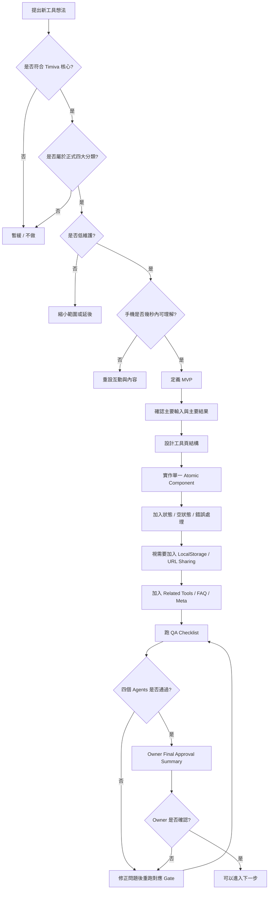

# Timiva New Tool Development Rules V2

> 最後更新：2026-06-21

## 文件目的

本文件定義 Timiva 新增工具時的開發判斷、MVP 範圍、頁面結構、狀態設計、資料保存、SEO、Related Tools 與 QA 注意事項。

所有新工具都應先遵守本文件，再進入設計、開發與驗收。

---

## 1. 新工具開發核心原則

Timiva 新工具開發應該遵守：

```text
少做
做舒服
手機優先
低維護
像 Widget
不要變成傳統工具大全
```

每個新工具都應該先問：

```text
這個工具是否值得被放到手機桌面上？
```

如果答案不明確，就先不要做，或縮小成更單純的版本。

---

## 2. 新工具開發流程圖



---

## 3. 新工具必須符合的核心問題

新增任何工具前，先回答：

```text
1. 這個工具是否跟時間、日期、節奏、進度有關？
2. 這個工具是否屬於 Important Dates / Timers & Focus / Daily Rhythm / Life Progress？
3. 使用者是否能在幾秒內理解用途？
4. 手機上是否能快速完成主要操作？
5. 是否可以純前端或低維護完成？
6. 是否能像一張高質感的小 App / Widget？
7. 是否會讓 Timiva 更像傳統工具站？
8. 是否會引入過高維護成本？
```

若答案偏向以下情況，就應暫緩或重新縮小範圍：

```text
需要會員
需要後端
需要大量資料庫
需要每日維護資料
需要醫療 / 財務 / 法律判斷
需要複雜報表
需要大型目標管理
需要社群或排行榜
```

---

## 4. 正式四大分類

Timiva 新工具必須優先歸入以下四大分類：

```text
1. Important Dates
2. Timers & Focus
3. Daily Rhythm
4. Life Progress
```

中文對應：

```text
1. 重要日子
2. 計時與專注
3. 日常節奏
4. 人生進度
```

---

## 5. 分類判斷規則

### 5.1 Important Dates

適合：

```text
重要日期
事件倒數
日期區間
日期加減
生日 / 年齡
紀念日
```

判斷問題：

```text
這個工具是在處理「哪一天」或「距離某一天多久」嗎？
```

---

### 5.2 Timers & Focus

適合：

```text
倒數計時
碼表
專注計時
全螢幕計時
番茄鐘
會議計時
```

判斷問題：

```text
這個工具是在處理「現在開始的一段時間」嗎？
```

---

### 5.3 Daily Rhythm

適合：

```text
呼吸節奏
休息提醒
恢復時間
斷食時間追蹤
起床後能量區間
日常節奏安排
```

判斷問題：

```text
這個工具是在幫使用者安排每天的節奏、休息、能量或恢復嗎？
```

注意：

```text
Daily Rhythm 不提供醫療、健康診斷、營養建議或療效承諾。
```

---

### 5.4 Life Progress

適合：

```text
年度進度
月份進度
人生進度
目標期限
里程碑進度
自訂時間範圍進度
```

判斷問題：

```text
這個工具是在幫使用者看見長期時間或目標進度嗎？
```

---

## 6. MVP 定義原則

每個新工具一開始只做最小可用版本。

MVP 應包含：

```text
一個清楚的主要用途
一個主要結果
最少必要輸入欄位
合理預設狀態
重設功能
手機直式可用
手機橫式不跑版
桌機版正常
基本 FAQ
相關工具推薦
Meta title / description
```

MVP 不應包含：

```text
帳號登入
雲端同步
複雜統計
多目標管理後台
社群分享系統
排行榜
推播後端
過度客製化主題
完整資料庫
```

---

## 7. 新工具頁標準結構

每個工具頁建議包含：

```text
1. Header
2. Tool Hero / H1 / Short Description
3. Tool App Area
4. Main Result / Status Area
5. Input / Control Area
6. Optional Templates / Quick Actions
7. Related Tools
8. FAQ / SEO Content
9. Footer
```

建議視覺優先順序：

```text
主結果 > 主要操作 > 輔助設定 > 相關工具 > FAQ > Footer
```

不要讓 FAQ、SEO、廣告或大量導覽搶走主工具焦點。

---

## 8. Atomic Component 開發方式

Timiva 新工具不得一次叫 Cursor 做完整工具。

每次任務應拆成：

```text
Tool Page Shell
Tool Hero
Result Card
Input Panel
Control Buttons
Mobile Bottom Control
Bottom Sheet
Related Tools
FAQ Section
SEO Metadata
```

每次只做一個 Atomic Component 或一個明確區塊。


### 8.1 新工具建議實作順序（Layout-first）

Timiva 新工具應優先採用以下順序，不要一開始就進入完整互動程式。

```text
1. 建立正確工具頁版型
   - 建立 route
   - 套用 V2 tool page shell
   - 放好 Header / Footer
   - 建立 first-screen container
   - 建立 lower content area
   - 建立 drawer / ToolAdSlot disabled 結構

2. 補下方靜態內容
   - About / 說明區
   - How to use / 使用方式
   - FAQ
   - FAQ JSON-LD
   - Related Tools
   - EN / ZH 文案

3. 做上方工具靜態畫面
   - 先不寫互動
   - 先確認 mobile portrait、mobile landscape、desktop 的視覺比例、節奏與層級
   - 先讓頁面看起來像正式 Timiva 工具

4. 最後才加互動與動態
   - JS state machine
   - 使用者操作
   - LocalStorage
   - Bottom sheet
   - 動畫 / 音效 / 動態效果
```

原因：

```text
這個順序可以先確認頁面結構、內容完整性與視覺方向，再處理高風險互動程式。
避免一開始就把 layout、SEO content、RWD、state machine、動畫混在同一批次，造成測試困難與回頭重修。
```

B0 scaffold 的定義：

```text
B0 不是空白頁。
B0 應該是「V2 工具頁共用版型 scaffold」。
至少要包含 Header、Footer、tool page root、first-screen / stage 結構、lower content area、drawer / ToolAdSlot disabled 等基礎結構。
```

批次命名建議：

```text
B0：V2 工具頁版型 scaffold
B1A：下方內容層（About / How to use / FAQ / Related Tools）
B1B：上方工具靜態畫面
B2+：互動程式、state machine、sheet、動畫、音效與其他動態效果
```

限制：

```text
不要在同一批次混做版型、下方內容、上方靜態 UI、互動程式與動態效果，除非 Owner 明確批准。
每個批次完成後都要先回報與驗收，再進下一批。
```


---

## 9. 狀態設計

每個工具都應考慮以下狀態：

```text
預設狀態
使用者輸入中
計算完成狀態
空狀態
錯誤或不合理輸入狀態
重設後狀態
重新整理後狀態
手機直式狀態
手機橫式狀態
```

狀態文案應該：

```text
簡短
清楚
不責怪使用者
不過度技術化
```

---

## 10. LocalStorage 使用規則

可以使用 LocalStorage 保存低風險、低敏感度資料。

適合保存：

```text
事件名稱
選擇日期
計時器設定
最後一次工具狀態
單一目標進度
使用者偏好的簡單設定
```

不適合保存：

```text
敏感個資
健康診斷資料
付款資訊
帳號密碼
大量歷史紀錄
高風險隱私內容
```

實作注意：

```text
資料讀取失敗時不能 crash
資料格式變更時要有 fallback
重設功能應清掉對應資料
不同工具的 key 不應互相衝突
```

---

## 11. URL Sharing 使用規則

適合加入 URL sharing 的工具：

```text
Event Countdown
Date Range Calculator
Life Progress Bar
Goal Countdown
```

URL sharing 適合保存：

```text
日期
事件名稱
簡單模式
必要的設定值
```

避免在 URL 放：

```text
敏感資料
大量文字
健康相關細節
使用者不希望被分享的內容
```

---

## 12. Related Tools 規則

每個工具頁建議推薦 2 到 4 個相關工具。

原則：

```text
優先推薦同分類工具
再推薦互補使用情境
不要推薦太多
不要放在主工具上方
手機版避免密集列表
```

範例：

```text
Event Countdown → Date Range Calculator / Birthday Countdown / Age Calculator
Date Range Calculator → Days Between Dates / Add or Subtract Days / Age Calculator
Countdown Timer → Stopwatch / Pomodoro Timer / Fullscreen Timer
Life Progress Bar → Year Progress / Month Progress / Goal Countdown
Breathing Timer → Break Timer / Focus Flow Timer / Fasting Recovery Timer
```

---

## 13. FAQ 規則

每個新工具至少準備 3 題 FAQ，最多通常不超過 6 題。

建議題型：

```text
這個工具可以做什麼？
如何使用這個工具？
結果是怎麼計算的？
這個工具會儲存我的資料嗎？
可以在手機上使用嗎？
和另一個相似工具有什麼不同？
```

FAQ 不應：

```text
承諾工具沒有的功能
過度塞關鍵字
寫成長篇行銷文
放在主工具之前
```

---

## 14. SEO 最小需求

每個新工具頁至少需要：

```text
H1
短描述
Meta title
Meta description
Related Tools
FAQ
FAQ Schema
語意化 HTML
```

SEO 內容必須放在工具體驗之後。

頁面順序應保持：

```text
工具體驗在前
SEO 補充在後
FAQ 解答真問題
不要讓頁面變成傳統工具站
```

---

## 15. Daily Rhythm 工具邊界

Daily Rhythm 類工具可以做，但定位必須是時間追蹤與節奏提示。

可以做：

```text
呼吸節奏計時
休息提醒
斷食時間追蹤
恢復時間追蹤
起床時間後的能量區間推估
```

不要做：

```text
醫療建議
診斷
治療
營養建議
睡眠疾病判斷
健康保證
個人化醫療結論
```

必要時加入聲明：

```text
本工具僅用於時間追蹤與節奏參考，不提供醫療、營養或健康建議。
```

---

## 16. 新工具實作前檢查清單

```text
工具名稱已確認
分類已確認
優先級已確認
MVP 範圍已確認
主要輸入已確認
主要結果已確認
預設狀態已確認
是否需要 LocalStorage 已確認
是否需要 URL sharing 已確認
相關工具已確認
FAQ 初稿已確認
不做項目已確認
```

---

## 17. 新工具完成後檢查清單

```text
主要功能正常
預設狀態正常
空狀態正常
錯誤輸入不 crash
手機直式正常
手機橫式正常
桌機版正常
Bottom sheet 正常
FAQ 正常
Footer 正常
LocalStorage 正常
既有工具沒有被改壞
npm run build 成功
```

---

## 18. Owner Final Approval

目前 Timiva 採用 Phase A：Owner 主導確認期。

因此即使 Agents 全部通過，Cursor 仍必須整理 Owner Final Approval Summary。

在 Owner 明確確認前，不得進入：

```text
commit
deploy
重大結構調整
locked components 修改
```

---

## 19. 結論

Timiva 新工具開發應該保持：

```text
分類清楚
MVP 明確
手機優先
低維護
Atomic Component 開發
SEO 輔助工具體驗
Owner 前期最終確認
```

不要讓任何新工具讓 Timiva 變成傳統工具大全。

---

## 20. Countdown Timer 實作後的共用經驗（2026-06-21）

以下為跨工具可重用經驗，不含 Countdown Timer 專屬 class 或實作細節：

```text
共用 Sheet 必須先經真機 keyboard / visualViewport 驗收；emulation 不足以單獨定案。
Mobile portrait 與 landscape 可共用同一 Sheet 實作，但 layout mode 必須分開驗收。
真機 input focus 不可只依 emulation；H / M / S 與 action row 可見性需實機確認。
Scroll lock 不應任意混用 fixed-body 策略；新工具需明確選用 msb-scroll-lock / msb-sheet-open，避免不必要混用 tool-operation-open。
Pointer-based ring interaction 的 touch-action: none 只能加在 hit area，不可加在整頁或 stage。
互動刻度應直接改變既有視覺元素（例如 tick 線段），避免 overlay 疊加造成破圖感。
多語系主操作按鈕應內容驅動寬度、單行顯示；避免 locale 固定寬度把 grid 撐破。
Visual batch 通過 Owner 確認後應鎖定，避免後續功能 batch 重做已驗收的視覺。
Related Tools drawer hover 規則應放在 shared drawer baseline，不要複製到各工具 CSS。
```

---

## 21. V2 Utility Capsule Control（2026-06-27）

### Global Interactive Cursor

```text
Use semantic <button>, <a href>, <summary>, or correct interactive roles.

A new semantic interactive element automatically receives pointer cursor from global.css.

Do not add local cursor:pointer or cursor-pointer to each tool for ordinary controls.

Local cursor declarations are reserved for exceptional interaction states only.
```

### Utility Capsule Control

符合 **Utility Capsule Control** 資格的第一屏次要膠囊控制項必須使用 `.tool-utility-control`。

```text
A qualifying Utility Capsule Control must use .tool-utility-control.

Do not recreate transition, transform, shared shadow, hover lift,
or active reset in tool-local CSS.

Do not use .preview-tool-control-btn alone as semantic classification.

Only opt in when all Utility Capsule Control criteria are met.
```

Shared baseline：`src/styles/tools/tool-utility-control-v2-baseline.css`（由 `tool-result-v2-baseline.css` import）

Validators：

```bash
node scripts/validate-global-interactive-cursor-baseline.mjs
node scripts/validate-tool-utility-control-baseline.mjs
```

正式規範：[互動控制規範](../standards/interactive-controls.md)
