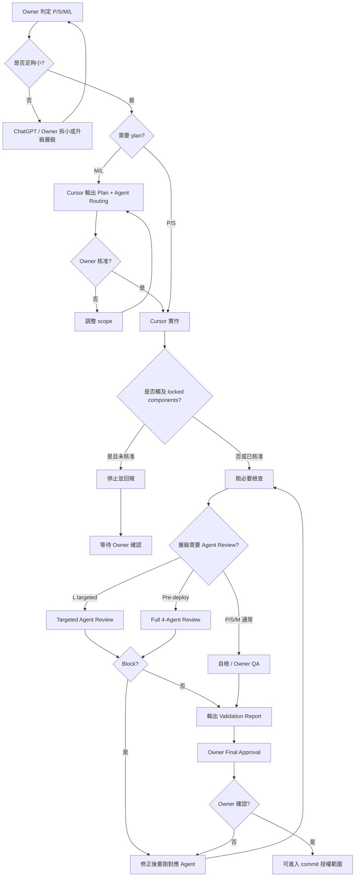

# Timiva Owner Workflow

## 文件目的

本文件定義 Timiva 的**Owner 主導開發流程**，以 **P / S / M / L 四層任務分級**取代舊版 CEO-only 模型。

它用來回答：

```text
ChatGPT、Cursor、Jane（Owner）各自負責什麼？
任務應該用哪一層？
什麼時候需要 plan、Agent review、validation report？
什麼時候可以 commit / push / deploy？
Cursor 何時必須停止或升級層級？
```

相關文件：

- Agent 審查細節：[`docs/workflow/agent-review.md`](agent-review.md)
- 文件索引與放置：[`docs/README.md`](../README.md)
- 決策紀錄：[`docs/project/decision-log.md`](../project/decision-log.md)

目前 Timiva 處於 **Phase A：Owner 主導確認期**。

---

## 1. 核心原則

```text
任務要小 · 範圍要清楚 · 共用元件要鎖定 · 完成後要驗證 · 前期由 Owner 確認
```

禁止：

```text
不要叫 AI 寫整站
不要叫 AI 一次完成完整工具
不要叫 AI 一次大改所有 layout
不要因 Agents 通過就自動 commit / deploy
```

---

## 2. 角色分工

| 角色 | 主要責任 | 典型產出 |
|---|---|---|
| **Jane（Owner）** | 產品方向、scope 核准、視覺與 UX 最終判斷、commit / push / deploy 授權 | 任務分級、核准 plan、Final Approval |
| **ChatGPT** | 任務拆解、plan 起草、規格整理、決策建議、文件草稿 | Task brief、implementation plan 草稿、分類建議 |
| **Cursor** | 讀 docs、輸出 plan（M/L）、依核准範圍實作、跑檢查、寫 validation report | Plan、code diff、validation report |
| **Agents（4 角色）** | L 層 targeted review；pre-deploy 完整 review | Pass / Minor / Block |
| **Skills** | 固定檢查流程輔助（可選） | 結構化 checklist 結果 |

**決策權：** Agents 與 Cursor 負責審查與執行，**不擁有** commit / push / deploy 決策權。

---

## 3. P / S / M / L 任務分級

### 3.1 總覽

| 層級 | 名稱 | 典型範例 | Implementation Plan | Agent Review | Validation |
|---|---|---|---|---|---|
| **P** | Polish | spacing 微調、hover 色值、文案 polish、截圖對齊 | ❌ 不需要 | ❌ 不需要 | Owner + Cursor 迭代 |
| **S** | Small | 單檔 bug、typo、明確一行修正、小範圍回歸 | ❌ 不需要正式 plan | ❌ 不需要 | 簡短自檢 |
| **M** | Medium | 單工具功能、單工具 QA、link integration、單工具 content | ✅ 簡短 plan | 通常 ❌ | Owner QA + 簡短 report |
| **L** | Large | 跨工具 baseline、共用 CSS、架構調整、新工具 MVP | ✅ 完整 plan | ✅ **Targeted** | 完整 report + targeted agents |
| **Pre-deploy** | 上線前總檢 | 整站或批次上線前 | pre-deploy checklist | ✅ **四代理人完整** | 完整 report |

### 3.2 P — Polish

```text
用途：視覺 polish、細節對齊
流程：Owner + Cursor 直接迭代
Plan：不需要
Agent Review：不需要
Doc 輸出：通常不需要 report；若形成 canonical 規則才更新 standards
授權：Owner 滿意後才可 commit；Cursor 不得自行 push / deploy
```

適合：

```text
調整某個 hover 色值
微調 padding / gap
對齊 Owner 截圖上的 1–2 個視覺細節
```

### 3.3 S — Small

```text
用途：小修正、範圍非常明確
流程：Owner 下指令 → Cursor 實作 → 簡短自檢 → Owner 確認
Plan：不需要正式 plan；指令中寫清楚範圍限制即可
Agent Review：不需要
Doc 輸出：必要時更新 decision-log；不需要 formal validation report
授權：Owner 確認後才可 commit
```

適合：

```text
修正單一 typo
修一個已定位的 build warning
補一個遺漏的 aria 屬性（不動 layout 結構）
```

### 3.4 M — Medium

```text
用途：單一工具範圍內的功能、QA、整合
流程：Owner / ChatGPT 出 task brief → Cursor 出簡短 plan → Owner 核准 → 實作 → Owner QA
Plan：需要簡短 Implementation Plan（含 Agent Routing 說明，通常全 N/A）
Agent Review：通常不需要；若任務意外觸及 SEO 結構或共用元件，升級至 L
Doc 輸出：local-docs validation report；涉及決策時更新 decision-log
授權：Owner Final Approval 後才可 commit / push / deploy
```

適合：

```text
Year Progress 站內 link integration
單工具 theme persistence
單工具 mobile landscape 修正
單工具 FAQ / meta 補強（不動全站 SEO 架構）
```

### 3.5 L — Large

```text
用途：跨工具、架構、共用 baseline、新工具 MVP
流程：ChatGPT 協助 plan → Cursor 出完整 plan + Agent Routing → Owner 核准 → 實作 → targeted Agent Review → validation report → Owner Final Approval
Plan：需要完整 Implementation Plan
Agent Review：Targeted（見 agent-review.md）
Doc 輸出：local-docs plan + validation report；canonical 變更更新 docs/standards 或 docs/workflow
授權：Owner Final Approval 後才可 commit；push / deploy 仍須 Owner 明示
```

適合：

```text
Global Interactive Cursor Baseline
Utility Capsule Control 共用 baseline
新工具 MVP 首次實作
跨四工具的控制項互動統一
locked components 變更（需 Owner 事前核准）
```

### 3.6 Pre-deploy

```text
用途：批次或整站上線前總檢
流程：依 docs/workflow/pre-deploy.md → 四代理人完整 review → 完整 validation report → Owner Final Approval
Plan：pre-deploy checklist 即 plan
Agent Review：Experience Lead + Brand Guardian + Tech Architect + Growth Strategist 全部 Required
授權：僅 Owner 可決定 push / deploy
```

---

## 4. 工作流程圖



---

## 5. Cursor 停止與升級規則

Cursor **必須停止**並回報 Owner，當：

```text
1. 任務需要修改 locked components 但未事前核准
2. 實作過程發現 scope 超出原 P/S/M/L 層級
3. 需要跨工具改共用 baseline 但任務被標為 M 或更低
4. 需要改 SEO 全站結構、BaseLayout、Header/Footer 視覺
5. 任一 Agent 回傳 Block
6. build 失敗或驗證 script 失敗且超出原任務範圍
```

**升級建議格式：**

```text
建議升級任務層級：

目前層級：
建議層級：
原因：
影響檔案：
是否需要完整 plan：
建議 Agent Routing：
等待 Owner 確認後再繼續。
```

**降級不可自動進行**；若 scope 縮小，仍須 Owner 確認。

---

## 6. Locked Components

以下元件完成並經 Owner 確認後視為 locked：

```text
Header
Footer visual layout
BaseLayout
Global background
Shared containers
Preview baseline layout
```

規則：

```text
1. Cursor 不得自行修改 locked components
2. 任務不需要時，不得順手修改
3. 若認為必須修改，先回報並等待 Owner 確認
4. L 層任務也一樣；locked 變更通常需 Owner 事前核准
```

回報格式：

```text
Component:
原因:
影響頁面:
替代方案:
Regression tests needed:
Owner approval required: yes
```

---

## 7. Atomic Component 定義

最小任務單位可以是：

```text
Tool Result Card · Control Buttons · Mobile Bottom Control
Bottom Sheet · Related Tools · FAQ Section · Ad Container placeholder
```

不應是：

```text
整個首頁 · 整個工具頁 · 整站 RWD · 全部 SEO · 全部廣告系統
```

---

## 8. 各層級驗證強度

### P — Polish

```text
Owner 視覺確認
Cursor 自述改了什麼
npm run build（若動到 code）
不需要 validation report 檔
```

### S — Small

```text
Cursor 列出修改檔案
docs 規範快速自檢（Tailwind、no inline style 等）
npm run build
Owner 確認即可
```

### M — Medium

```text
簡短 Implementation Plan（已完成）
npm run build
工具相關 validate scripts（若有）
Owner QA（含手機直式 / 橫式，若涉及 UI）
local-docs validation report（精簡版可接受）
Agent Review 表格：全 N/A 並註明原因
```

### L — Large

```text
完整 Implementation Plan
npm run build + 相關 validate scripts
Targeted Agent Review（見 agent-review.md）
完整 local-docs validation report
Owner Final Approval Summary
```

### Pre-deploy

```text
docs/workflow/pre-deploy.md 全項
四代理人完整 review
完整 validation report
Owner 明示 push / deploy 授權
```

---

## 9. Validation Report 基本格式

P 層通常省略。S 層可只用對話摘要。M 層以上建議使用：

```text
## Timiva Validation Report

### 1. 任務層級
P / S / M / L / Pre-deploy

### 2. 本次完成內容

### 3. 修改檔案

### 4. 是否修改 locked components
是 / 否 · 說明

### 5. Docs 規範檢查
| 檢查項目 | 結果 | 備註 |

### 6. Agent Review
| Agent | Required? | Result | Notes |
（P/S 可整段寫 N/A — 層級不需要 Agent Review）

### 7. 仍需 Owner 確認

### 8. Owner Final Approval
等待 Owner 確認，可以進入下一步。
```

若任務涉及 SEO / FAQ，M 層以上需補充 H1、meta、FAQ、Schema、Related Tools 檢查結果。

---

## 10. 文件輸出規則

| 層級 | 更新 tracked docs | 寫入 local-docs |
|---|---|---|
| P | 通常否 | 否 |
| S | 必要時 decision-log | 可選 note |
| M | decision-log（有決策時） | validation report |
| L | standards / workflow / decision-log（canonical 變更時） | plan + validation report |
| Pre-deploy | current-status | full validation report |

**Plan 與 report 預設放 local-docs**，不進 Git，除非 Owner 明確要求某份 plan 進 tracked。

---

## 11. Commit / Push / Deploy 授權邊界

### Cursor 可以做（在 Owner 核准 scope 內）

```text
讀 docs
輸出 plan
修改核准範圍內的 code / docs
跑 build 與 validate scripts
寫 local-docs report
```

### Cursor 不可以做（除非 Owner 明示）

```text
git commit
git push
deploy
修改 locked components（未核准）
擴大 scope
自行降級或略過 Agent Block
```

### Owner 授權語句

進入 commit 下一步：

```text
確認，可以進入下一步。
```

明示 push / deploy 時，Owner 需另外說明；**通過 QA 不等於可以上線**。

### 部署狀態表述規則

```text
Home、EC、DR、CT：可描述為已部署
Year Progress：實作完成，站內連結整合完成，待 Owner push / deploy
不得對 YP 使用「已上線」除非 Owner 完成 deploy 並更新 current-status
```

---

## 12. 最高決策順位

Agents 或 ChatGPT 意見衝突時：

```text
1. 使用者能不能在手機上舒服完成主要任務
2. 是否符合 Timiva Widget-like 品牌核心
3. 是否能低維護、穩定、純前端運作
4. 是否有 SEO / AEO 價值
5. 是否不破壞未來廣告與變現空間
```

常見裁決：

| 衝突 | 裁決 |
|---|---|
| SEO 想加更多文字，UX 覺得干擾 | UX 優先，SEO 下移或收斂 |
| 視覺想加動畫，Tech 覺得高維護 | 低維護優先，改成輕量效果 |
| 廣告想放高流量位置，UX 覺得干擾 | 不放，改放結果後 |

---

## 13. Tailwind 與 RWD 實作規則（摘要）

所有層級實作 code 時遵守：

```text
Tailwind 負責樣式 · HTML 負責語意 · Component 負責重用
中文註解標 major sections · RWD 以元件為單位分段
禁止：inline style · !important · CSS id selector · 任意 hard-code 顏色
```

RWD 順序：同一元件先 desktop 再 mobile，不要全站 desktop 寫完才寫 mobile。

詳見 [`docs/standards/tailwind-guidelines.md`](../standards/tailwind-guidelines.md)。

---

## 14. Phase A 規則（目前）

```text
Agents 通過 ≠ 可以 commit
Cursor 完成 ≠ 可以 push
Validation report 完成 ≠ 可以 deploy
Owner 明確確認後，才可進入授權範圍內的下一步
```

Phase B / C 決策權限調整見 [`docs/project/decision-log.md`](../project/decision-log.md)；未切換前以 Phase A 為準。

---

## 15. Cursor 任務指令模板（M 層以上）

```text
請依照 docs/workflow/owner-workflow.md 執行。

任務層級：M / L
本次任務：[寫清楚任務]

範圍限制：
- 只處理 [指定範圍]
- 不修改 Header、Footer、BaseLayout（除非已核准）
- 不擴大 scope

請先輸出 Implementation Plan（含 Agent Routing），等待 Owner 核准後再實作。

完成後：
- 跑必要 checks
- 輸出 validation report 至 local-docs/reports/
- 等待 Owner Final Approval
```

---

## 16. 結論

Timiva Owner Workflow 的重點：

```text
用 P/S/M/L 決定 plan、Agent、驗證深度
ChatGPT 協助思考與文件，Cursor 負責執行與回報
Jane 保有最終產品與 deploy 決策權
小步前進，避免一次改整站
```
