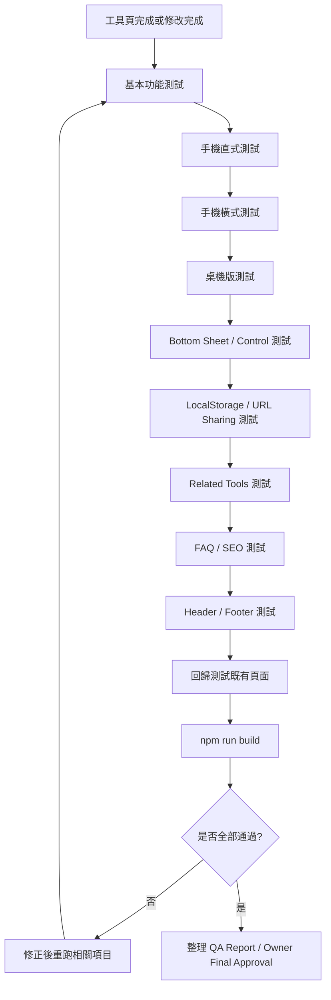

# Timiva Tool Page QA Checklist V2

## 文件目的

本文件定義 Timiva 工具頁完成後的正式 QA 檢查清單。

本文件適用於：

```text
新增工具頁
修改工具頁
修改 Bottom Sheet
修改工具主體
修改 FAQ / SEO
修改 Header / Footer / Base Layout
commit 前
deploy 前
```

本文件是 `agents/skills/tool-page-qa-skill.md` 的正式規範來源。

---

## 1. QA 核心原則

Timiva 工具頁 QA 的目的不是只確認「功能能不能跑」，而是確認：

```text
手機是否舒服
工具是否直覺
視覺是否一致
技術是否穩定
SEO 是否完整
是否沒有改壞既有頁面
```

Validated shared baseline 的目的，是消除重複 Owner QA。新工具 QA 應集中於 tool-specific decisions，而不是重新驗證未修改的 shared frame。

```text
一般新工具只要使用 ToolPageFrame、validator PASS、且沒有 Frame-specific override／exception，
就不再要求 Owner 每支工具重新量 768px、20rem、56px、640px gate、portrait 沉底等固定事項。
只有 Frame 本身修改、工具需要特殊 Page Frame、或 validator／regression 發現 contract 被破壞時，才重新做完整 Frame QA。
```

---

## 2. QA 總流程圖



---

## 3. 基本功能測試

每個工具頁都必須檢查：

```text
主要輸入可操作
主要結果計算正確
預設狀態正常
空狀態正常
錯誤輸入不 crash
重設功能正常
重新整理後頁面正常
工具不依賴後端即可使用
```

---

## 3.1 日期輸入 QA（條件式）

若工具包含日期輸入，需對照 [`docs/standards/date-input.md`](../standards/date-input.md) 檢查相關項目：

```text
[ ] empty / incomplete / valid / invalid 狀態行為正確
[ ] valid → invalid 是否歸零（結果與衍生狀態）
[ ] 6 / 7 / 8 碼純數字推斷正確
[ ] slash / dash 輸入可接受且解析正確
[ ] 回頭修改 segment 行為穩定（不誤跳、不殘留錯誤值）
[ ] mobile auto-advance 符合標準（含 Day 欄位例外規則）
[ ] 雙日期欄位一致性（Start / End 或同等欄位行為對齊）
```

快速日期輸入型工具（例如 Days Between Dates、Date Calculator、Business Days Calculator）應以該文件為 input behavior baseline，不可只測「能算出結果」。

---

## 4. 手機直式測試

手機直式是 Timiva 的核心體驗，必須優先測試。

檢查：

```text
主結果一眼看懂
主要 CTA 清楚
觸控目標足夠
輸入欄位不擠壓
頁面可以自然滑動
Bottom Control 不遮住必要內容
Bottom Sheet 可正常開關
點擊背景可關閉 Bottom Sheet
Footer 不突兀
```

Block 條件：

```text
手機直式無法完成主要任務
主結果被遮住
主要 CTA 不清楚
Bottom Sheet 無法關閉
輸入欄位超出畫面
```

---

## 5. 手機橫式測試

手機橫式必須獨立測試。

不能假設手機直式正常就代表手機橫式正常。

檢查：

```text
主結果仍可見
標題不必要省略
輸入欄位不超出
長文字輸入不跑版
Bottom Sheet 不過高
Bottom Control 不貼 Footer
轉回直式後 layout 恢復正常
廣告不壓縮主工具
```

Block 條件：

```text
主結果不可見
主要任務無法完成
輸入欄位超出畫面
Bottom Sheet 過高且不可操作
轉回直式後 layout 壞掉
```

---

## 6. 桌機版測試

檢查：

```text
主工具仍是焦點
內容寬度合理
Header 對齊正常
Footer 對齊正常
Related Tools 不搶主工具
FAQ / SEO 在工具體驗之後
廣告不壓縮主工具
```

---

## 7. Bottom Control / Bottom Sheet 測試

若工具頁使用 Bottom Control / Bottom Sheet，必須檢查：

```text
Bottom Control 可點擊
Bottom Sheet 可開啟
Bottom Sheet 可關閉
點擊背景可關閉
內容過多時可捲動
鍵盤開啟時不嚴重跑版
Bottom Sheet 內不放廣告
轉向後狀態正常
主要操作按鈕不是 viewport fixed
主要操作按鈕會跟頁面一起滑動
bottom sheet 開啟時，背景結果內容區整組縮放
bottom sheet 開啟時，底部主要按鈕不納入背景縮放群組
sheet-open 時，結果區縮放後在 Header 與 sheet 頂部之間保持視覺平衡
sheet-open 時，結果區沒有過度貼近 header
sheet-open 時，sheet 上方沒有不自然大空白
portrait keyboard-open 時，result group 與 sheet 形成同一個 composition，一起為鍵盤讓位
portrait keyboard-open 時，sheet 沒有被夾在 result group 與 keyboard 中間
portrait keyboard-open 時，sheet 與 keyboard 中間沒有露出背景結果 / You may also need / 相關工具
keyboard 關閉後，result group 與 sheet 立即回到一般 sheet-open 狀態
keyboard-open 沒有用大面積 ::after / 延伸底色遮空隙，sheet 本體維持正常 panel 高度
sheet 開啟與 input focus 時背景維持 scroll lock，沒有捲到 You may also need 或下方內容
手機直式 sheet 為上下排列；手機橫式 sheet 為一列兩欄 compact 版面
手機橫式 sheet / panel 高度為內容驅動 compact layout
手機橫式 sheet 沒有直接沿用直式 sheet 高度
手機橫式 sheet 沒有大面積空白 panel
landscape keyboard-open 維持 compact，沒有被 portrait keyboard lift 推高或產生多餘色塊
landscape + keyboard + iOS input accessory bar：不把整個 sheet panel 抬到鍵盤上方
landscape + keyboard + iOS input accessory bar：不露出大面積 sheet 背板 / 紫色 panel
landscape + keyboard + iOS input accessory bar：focused input 可見可編輯；背景不亂跳
```

Block 條件：

```text
Bottom Sheet 無法關閉
Bottom Sheet 過高不可操作
Bottom Control 與 Footer 重疊
Bottom Sheet 內出現廣告
主要操作按鈕做成 viewport fixed 或 fixed bottom action bar
主要操作按鈕樣式偏離 Event Countdown Edit / Theme / Share 基準
手機橫式誤用桌機 inline input（且 product spec 未明確指定）
bottom sheet 開啟時縮放對象錯誤或背景縮放不完整
sheet-open 時結果區過度貼近 header 或 sheet 上方出現不自然大空白
portrait keyboard-open 時只移動 sheet，result group 未一起讓位
portrait keyboard-open 時 sheet 被夾在 result group 與 keyboard 中間
portrait keyboard-open 時 sheet 與 keyboard 中間露出背景結果或其他下方內容
keyboard 關閉後 result group / sheet 未立即恢復一般 sheet-open 狀態
keyboard-open 用大面積延伸底色遮空隙，或 sheet 被拉成大色塊 / 留下短暫異常高度
input focus 時背景被捲到 You may also need 或下方內容
手機橫式 sheet 直接沿用直式高度或撐出大面積空白 panel
landscape 被 portrait keyboard lift 影響，出現推高、多餘色塊或破壞 compact panel
landscape + keyboard + iOS accessory bar 時整個 sheet 被抬到鍵盤上方並露出大面積背板
```

---

## 8. LocalStorage 測試

如工具使用 LocalStorage，必須檢查：

```text
初次進入不 crash
輸入後可保存
重新整理後可恢復
資料格式錯誤時有 fallback
重設後可清除資料
不同工具 key 不互相衝突
```

不要保存：

```text
敏感個資
健康診斷資料
帳號密碼
付款資訊
大量歷史紀錄
```

---

## 9. URL Sharing 測試

如工具使用 URL sharing，必須檢查：

```text
分享 URL 可開啟
URL 缺參數時不 crash
URL 參數錯誤時有 fallback
不在 URL 放敏感資料
中英文路由下 URL 正常
```

---

## 10. Related Tools 測試

檢查：

```text
Related Tools 最多 3 個（除非 Owner 明確核准更多）
優先推薦最接近使用者意圖的工具，而非單純依新工具順序
優先同分類工具
再推薦互補情境
連結正確
不放在主工具上方
手機版不過度密集
Coming Soon 狀態清楚
```

---

## 11. FAQ / SEO 測試

每個工具頁至少檢查：

```text
H1 存在
Meta title 存在
Meta description 存在
FAQ 3 到 6 題
FAQ 標題使用 {Tool Name} FAQ，不得使用 generic「Frequently asked questions」或僅「常見問題」
FAQ 解答真問題
FAQ Schema / JSON-LD 正確
FAQ 與頁面顯示內容一致
SEO 內容不壓過主工具
中英文內容不混雜
```

Block 條件：

```text
H1 缺失
Meta 缺失
FAQ Schema 錯誤
FAQ 與工具功能不一致
FAQ 標題不符合工具頁命名規則
SEO 區塊放到主工具前面
```

---

## 11.0 B0 Tool Page Frame gate

新工具 B0 必須使用 shared `ToolPageFrame`。這是 productionize 已驗證的 Tool Page page-type baseline，不是重新設計，也不是從單一工具複製 class。

### 兩階段 QA

**Baseline 建立期**（Lunar Date Converter 作 first adopter）：

```text
完整驗證一次 Frame：
Desktop / portrait / landscape / lower content / capsule / drawer / stage
```

此階段通過後，Tool Page Frame baseline 才正式成立。

**Baseline 正式成立後**（一般新工具）：

```text
[ ] 使用 ToolPageFrame（不得從 Hours／JEC／DC 重建 first-screen RWD）
[ ] node scripts/validate-tool-page-frame.mjs 通過
[ ] node scripts/validate-tool-page-frame-adopters.mjs 通過（Primary Entry shell opt-in）
[ ] node scripts/validate-primary-entry-capsule-baseline.mjs 通過
[ ] 沒有 Frame-specific override／exception
[ ] 沒有 import preview CSS 當作 production Frame
[ ] 沒有覆寫 .tpf-*
[ ] stage 寬度與 lower-content max-w-3xl 未混用
```

通過以上項目後，Owner **不必**再為該工具重測：

```text
768px mobile／desktop 切換
capsule 20rem／portrait 56px（3.5rem）
desktop 640px gate
portrait 1fr / auto 沉底
lower-content max-w-3xl
drawer 300px chrome／placement
first-screen → lower-content spacing
```

必須重新做完整 Frame QA 的情況：

```text
Frame 本身被修改
該工具需要特殊 Page Frame（必須在 product spec 或任務提詞明確指定）
validator 或 regression 發現 contract 被破壞
```

B0 未通過時，**不得進入 B1A**。既有 DC／Hours／JEC production 不在本次 Frame 遷移範圍；它們仍是 regression comparator／來源，不是 adopter。

**B1B Component Style 提醒：** 上方靜態畫面必須使用 canonical Component Style Baseline（title、A1 title→result gap、B3 textual primary defaults、Supporting Result Text、Textual Result Support Divider、Standard Pill Field 等）。不得從偏小 textual fallback 或任意 spacing 開始。Owner Visual QA 仍保留最終判斷。詳見 `docs/standards/design-system.md`、`layout-system.md` §6.0。

**Project Design Assistant（cross-link）：** Gate review 可作 QA evidence 的一部分。Canonical skill：[`agents/skills/project-design-assistant-skill.md`](../../agents/skills/project-design-assistant-skill.md)。**不取代** automated validator、browser QA、device / viewport QA、Owner visual QA、本文件既有 Tool Page QA checklist。Lunar first adopter：B0 仍依本節完整 ToolPageFrame QA；Design Assistant Foundation Gate 是補充 guardrail，不是替代。

---

## 11A. B1A lower content and sidebar QA

B1A 不只補 lower content 文案，也必須完成 lower content / sidebar 的基礎互動。

B1A 完成範圍應包含：

```text
About
How to use
Common uses / tags
Tool-specific FAQ
FAQ JSON-LD
Related Tools
Mobile lower related rows
Desktop drawer collapse / expand 行為
Drawer aria-expanded 與 accessible label
Sidebar hover no-lift 防回歸檢查
```

B1A 完成後、進入 B1B 前，Owner browser review 必須至少對照 **一個已核准的 production 工具頁** 檢查：

```text
[ ] Lower content 結構與順序對齊既有正式工具（About → How to use → Common uses/tags → {Tool Name} FAQ）
[ ] About 使用工具專屬標題（非 generic About the…）
[ ] How to use 使用工具專屬標題（非僅 How to use / 使用方式）
[ ] FAQ 標題為 {Tool Name} FAQ，非 generic Frequently asked questions / 常見問題
[ ] Common uses / tags 區塊存在，除非 product spec 明確排除
[ ] Tags / chips 為資訊標籤、非互動，除非 product spec 明確要求
[ ] Related Tools 最多 3 個
[ ] Related Tools 依最接近使用者意圖排序，非單純新工具順序
[ ] Desktop 右側 sidebar related cards 不得 hover-lift 或向上 translate
[ ] Sidebar cards 不得重用首頁 ToolCard hover 行為
[ ] Desktop drawer collapse / expand 控制項可見
[ ] Desktop drawer collapse / expand 行為正常
[ ] Drawer aria-expanded 與 accessible label 正確
[ ] Sidebar hover 不造成 layout shift
[ ] Desktop drawer 修正不造成手機破版或水平捲軸
[ ] node scripts/validate-tool-drawer-related-hover.mjs 通過
```

若 Owner browser review 發現以上任一項失敗，**必須回到 B1A regression fix**，不得進入 B1B。

---

## 11B. B1B / B2 前：手機第一屏控制區 QA gate

新工具在 **B1B / B2 前**，若有 mobile bottom sheet + input focus，Owner browser review 必須至少檢查以下六種狀態：

```text
[ ] mobile portrait closed state（手機直式、sheet 關閉）
[ ] mobile portrait sheet-open state（手機直式、sheet 開啟）
[ ] mobile portrait sheet-open + keyboard（手機直式、sheet 開啟 + 鍵盤）
[ ] mobile landscape closed state（手機橫式、sheet 關閉）
[ ] mobile landscape sheet-open without keyboard（手機橫式、sheet 開啟、無鍵盤）
[ ] mobile landscape sheet-open + keyboard + iOS input accessory bar（手機橫式、鍵盤 + 上一欄/下一欄/完成）
```

> 詳細共用規則見 `docs/standards/mobile-sheet.md` §12。
> B2B 不可在上述 mobile sheet 狀態未通過前開始。

QA 必須確認：

```text
[ ] 主要按鈕不是 viewport fixed
[ ] 主要按鈕會跟頁面一起滑動
[ ] 主要按鈕位置高度與其他一般工具頁一致
[ ] 主要按鈕與下方第一個內容標題（例如 You may also need / 相關工具）距離一致
[ ] 按鈕樣式符合 Event Countdown Edit / Theme / Share 那套（Date Range 手機日期按鈕同型，可含 icon）
[ ] 沒有新增另一套滿版大 CTA 或 fixed bottom action bar
[ ] 手機橫式沒有套用桌機 inline input（除非 product spec 明確指定）
[ ] 手機橫式結果區與按鈕可完整呈現在第一屏內
[ ] 手機橫式按鈕尺寸與樣式未因單一工具任意縮小或變形
[ ] 手機直式 bottom sheet 內容為上下排列
[ ] 手機橫式 bottom sheet 內容為一列兩欄 compact 版面（非直式 sheet 直接壓扁）
[ ] bottom sheet 開啟時，背景結果內容區整組縮放
[ ] bottom sheet 開啟時，底部主要按鈕不被納入背景縮放群組
[ ] sheet-open 時，結果區縮放後沒有過度貼近 header
[ ] sheet-open 時，結果區在 sheet 上方可視空間中保持視覺平衡
[ ] sheet-open 時，sheet 上方沒有不自然大空白
[ ] portrait keyboard-open 時，result group 與 sheet 一起為鍵盤讓位（同一 composition）
[ ] portrait keyboard-open 時，sheet 沒有被夾在 result group 與 keyboard 中間
[ ] portrait keyboard-open 時，sheet 與 keyboard 中間沒有露出背景結果 / You may also need / 相關工具
[ ] keyboard 關閉後，result group 與 sheet 立即回到一般 sheet-open 狀態
[ ] keyboard-open 沒有用大面積 ::after / 延伸底色遮空隙；sheet 本體維持正常 panel 高度
[ ] sheet 開啟與 input focus 時背景維持 scroll lock，沒有捲到 You may also need / 相關工具
[ ] landscape sheet 高度為內容驅動 compact layout
[ ] landscape sheet 沒有直接套用直式 sheet 高度
[ ] landscape sheet 沒有大面積空白 panel
[ ] landscape keyboard-open 維持 compact，未被 portrait keyboard lift 影響
[ ] landscape + keyboard + iOS accessory bar：沒有把整個 sheet panel 抬到鍵盤上方
[ ] landscape + keyboard + iOS accessory bar：沒有露出大面積 sheet 背板 / 紫色 panel
[ ] landscape + keyboard + iOS accessory bar：focused input 可見可編輯；背景穩定
[ ] landscape + keyboard + iOS accessory bar：不要求完整展示整個 sheet；優先保護輸入可用
```

適用範圍：

```text
以上規則適用於一般工具。
特殊互動工具（例如 Countdown Timer）可例外，但例外必須在 product spec 或任務提詞中明確指定。
Cursor 不得自行判斷某工具是否為例外。
沒有明確例外時，一律套用標準 mobile first-screen baseline。
```

規範來源：`docs/standards/layout-system.md` §6.6 F。

若 Owner browser review 發現以上任一項失敗，**必須回到 B1B regression fix**，不得進入 B2。

---

## 12. Header / Footer 測試

Header / Footer 是 locked components。

檢查：

```text
Header 是否仍使用共用元件
Footer 是否仍使用共用元件
Header / Footer 是否全站一致
語系切換是否正常
Footer 連結是否正確
Footer 在手機直式正常
Footer 在手機橫式不突兀
```

未經 Owner 確認，不得修改：

```text
Header
Footer
Base Layout
全站背景
共用容器
```

---

## 13. Tailwind / HTML 測試

檢查：

```text
使用 Tailwind CSS
HTML 保持語意化
主要區塊有中文註解
RWD 以元件為單位分段
沒有 inline style
沒有 !important
沒有 CSS id selector
沒有大量無原因 arbitrary values
```

---

## 13.0 Global Interactive Cursor

```text
Enabled controls → pointer
Disabled controls → default
aria-disabled controls → default
Text inputs → text cursor
Special controls → correct special cursor
Non-interactive content → default
No redundant local cursor:pointer
No redundant cursor-pointer on semantic controls
Utility Capsule hover lift remains separate from cursor behavior
```

Automated check:

```bash
node scripts/validate-global-interactive-cursor-baseline.mjs
```

---

## 13.1 V2 Utility Capsule Control

Utility Capsule Control 互動驗收：

```text
Correct controls use .tool-utility-control
Incorrect roles do not use it
Fine-pointer hover lifts by 2px
Pointer exit returns smoothly
Active resets movement
Touch has no sticky hover
Reduced motion has no movement
Focus-visible remains clear
No tool-local transition duplication
No primary/text/navigation/sheet control contamination
```

Automated check:

```bash
node scripts/validate-tool-utility-control-baseline.mjs
```

---

## 14. 回歸測試

修改任何工具頁後，至少檢查：

```text
Home Page
All Tools Page
已完成工具頁
Privacy Policy
Terms of Use
Contact
Header
Footer
手機直式
手機橫式
桌機版
```

修改共用元件後，必須擴大回歸測試。

---

## 15. Commit 前最小檢查

commit 前至少確認：

```text
npm run build 成功
沒有明顯 console error
手機直式可完成主要任務
手機橫式不嚴重跑版
桌機版正常
Header / Footer 沒有壞
FAQ / SEO 沒有明顯錯誤
沒有未經確認修改 locked components
```

---

## 16. QA Report 格式

```text
# Timiva Tool Page QA Report

Tool:
Date:
Reviewer:

## Summary
Result: Pass / Pass with minor notes / Block

## Checks
| Item | Result | Notes |
|---|---|---|
| Main function | Pass / Block | |
| Mobile portrait | Pass / Block | |
| Mobile landscape | Pass / Block | |
| Desktop | Pass / Block | |
| Bottom Sheet / Control | Pass / N/A / Block | |
| LocalStorage | Pass / N/A / Block | |
| URL Sharing | Pass / N/A / Block | |
| Related Tools | Pass / Block | |
| FAQ / SEO | Pass / Block | |
| Header / Footer | Pass / Block | |
| Build | Pass / Block | |

## Required fixes
- ...

## Minor notes
- ...

## Owner attention
- ...
```

---

## 17. 結論

Timiva 工具頁 QA 必須同時確認：

```text
功能正確
手機舒服
橫式穩定
視覺一致
SEO 完整
共用元件沒壞
build 成功
Owner 前期確認
```

工具能跑不代表完成。

工具要符合 Timiva 的體驗、品牌、技術與搜尋策略，才算完成。
